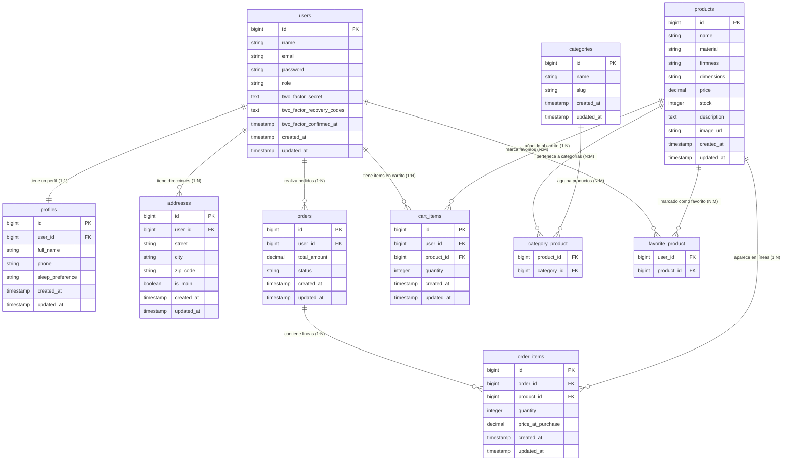

# Diagrama Entidad-Relación — Reposa+

> **Asignatura:** Tecnologías Avanzadas de Desarrollo (EPD3)  
> **Proyecto:** Reposa+ — Tienda online de colchones y descanso  
> **Última actualización:** 30 de mayo de 2026

## Descripción general

El siguiente diagrama representa **todas las tablas** de la base de datos de Reposa+ y las relaciones entre ellas.

### Tipos de relación empleados

| Tipo | Notación Mermaid | Ejemplo en Reposa+ |
|------|-----------------|---------------------|
| **1:1** (Uno a uno) | `\|\|--\|\|` | `users` ↔ `profiles` — Cada usuario tiene exactamente un perfil. |
| **1:N** (Uno a muchos) | `\|\|--o{` | `users` ↔ `orders` — Un usuario puede tener muchos pedidos. |
| **N:M** (Muchos a muchos) | Tabla pivote intermedia | `products` ↔ `categories` a través de `category_product`. |

---

## Diagrama ER (Mermaid)



---

## Vistas SQL

Además de las tablas anteriores, la base de datos incluye dos **vistas SQL** que facilitan la obtención de estadísticas para el panel de administración.

### `v_order_summary`

Resumen de pedidos por usuario. Utilizada en el dashboard del administrador para mostrar estadísticas de clientes.

| Columna | Tipo | Descripción |
|---------|------|-------------|
| `user_id` | bigint | ID del usuario |
| `user_name` | string | Nombre del usuario |
| `user_email` | string | Correo electrónico |
| `total_orders` | integer | Número total de pedidos |
| `total_spent` | decimal | Importe total gastado |

```sql
-- Definición simplificada
CREATE VIEW v_order_summary AS
SELECT
    u.id        AS user_id,
    u.name      AS user_name,
    u.email     AS user_email,
    COUNT(o.id) AS total_orders,
    COALESCE(SUM(o.total_amount), 0) AS total_spent
FROM users u
LEFT JOIN orders o ON o.user_id = u.id
GROUP BY u.id, u.name, u.email;
```

### `v_top_favorited_products`

Productos más añadidos a favoritos. Útil para identificar los artículos más populares.

| Columna | Tipo | Descripción |
|---------|------|-------------|
| `id` | bigint | ID del producto |
| `name` | string | Nombre del producto |
| `price` | decimal | Precio del producto |
| `favorited_by_count` | integer | Número de usuarios que lo marcaron como favorito |

```sql
-- Definición simplificada
CREATE VIEW v_top_favorited_products AS
SELECT
    p.id,
    p.name,
    p.price,
    COUNT(fp.user_id) AS favorited_by_count
FROM products p
LEFT JOIN favorite_product fp ON fp.product_id = p.id
GROUP BY p.id, p.name, p.price
ORDER BY favorited_by_count DESC;
```

---

> **Nota:** Las vistas están envueltas en modelos Eloquent (`OrderSummary`, `TopFavoritedProduct`) para acceder a ellas de forma limpia desde los controladores de Laravel.
