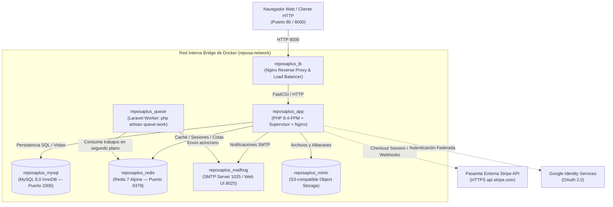
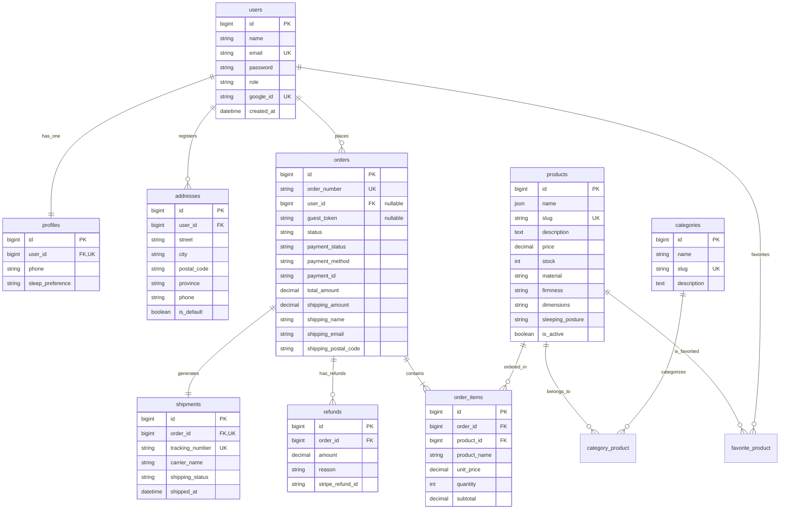

# Anexo III: Documento de Diseño (Métrica v3 — DSI)

**Proyecto:** Reposa+ — E-Commerce Transaccional Especializado en Descanso Ergonómico (*Sleep Tech*)  
**Autor:** Jonathan Quispe  
**Tutor Académico:** Rubén Pérez Chacón  
**Código TFG:** 25-26-C13  
**Institución:** Escuela Politécnica Superior — Universidad Pablo de Olavide (UPO), Sevilla  
**Titulación:** Grado en Ingeniería Informática en Sistemas de Información (Convocatoria: Mayo/Septiembre 2026)  

---

## 1. Control del Documento

### 1.1. Metadatos del Documento
| Propiedad | Valor |
|---|---|
| **Denominación del Documento** | Anexo III: Documento de Diseño (DSI - Diseño de Sistemas de Información) |
| **Proyecto** | Reposa+ (E-Commerce Sleep Tech) |
| **Edición / Versión** | 1.1.0-tfg-final |
| **Fecha de Aprobación** | 18 de Septiembre de 2026 |
| **Autor** | Jonathan Quispe |
| **Organización** | Escuela Politécnica Superior — Universidad Pablo de Olavide |
| **Estado** | Aprobado / Consolidado |

### 1.2. Registro de Cambios
| Versión | Fecha | Autor | Descripción del Cambio |
|---|---|---|---|
| 0.1.0 | 20/06/2026 | Jonathan Quispe | Diseño preliminar del esquema físico de base de datos y patrón MVC. |
| 1.0.0 | 29/08/2026 | Jonathan Quispe | Topología de 7 microservicios Docker, Vistas SQL nativas y bloqueo pesimista. |
| 1.1.0 | 18/09/2026 | Jonathan Quispe | Estandarización formal Métrica v3 DSI, fichas DDL completas con constraints y clases CL-xxx. |

---

## 2. Arquitectura Física y Diagrama de Despliegue

La infraestructura de ejecución de **Reposa+** está enteramente virtualizada mediante contenedores desacoplados sobre **Docker Engine**, garantizando paridad absoluta entre los entornos de desarrollo, integración continua (CI) y producción:

### 2.1. Topología del Ecosistema Docker (7 Microservicios)



### 2.2. Especificación de los Nodos del Sistema
1. **`reposaplus_lb` (Load Balancer & Proxy Inverso):**
   - Imagen base: `nginx:alpine`.
   - Responsabilidad: Terminación HTTP, enrutamiento de tráfico al servidor de aplicación, gestión de cabeceras de proxy (`X-Forwarded-For`, `X-Forwarded-Proto`) y compresión gzip de recursos estáticos.
2. **`reposaplus_app` (Servidor de Aplicación Web):**
   - Imagen construida a medida con **PHP 8.4-FPM**, extensiones nativas (`pdo_mysql`, `redis`, `gd`, `zip`, `intl`, `bcmath`), Composer 2 y servidor Nginx interno coordinado mediante `supervisord`.
   - Ejecuta el framework **Laravel 11/12+** y procesa el ciclo de vida de peticiones HTTP.
3. **`reposaplus_queue` (Procesador Asíncrono de Colas):**
   - Instancia dedicada que ejecuta `php artisan queue:work redis --tries=3 --timeout=90`.
   - Desacopla tareas bloqueantes: emisión de correos de confirmación vía SMTP y generación de albaranes pesados.
4. **`reposaplus_mysql` (Motor de Base de Datos Relacional):**
   - Imagen oficial: `mysql:8.0`.
   - Motor de almacenamiento: **InnoDB** con transacciones ACID, claves foráneas estrictas (`ON DELETE RESTRICT/CASCADE`) y bloqueo pesimista a nivel de fila (`SELECT ... FOR UPDATE`).
5. **`reposaplus_redis` (Caché y Mensajería Rápida):**
   - Imagen: `redis:7-alpine`.
   - Utilizado como broker de colas para Laravel Queue y gestor de sesiones de alta disponibilidad.
6. **`reposaplus_mailhog` (Servidor de Correo de Sandbox):**
   - Servidor SMTP local seguro en puerto 1025 que intercepta los correos transaccionales para inspección visual en su dashboard web (puerto 8025), impidiendo el envío involuntario a buzones reales durante desarrollo y pruebas.
7. **`reposaplus_minio` (Almacenamiento de Objetos S3):**
   - Almacenamiento desacoplado para fotografías de catálogo y archivos PDF de facturas.

### 2.3. Requisitos No Funcionales de Arquitectura y Operación

| Código | Denominación | Especificación Técnica |
|---|---|---|
| **RNF-OP-01** | Portabilidad de Contenedores | Toda la infraestructura debe levantarse de forma desatendida mediante el comando estándar `docker compose up -d`. |
| **RNF-OP-02** | Escalabilidad Horizontal | La aplicación está desacoplada del estado local: las sesiones residen en Redis y los archivos en MinIO/S3, permitiendo añadir réplicas del contenedor `reposaplus_app` tras el balanceador sin pérdida de coherencia. |
| **RNF-SEG-01**| Aislamiento de Red | Los microservicios de datos (`mysql`, `redis`) residen en una red privada virtual de Docker (`reposa-network`) sin exposición directa de puertos al exterior en entornos de producción. |
| **RNF-SEG-02**| Cifrado de Secretos | Todas las credenciales sensibles (claves de API de Stripe, secretos de Google OAuth, contraseñas de BD) se inyectan a través de variables de entorno protegidas (`.env`). |

---

## 3. Modelo Físico Relacional de Base de Datos

El diseño de la base de datos se encuentra normalizado en **Tercera Forma Normal (3FN)**, implementando integridad referencial estricta y restricciones de chequeo (*CHECK constraints*) a nivel de esquema DDL.

### 3.1. Diagrama Físico de Base de Datos (E-R)



---

### 3.2. Fichas Técnicas DDL por Tabla Física

---
#### Tabla: `users` (Usuarios y Autenticación)
* **Propósito:** Almacén central de credenciales de acceso e identidades locales o federadas.
* **Columnas:**
  | Campo | Tipo SQL | Nulo | Por Defecto | Descripción |
  |---|---|---|---|---|
  | `id` | `BIGINT UNSIGNED` | NO | `AUTO_INCREMENT` | Identificador único del usuario. |
  | `name` | `VARCHAR(255)` | NO | — | Nombre y apellidos del usuario. |
  | `email` | `VARCHAR(255)` | NO | — | Correo electrónico de inicio de sesión. |
  | `password` | `VARCHAR(255)` | SÍ | `NULL` | Hash Bcrypt (nulo para cuentas puras de Google OAuth). |
  | `role` | `VARCHAR(50)` | NO | `'user'` | Rol de acceso (`'admin'` o `'user'`). |
  | `google_id` | `VARCHAR(255)` | SÍ | `NULL` | Identificador único devuelto por Google Identity Services. |
  | `created_at` | `TIMESTAMP` | SÍ | `NULL` | Fecha de creación del registro. |
* **Restricciones:**
  - **PK:** `PRIMARY KEY (id)`
  - **UK 1:** `UNIQUE KEY users_email_unique (email)`
  - **UK 2:** `UNIQUE KEY users_google_id_unique (google_id)`
  - **CHECK:** `CHECK (role IN ('user', 'admin'))`

---
#### Tabla: `products` (Catálogo de Almohadas)
* **Propósito:** Registro de productos de descanso con atributos biomédicos y control de inventario.
* **Columnas:**
  | Campo | Tipo SQL | Nulo | Por Defecto | Descripción |
  |---|---|---|---|---|
  | `id` | `BIGINT UNSIGNED` | NO | `AUTO_INCREMENT` | Identificador único del producto. |
  | `name` | `JSON` | NO | — | Denominación en formato JSON multilingüe (`{"es": "...", "en": "..."}`). |
  | `slug` | `VARCHAR(255)` | NO | — | Identificador amigable para URLs públicas. |
  | `description` | `TEXT` | SÍ | `NULL` | Detalle de ergonomía y ficha de descanso. |
  | `price` | `DECIMAL(10,2)` | NO | — | Precio de venta al público en euros (€). |
  | `stock` | `INT` | NO | `0` | Unidades físicas disponibles en almacén. |
  | `material` | `VARCHAR(100)` | NO | `'Viscoelástica'` | Material textil y núcleo (ej. Látex, Espuma con memoria). |
  | `firmness` | `VARCHAR(50)` | NO | `'Media'` | Grado de firmeza (`'Baja'`, `'Media'`, `'Alta'`). |
  | `sleeping_posture`| `VARCHAR(100)` | NO | `'Cualquiera'` | Postura recomendada (`'Lado'`, `'Boca arriba'`, `'Boca abajo'`). |
  | `is_active` | `TINYINT(1)` | NO | `1` | Flag de visibilidad en el catálogo comercial. |
* **Restricciones:**
  - **PK:** `PRIMARY KEY (id)`
  - **UK:** `UNIQUE KEY products_slug_unique (slug)`
  - **CHECK 1:** `CHECK (price >= 0.00)`
  - **CHECK 2:** `CHECK (stock >= 0)`

---
#### Tabla: `orders` (Cabecera Transaccional de Pedidos)
* **Propósito:** Registro maestro de transacciones comerciales, estados de pago y datos inmutables de entrega.
* **Columnas:**
  | Campo | Tipo SQL | Nulo | Por Defecto | Descripción |
  |---|---|---|---|---|
  | `id` | `BIGINT UNSIGNED` | NO | `AUTO_INCREMENT` | Identificador único interno. |
  | `order_number` | `VARCHAR(64)` | NO | — | Código comercial de pedido (ej. `ORD-2026-XXXX`). |
  | `user_id` | `BIGINT UNSIGNED` | SÍ | `NULL` | FK del usuario (NULL para compras de invitados). |
  | `guest_token` | `VARCHAR(64)` | SÍ | `NULL` | Token criptográfico SHA-256 para acceso seguro de invitados. |
  | `status` | `VARCHAR(50)` | NO | `'pending'` | Estado del pedido en el autómata de estados finitos. |
  | `payment_status` | `VARCHAR(50)` | NO | `'pending'` | Estado financiero (`'pending'`, `'paid'`, `'refunded'`). |
  | `payment_method` | `VARCHAR(50)` | NO | `'direct'` | Método empleado (`'direct'`, `'stripe'`). |
  | `payment_id` | `VARCHAR(255)` | SÍ | `NULL` | ID de sesión o PaymentIntent de Stripe. |
  | `total_amount` | `DECIMAL(10,2)` | NO | — | Importe total final cobrado al cliente. |
  | `shipping_amount`| `DECIMAL(10,2)` | NO | `0.00` | Coste logístico de envío aplicado. |
  | `shipping_name` | `VARCHAR(255)` | NO | — | Nombre inmutable del destinatario. |
  | `shipping_email`| `VARCHAR(255)` | NO | — | Email inmutable de contacto. |
  | `shipping_postal_code`| `VARCHAR(20)` | NO | — | Código postal de entrega. |
* **Restricciones:**
  - **PK:** `PRIMARY KEY (id)`
  - **UK:** `UNIQUE KEY orders_order_number_unique (order_number)`
  - **FK:** `FOREIGN KEY (user_id) REFERENCES users(id) ON DELETE SET NULL`
  - **CHECK 1:** `CHECK (total_amount >= 0.00)`
  - **CHECK 2:** `CHECK (status IN ('pending', 'processing', 'shipped', 'delivered', 'completed', 'cancelled', 'refunded'))`

---
#### Tabla: `order_items` (Líneas de Detalle de Pedido)
* **Propósito:** Snapshot histórico inmutable de los productos adquiridos, cantidades y precios vigentes en el momento de la compra.
* **Columnas:**
  | Campo | Tipo SQL | Nulo | Por Defecto | Descripción |
  |---|---|---|---|---|
  | `id` | `BIGINT UNSIGNED` | NO | `AUTO_INCREMENT` | Identificador de línea. |
  | `order_id` | `BIGINT UNSIGNED` | NO | — | FK hacia la cabecera del pedido. |
  | `product_id` | `BIGINT UNSIGNED` | NO | — | FK hacia el producto original. |
  | `product_name` | `VARCHAR(255)` | NO | — | Denominación textual congelada del producto. |
  | `unit_price` | `DECIMAL(10,2)` | NO | — | Precio unitario congelado en la fecha del pedido. |
  | `quantity` | `INT` | NO | `1` | Número de unidades compradas. |
  | `subtotal` | `DECIMAL(10,2)` | NO | — | Importe de línea (`unit_price * quantity`). |
* **Restricciones:**
  - **PK:** `PRIMARY KEY (id)`
  - **FK 1:** `FOREIGN KEY (order_id) REFERENCES orders(id) ON DELETE CASCADE`
  - **FK 2:** `FOREIGN KEY (product_id) REFERENCES products(id) ON DELETE RESTRICT`
  - **CHECK 1:** `CHECK (quantity > 0)`
  - **CHECK 2:** `CHECK (unit_price >= 0.00)`

---
#### Tabla: `shipments` (Expediciones y Paquetería Estándar)
* **Propósito:** Control de la trazabilidad postal, códigos de seguimiento y vinculación física con el bulto.
* **Columnas:**
  | Campo | Tipo SQL | Nulo | Por Defecto | Descripción |
  |---|---|---|---|---|
  | `id` | `BIGINT UNSIGNED` | NO | `AUTO_INCREMENT` | Identificador de la expedición. |
  | `order_id` | `BIGINT UNSIGNED` | NO | — | FK de la orden vinculada (relación 1:1). |
  | `tracking_number`| `VARCHAR(64)` | NO | — | Código postal de 15 caracteres (`RPX...ES`). |
  | `carrier_name` | `VARCHAR(100)` | NO | `'Correos Express'` | Nombre del operador logístico. |
  | `shipping_status`| `VARCHAR(50)` | NO | `'pre_transit'`| Estado logístico (`pre_transit`, `in_transit`, `delivered`, `cancelled`). |
  | `label_path` | `VARCHAR(255)` | SÍ | `NULL` | Ruta de la etiqueta generada. |
  | `shipped_at` | `TIMESTAMP` | SÍ | `NULL` | Fecha y hora real de entrega al transportista. |
  | `delivered_at` | `TIMESTAMP` | SÍ | `NULL` | Fecha y hora de entrega al destinatario final. |
* **Restricciones:**
  - **PK:** `PRIMARY KEY (id)`
  - **UK 1:** `UNIQUE KEY shipments_order_id_unique (order_id)`
  - **UK 2:** `UNIQUE KEY shipments_tracking_number_unique (tracking_number)`
  - **FK:** `FOREIGN KEY (order_id) REFERENCES orders(id) ON DELETE CASCADE`
  - **CHECK:** `CHECK (shipping_status IN ('pre_transit', 'in_transit', 'delivered', 'cancelled'))`

---
#### Tabla: `refunds` (Auditoría de Reembolsos)
* **Propósito:** Registro contable de devoluciones económicas y cancelaciones.
* **Columnas:**
  | Campo | Tipo SQL | Nulo | Por Defecto | Descripción |
  |---|---|---|---|---|
  | `id` | `BIGINT UNSIGNED` | NO | `AUTO_INCREMENT` | Identificador de la devolución. |
  | `order_id` | `BIGINT UNSIGNED` | NO | — | FK hacia el pedido reembolsado. |
  | `amount` | `DECIMAL(10,2)` | NO | — | Importe económico reembolsado (€). |
  | `reason` | `TEXT` | SÍ | `NULL` | Justificación técnica del reembolso. |
  | `stripe_refund_id`| `VARCHAR(255)` | SÍ | `NULL` | Identificador oficial devuelto por la API de Stripe (`re_...`). |
  | `refunded_at` | `TIMESTAMP` | NO | `CURRENT_TIMESTAMP` | Momento exacto de la transacción de reembolso. |
* **Restricciones:**
  - **PK:** `PRIMARY KEY (id)`
  - **FK:** `FOREIGN KEY (order_id) REFERENCES orders(id) ON DELETE CASCADE`
  - **CHECK:** `CHECK (amount > 0.00)`

---

### 3.3. Vistas SQL Nativas de Alto Rendimiento

Para optimizar las cargas de trabajo analíticas en el back-office y eliminar el coste computacional de agrupaciones en tiempo de ejecución:

#### 1. Vista: `v_order_summary` (Agregación Diaria de Rendimiento Comercial)
```sql
CREATE OR REPLACE VIEW v_order_summary AS
SELECT 
    DATE(o.created_at) AS order_date,
    COUNT(o.id) AS total_orders,
    SUM(o.total_amount) AS gross_revenue,
    SUM(CASE WHEN o.status = 'completed' THEN 1 ELSE 0 END) AS completed_orders,
    SUM(CASE WHEN o.status = 'refunded' THEN 1 ELSE 0 END) AS refunded_orders,
    AVG(o.total_amount) AS average_ticket
FROM orders o
GROUP BY DATE(o.created_at)
ORDER BY order_date DESC;
```

#### 2. Vista: `v_top_favorited_products` (Expectativas de Demanda y Deseos)
```sql
CREATE OR REPLACE VIEW v_top_favorited_products AS
SELECT 
    p.id AS product_id,
    p.name AS product_name,
    p.price AS unit_price,
    p.stock AS current_stock,
    COUNT(fp.user_id) AS favorited_by_count
FROM products p
LEFT JOIN favorite_product fp ON p.id = fp.product_id
GROUP BY p.id, p.name, p.price, p.stock
ORDER BY favorited_by_count DESC;
```

---

## 4. Diseño de Controladores del Sistema (`CL-xxx`)

Los controladores actúan como orquestadores del flujo de ejecución en la arquitectura MVC de Laravel:

---
### Ficha: `CL-001` — `ProductController` (Catálogo y Asesor Anatómico)
* **Código:** `CL-001` | **Espacio de Nombres:** `App\Http\Controllers\ProductController`
* **Propósito:** Gestionar la visualización del catálogo comercial, búsqueda multiatributo y detalle ergonómico.
* **Tabla de Métodos:**
  | Visibilidad | Método | Parámetros | Tipo Retorno | Descripción Algorítmica |
  |---|---|---|---|---|
  | `public` | `index()` | `Request $request` | `View` | Aplica filtros de categoría, firmeza y precio sobre el modelo `Product`; ejecuta paginación a 9 ítems y renderiza `products.index`. |
  | `public` | `show()` | `Product $product` | `View` | Recupera el producto con sus categorías (`load('categories')`); calcula el estado del stock y renderiza `products.show`. |
  | `public` | `search()`| `Request $request` | `JsonResponse / View` | Realiza coincidencia textual debounced sobre `name` y `description`; si es petición AJAX retorna JSON con sugerencias instantáneas. |

---
### Ficha: `CL-002` — `CartController` (Gestión Asíncrona de Cesta)
* **Código:** `CL-002` | **Espacio de Nombres:** `App\Http\Controllers\CartController`
* **Propósito:** Controlar el ciclo de vida del carrito en sesión y la reactividad con el servicio `CartCalculator`.
* **Tabla de Métodos:**
  | Visibilidad | Método | Parámetros | Tipo Retorno | Descripción Algorítmica |
  |---|---|---|---|---|
  | `public` | `index()` | — | `View` | Recupera el array de carrito desde `session('cart', [])`, calcula subtotales, IVA y estado del umbral de envío gratuito (50€). |
  | `public` | `add()` | `Request $request` | `JsonResponse / Redirect` | Valida `$request->id` y cantidad; comprueba disponibilidad de stock en el modelo; actualiza la sesión; retorna JSON con nuevo contador y subtotal si `wantsJson()`. |
  | `public` | `update()`| `Request $request` | `JsonResponse` | Ajusta la cantidad solicitada con tope máximo en el stock disponible; recalcula el desglose impositivo y retorna JSON. |
  | `public` | `remove()`| `int $id` | `JsonResponse / Redirect` | Elimina la clave del producto en el array de sesión y despacha notificación flash de éxito. |

---
### Ficha: `CL-003` — `CheckoutController` (Orquestación Transaccional y Stripe)
* **Código:** `CL-003` | **Espacio de Nombres:** `App\Http\Controllers\CheckoutController`
* **Propósito:** Validar el checkout híbrido, ejecutar transacciones con bloqueo pesimista y crear sesiones de pago con Stripe.
* **Tabla de Métodos:**
  | Visibilidad | Método | Parámetros | Tipo Retorno | Descripción Algorítmica |
  |---|---|---|---|---|
  | `public` | `index()` | `Request $request` | `View / Redirect` | Redirige al carrito si está vacío; si el usuario es invitado comprueba datos previos en sesión; renderiza `checkout.index`. |
  | `public` | `process()`| `CheckoutRequest $request` | `RedirectResponse` | Ejecuta `DB::transaction()` con `$product->lockForUpdate()`; decrementa inventario; persiste `Order` y `OrderItem`; genera `Shipment`; vacía el carrito y redirige a confirmación o a Stripe según el método elegido. |
  | `public` | `stripeSuccess()` | `Request $request` | `RedirectResponse` | Valida `session_id` con Stripe; comprueba que el pago fue exitoso; regulariza el pedido a `paid`/`processing` y redirige a la vista de confirmación. |
  | `public` | `stripeCancel()` | — | `RedirectResponse` | Restaura la sesión para evitar pérdida de datos en el formulario y redirige al carrito con mensaje de advertencia. |

---
### Ficha: `CL-004` — `AdminController` (Gestión Operativa de Back-Office)
* **Código:** `CL-004` | **Espacio de Nombres:** `App\Http\Controllers\Admin\AdminController`
* **Propósito:** Administración integral de inventario, visualización de métricas de ventas y ejecución de reembolsos.
* **Tabla de Métodos:**
  | Visibilidad | Método | Parámetros | Tipo Retorno | Descripción Algorítmica |
  |---|---|---|---|---|
  | `public` | `dashboard()` | — | `View` | Consulta la vista nativa `v_order_summary` y `v_top_favorited_products`; calcula KPIs de ventas y renderiza `admin.dashboard`. |
  | `public` | `orders()` | `Request $request` | `View` | Lista pedidos con *Eager Loading* de usuario, ítems y expedición; aplica filtros combinados de estado de pedido y seguimiento. |
  | `public` | `updateOrderStatus()` | `Request $request, Order $order` | `RedirectResponse` | Valida que la transición solicitada pertenezca a `Order::ALLOWED_TRANSITIONS`; actualiza el estado y sincroniza la paquetería si procede. |
  | `public` | `refundOrder()` | `Request $request, Order $order` | `RedirectResponse` | Invoca la API de Stripe si el cobro fue electrónico; transiciona a `refunded`; incrementa el stock de los productos adquiridos y anula el envío. |

---
### Ficha: `CL-005` — `ShippingController` (Paquetería y Albarán A6)
* **Código:** `CL-005` | **Espacio de Nombres:** `App\Http\Controllers\ShippingController`
* **Propósito:** Gestión de la trazabilidad postal y generación de etiquetas térmicas de transporte.
* **Tabla de Métodos:**
  | Visibilidad | Método | Parámetros | Tipo Retorno | Descripción Algorítmica |
  |---|---|---|---|---|
  | `public` | `showLabel()` | `Shipment $shipment` | `View` | Renderiza el albarán térmico A6 con remitente, datos del destinatario y código de barras Code 128 generado al vuelo. |
  | `public` | `advanceStatus()` | `Shipment $shipment` | `RedirectResponse` | Avanza el estado de la expedición (`pre_transit` $\rightarrow$ `in_transit` $\rightarrow$ `delivered`); sincroniza bidireccionalmente el estado de la orden asociada. |

---

## 5. Especificaciones de Construcción y Puesta en Marcha

### 5.1. Árbol de Directorios del Código Fuente
```text
Reposa+/
├── app/
│   ├── Console/Commands/      # Comandos artisan personalizados (ResetOrderTestMatrix)
│   ├── Http/
│   │   ├── Controllers/       # Controladores MVC (Cart, Checkout, Product, Shipping)
│   │   ├── Middleware/        # Middlewares (Admin, SetLocale, GoogleOnboarding)
│   │   └── Requests/          # Validadores formales FormRequest (CheckoutRequest)
│   ├── Models/                # Modelos Eloquent con relaciones y casts
│   └── Services/              # Servicios de dominio (CartCalculator, CourierMockService)
├── database/
│   ├── factories/             # Generadores de datos de prueba
│   ├── migrations/            # Scripts DDL de base de datos y Vistas SQL
│   └── seeders/               # Población determinista de catálogo y pedidos
├── docker/                    # Configuraciones Nginx, PHP-FPM y supervisord
├── lang/                      # Diccionarios de internacionalización (es/en)
├── resources/
│   ├── js/                    # Scripts frontend debounced y reactividad de carrito
│   ├── scss/                  # Estilos Sass y tokens de diseño The Midnight Sanctuary
│   └── views/                 # Plantillas Blade jerárquicas y componentes
├── tests/
│   ├── Feature/               # 112 pruebas de integración transaccionales con Pest
│   └── Unit/                  # 29 pruebas unitarias puras en memoria con Pest
├── e2e/                       # 8 pruebas de sistema E2E con Microsoft Playwright
├── docker-compose.yml         # Orquestación de los 7 microservicios
└── Makefile                   # Atajos de terminal para administración rápida
```

### 5.2. Procedimiento de Arranque del Entorno Local
Para inicializar el sistema completo desde cero en cualquier máquina con Docker instalado:

```bash
# 1. Clonar el repositorio
git clone https://github.com/JonyDevProjects/Reposa-_vX.git
cd Reposa-_vX

# 2. Levantar el ecosistema de 7 microservicios Docker
docker compose up -d

# 3. Instalar dependencias de Composer y Node.js (si no están cacheadas)
docker exec reposaplus_app composer install
docker exec reposaplus_app npm install && docker exec reposaplus_app npm run build

# 4. Generar clave criptográfica de Laravel y ejecutar migraciones con seeders
docker exec reposaplus_app php artisan key:generate
docker exec reposaplus_app php artisan migrate:fresh --seed

# 5. Generar la matriz determinista de pedidos de prueba para el panel
docker exec reposaplus_app php artisan orders:reset-test-matrix

# 6. Acceder a la plataforma
# Storefront: http://localhost:8000
# Panel Admin: http://localhost:8000/admin (admin@reposaplus.com / admin123)
# Buzón MailHog: http://localhost:8025
```

---

## 6. Requisitos de Implantación para Entorno de Producción Real

Para el traspaso formal del software desde el entorno académico/staging hacia un entorno de explotación comercial abierto al público, se establecen los siguientes requisitos de infraestructura:

1. **Infraestructura de Servidor:**
   - Servidor Cloud VPS (ej. AWS EC2, Hetzner Cloud o DigitalOcean Droplet) con un mínimo de 4 vCPUs, 8 GB de memoria RAM y almacenamiento SSD NVMe.
   - Sistema Operativo: Ubuntu Server 24.04 LTS con Docker Engine y Docker Compose instalados.
2. **Seguridad Perimetral y Certificados SSL/TLS:**
   - Nombre de dominio registrado (ej. `reposaplus.es`).
   - Certificado digital SSL/TLS emitido por autoridad de certificación reconocida (Let's Encrypt / Cloudflare) con renovación automática mediante `certbot`.
   - Redirección forzada de todo el tráfico HTTP no seguro hacia HTTPS (puerto 443) con cabeceras de seguridad HSTS (*HTTP Strict Transport Security*).
3. **Configuración de Pasarela Stripe en Modo Producción:**
   - Sustitución de las claves de prueba (`pk_test_...`, `sk_test_...`) por las credenciales de producción de Stripe (`pk_live_...`, `sk_live_...`).
   - Configuración del endpoint de Webhook en el panel de desarrolladores de Stripe hacia `https://reposaplus.es/stripe/webhook` con verificación estricta de firma secreta.
4. **Almacenamiento de Objetos y Entrega de Contenidos (CDN):**
   - Configuración del driver `s3` de Laravel contra un bucket de Amazon S3 o Cloudflare R2 para la entrega de imágenes de catálogo a través de una red CDN global, reduciendo la latencia de carga por debajo de 50 ms en cualquier punto geográfico.
