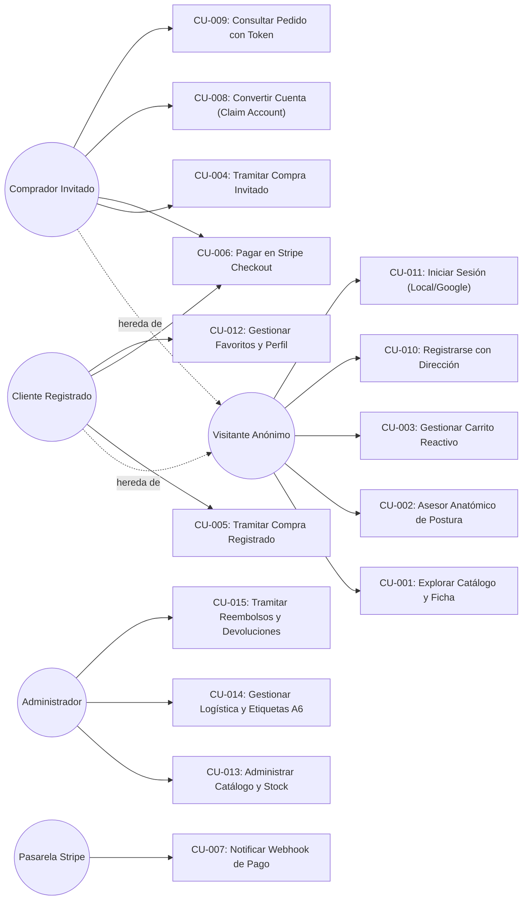
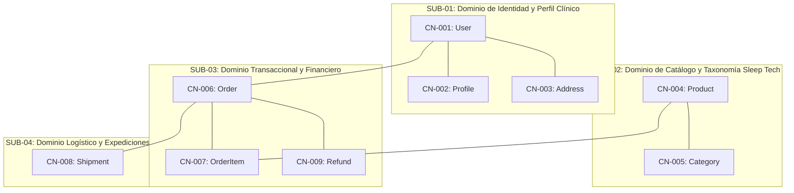

# Anexo II: Documento de Análisis (Métrica v3 — ASI)

**Proyecto:** Reposa+ — E-Commerce Transaccional Especializado en Descanso Ergonómico (*Sleep Tech*)  
**Autor:** Jonathan Quispe  
**Tutor Académico:** Rubén Pérez Chacón  
**Código TFG:** 25-26-C13  
**Institución:** Escuela Politécnica Superior — Universidad Pablo de Olavide (UPO), Sevilla  
**Titulación:** Grado en Ingeniería Informática en Sistemas de Información (Convocatoria: Mayo/Septiembre 2026)  

---

## 1. Control del Documento

### 1.1. Metadatos del Documento
| Propiedad | Valor |
|---|---|
| **Denominación del Documento** | Anexo II: Documento de Análisis (ASI - Análisis de Sistemas de Información) |
| **Proyecto** | Reposa+ (E-Commerce Sleep Tech) |
| **Edición / Versión** | 1.1.0-tfg-final |
| **Fecha de Aprobación** | 18 de Septiembre de 2026 |
| **Autor** | Jonathan Quispe |
| **Organización** | Escuela Politécnica Superior — Universidad Pablo de Olavide |
| **Estado** | Aprobado / Consolidado |

### 1.2. Registro de Cambios
| Versión | Fecha | Autor | Descripción del Cambio |
|---|---|---|---|
| 0.1.0 | 15/05/2026 | Jonathan Quispe | Definición preliminar de requisitos funcionales y casos de uso base. |
| 1.0.0 | 29/08/2026 | Jonathan Quispe | Incorporación de Guest Checkout, Claim Account, Paquetería Estándar y matrices de trazabilidad. |
| 1.1.0 | 18/09/2026 | Jonathan Quispe | Normalización estricta al estándar Métrica v3 UPO, fichas tabulares completas y catálogo de interfaces IU/IF. |

---

## 2. Catálogo de Requisitos del Sistema

### 2.1. Requisitos Funcionales (`RF-xxx`)

#### Módulo 1: Catálogo, Búsqueda y Asesor Anatómico
---
##### Ficha: `RF-001` — Visualización y Exploración del Catálogo de Descanso
* **Código:** `RF-001` | **Versión:** 1.1 | **Autores:** Jonathan Quispe
* **Fuentes:** `OBJ-001`, `OBJ-004`
* **Descripción:**
  - El sistema debe permitir a cualquier visitante (anónimo o autenticado) consultar el catálogo completo de productos con paginación optimizada.
  - Cada tarjeta debe exhibir: imagen de alta fidelidad, denominación comercial, material ergonómico (viscoelástica, látex), firmeza (baja, media, alta), precio (€ con IVA) y estado del stock (en stock, agotado).
* **Actores:** Visitante Anónimo, Cliente Registrado.
* **Comentarios:** Renderizado *above-the-fold* sin bloqueos de hidratación JS.

##### Ficha: `RF-002` — Ficha de Producto y Asesor Anatómico de Postura
* **Código:** `RF-002` | **Versión:** 1.1 | **Autores:** Jonathan Quispe
* **Fuentes:** `OBJ-001`, `OBJ-002`
* **Descripción:**
  - El sistema debe ofrecer una página de detalle con especificaciones biomédicas: postura recomendada (lado, boca arriba, boca abajo), beneficios cervicales, densidad y dimensiones.
  - Debe incorporar un selector numérico de unidades limitado al stock disponible y botón de compra directa.
* **Actores:** Visitante Anónimo, Cliente Registrado.
* **Comentarios:** Incluye marcado semántico estructurado para indexación en buscadores.

##### Ficha: `RF-003` — Búsqueda Multiatributo y Filtrado Dinámico
* **Código:** `RF-003` | **Versión:** 1.1 | **Autores:** Jonathan Quispe
* **Fuentes:** `OBJ-001`, `OBJ-002`
* **Descripción:**
  - El sistema debe filtrar el catálogo en tiempo real por: categoría taxonómica, rango de precios, nivel de firmeza y postura al dormir.
  - La barra de búsqueda global en el encabezado debe procesar coincidencias en título, material y descripción ergonómica.
* **Actores:** Visitante Anónimo, Cliente Registrado.
* **Comentarios:** Filtros sincronizados con la URL mediante parámetros GET limpios.

---
#### Módulo 2: Carrito Reactivo y Tramitación de Pedidos
---
##### Ficha: `RF-004` — Cesta de la Compra Reactiva y Asíncrona
* **Código:** `RF-004` | **Versión:** 1.1 | **Autores:** Jonathan Quispe
* **Fuentes:** `OBJ-001`, `OBJ-003`
* **Descripción:**
  - El sistema debe permitir añadir, modificar cantidades y eliminar productos desde cualquier vista sin recarga completa de página (Fetch AJAX con debounce de 300 ms).
  - El motor `CartCalculator` debe recalcular dinámicamente: subtotal base, desglose de IVA (21%), gastos de envío deterministas y la barra de progreso hacia el umbral de envío gratuito (50,00 €).
* **Actores:** Visitante Anónimo, Cliente Registrado.
* **Comentarios:** El carrito anónimo reside en sesión PHP y se fusiona automáticamente al iniciar sesión.

##### Ficha: `RF-005` — Checkout Híbrido: Compra como Invitado (*Guest Checkout*)
* **Código:** `RF-005` | **Versión:** 1.1 | **Autores:** Jonathan Quispe
* **Fuentes:** `OBJ-001`, `OBJ-004`
* **Descripción:**
  - Los usuarios no registrados deben poder completar la compra introduciendo únicamente: nombre completo, correo electrónico, teléfono y dirección postal de entrega.
  - Al completar el pedido, el sistema debe generar un identificador criptográfico (`guest_token` SHA-256) que faculta el acceso seguro a la pantalla de confirmación y a la factura en PDF.
* **Actores:** Comprador Invitado.
* **Comentarios:** Elimina el abandono de carrito por fricción de registro forzoso.

##### Ficha: `RF-006` — Conversión de Cuenta Post-Compra en un Clic (*Claim Account*)
* **Código:** `RF-006` | **Versión:** 1.1 | **Autores:** Jonathan Quispe
* **Fuentes:** `OBJ-004`
* **Descripción:**
  - En la vista de confirmación del pedido de invitado, el sistema debe ofrecer crear una cuenta con un solo clic, solicitando únicamente la contraseña deseada.
  - Al crearse la cuenta, el sistema debe vincular de forma retroactiva el pedido realizado y la dirección postal al nuevo usuario e iniciar sesión automáticamente.
* **Actores:** Comprador Invitado.
* **Comentarios:** Transforma compradores casuales en clientes recurrentes.

##### Ficha: `RF-007` — Bloqueo Pesimista de Inventario y Prevención de Sobreventas
* **Código:** `RF-007` | **Versión:** 1.1 | **Autores:** Jonathan Quispe
* **Fuentes:** `OBJ-003`
* **Descripción:**
  - Al tramitar el pedido, el sistema debe ejecutar una transacción atómica (`DB::transaction`) y bloquear la fila física del producto mediante `SELECT ... FOR UPDATE` (`lockForUpdate()`).
  - Si dos compradores compiten por la última unidad, la segunda transacción en cola debe ser cancelada con rollback atómico y mensaje de error claro.
* **Actores:** Comprador Invitado, Cliente Registrado.
* **Comentarios:** Validación indispensable para la integridad financiera y de stock.

---
#### Módulo 3: Pasarela de Pagos y Emisión de Documentos
---
##### Ficha: `RF-008` — Procesamiento Seguro con Stripe Checkout
* **Código:** `RF-008` | **Versión:** 1.1 | **Autores:** Jonathan Quispe
* **Fuentes:** `OBJ-005`
* **Descripción:**
  - El sistema debe redirigir al cliente a una sesión de pago segura alojada en Stripe con soporte para tarjeta de crédito, débito y Apple Pay / Google Pay.
  - El servidor local no debe capturar, transmitir ni almacenar datos de tarjetas (cumplimiento PCI-DSS).
* **Actores:** Comprador Invitado, Cliente Registrado, Pasarela Stripe.
* **Comentarios:** Manejo de URL de éxito (`/checkout/success`) y cancelación (`/checkout/cancel`).

##### Ficha: `RF-009` — Notificación Asíncrona vía Webhooks de Stripe
* **Código:** `RF-009` | **Versión:** 1.1 | **Autores:** Jonathan Quispe
* **Fuentes:** `OBJ-005`
* **Descripción:**
  - El sistema debe recibir eventos HTTP `checkout.session.completed` procedentes de Stripe, verificando obligatoriamente la firma HMAC-SHA256 (`webhook_secret`).
  - El sistema debe registrar el `payment_intent_id` y marcar la transacción como procesada de forma estrictamente idempotente.
* **Actores:** Pasarela Stripe Externa.
* **Comentarios:** Tolera caídas de red y retransmisiones de Stripe durante 72 horas.

##### Ficha: `RF-010` — Generación y Descarga Segura de Facturas en Formato PDF
* **Código:** `RF-010` | **Versión:** 1.1 | **Autores:** Jonathan Quispe
* **Fuentes:** `OBJ-001`, `OBJ-004`
* **Descripción:**
  - El sistema debe compilar al vuelo facturas comerciales normalizadas en formato PDF mediante la librería Dompdf, incluyendo desglose de bases imponibles, 21% IVA y datos fiscales.
  - La descarga de facturas de invitados exige la validación del `guest_token`; la de usuarios autenticados exige coincidencia estricta de `user_id` (HTTP 403 en caso contrario).
* **Actores:** Comprador Invitado, Cliente Registrado, Administrador.
* **Comentarios:** El diseño en PDF replica fielmente la identidad sobria *Midnight Sanctuary*.

---
#### Módulo 4: Autenticación, Perfil y Fidelización
---
##### Ficha: `RF-011` — Registro Tradicional con Captura Obligatoria de Dirección
* **Código:** `RF-011` | **Versión:** 1.1 | **Autores:** Jonathan Quispe
* **Fuentes:** `OBJ-002`, `OBJ-004`
* **Descripción:**
  - El formulario de registro debe exigir: nombre, email, contraseña con confirmación, teléfono móvil y los datos postales de envío (calle, ciudad, código postal, provincia).
  - La contraseña se almacena con hash Bcrypt y factor de coste 12.
* **Actores:** Visitante Anónimo.
* **Comentarios:** Garantiza que un usuario registrado pueda comprar en un solo paso posterior.

##### Ficha: `RF-012` — Autenticación Federada con Google OAuth 2.0
* **Código:** `RF-012` | **Versión:** 1.1 | **Autores:** Jonathan Quispe
* **Fuentes:** `OBJ-004`
* **Descripción:**
  - El sistema debe permitir el inicio de sesión y registro mediante Google Identity Services (`google_id`).
  - Si el usuario se autentica con Google por primera vez, el sistema debe redirigir obligatoriamente a una pantalla de *Onboarding* para capturar su dirección de envío postal.
  - Si se inicia sesión con Google desde el checkout, se preserva el contenido del carrito.
* **Actores:** Visitante Anónimo, Cliente Registrado.
* **Comentarios:** Integración mediante Laravel Socialite.

##### Ficha: `RF-013` — Lista de Favoritos y Preferencias Biomecánicas
* **Código:** `RF-013` | **Versión:** 1.1 | **Autores:** Jonathan Quispe
* **Fuentes:** `OBJ-002`
* **Descripción:**
  - Los usuarios autenticados pueden marcar/desmarcar almohadas como favoritas con botón reactivo asíncrono.
  - El perfil de usuario debe permitir almacenar la postura predilecta de descanso y dolencias frecuentes (cervicalgia, insomnio) para recomendaciones personalizadas.
* **Actores:** Cliente Registrado.
* **Comentarios:** Los favoritos alimentan la vista analítica `v_top_favorited_products`.

---
#### Módulo 5: Administración de Back-Office, Logística y Operativa
---
##### Ficha: `RF-014` — Control de Acceso por Roles (RBAC) y Seguridad Administrativa
* **Código:** `RF-014` | **Versión:** 1.1 | **Autores:** Jonathan Quispe
* **Fuentes:** `OBJ-001`
* **Descripción:**
  - El acceso a todas las rutas bajo el prefijo `/admin/*` queda estrictamente restringido a usuarios con campo `role = 'admin'` en la tabla `users` mediante el middleware `admin`.
  - Intentos de acceso por clientes regulares o invitados son rechazados con código HTTP 403 Forbidden.
* **Actores:** Administrador.
* **Comentarios:** Separación absoluta entre capas de presentación pública y back-office.

##### Ficha: `RF-015` — Gestión CRUD de Catálogo, Categorías y Control de Stock
* **Código:** `RF-015` | **Versión:** 1.1 | **Autores:** Jonathan Quispe
* **Fuentes:** `OBJ-001`, `OBJ-002`
* **Descripción:**
  - El administrador puede dar de alta, editar, previsualizar y desactivar productos, administrando precios, materiales, posturas y nivel de stock disponible.
  - Permite la gestión de categorías taxonómicas y asociación de múltiples categorías por producto.
* **Actores:** Administrador.
* **Comentarios:** Soporte para subida de fotografías de producto con almacenamiento gestionado.

##### Ficha: `RF-016` — Gestión Logística, Seguimiento Postal y Albaranes Térmicos A6
* **Código:** `RF-016` | **Versión:** 1.1 | **Autores:** Jonathan Quispe
* **Fuentes:** `OBJ-006`
* **Descripción:**
  - El panel administrativo debe mostrar el listado de expediciones (`shipments`), permitiendo avanzar el estado logístico (`pre-transit` $\rightarrow$ `in_transit` $\rightarrow$ `delivered`).
  - La actualización de la paquetería sincroniza automáticamente el estado del pedido asociado.
  - El sistema debe renderizar etiquetas térmicas de expedición estándar A6 (10x15 cm) con código de barras Code 128 y código `RPX...ES` para el transportista.
* **Actores:** Administrador.
* **Comentarios:** Vista optimizada para impresión directa en impresoras térmicas de almacén.

##### Ficha: `RF-017` — Reembolsos Integrales Auditados y Reposición de Stock
* **Código:** `RF-017` | **Versión:** 1.1 | **Autores:** Jonathan Quispe
* **Fuentes:** `OBJ-003`, `OBJ-005`
* **Descripción:**
  - El administrador puede tramitar reembolsos de pedidos en estados terminales o completados.
  - Si el pedido fue abonado mediante Stripe, el sistema invoca la API `Stripe::refunds->create()` de forma segura; si fue pago directo, regulariza el estado a `refunded`.
  - En ambos casos, el sistema repone automáticamente el inventario de los productos y cancela el albarán logístico.
* **Actores:** Administrador, Pasarela Stripe.
* **Comentarios:** Transacción con auditoría en la tabla `refunds`.

---

### 2.2. Requisitos No Funcionales (`RNF-xxx`)

| Código | Categoría | Denominación | Especificación Técnica |
|---|---|---|---|
| **RNF-001** | Tecnología | Framework y Lenguaje | Backend desarrollado sobre **Laravel 11/12+** ejecutado bajo **PHP 8.4** nativo en contenedores Linux optimizados. |
| **RNF-002** | Seguridad | Criptografía y Hash | Almacenamiento de contraseñas con **Bcrypt (cost 12)**; protección contra SQL Injection vía PDO/Eloquent; protección obligatoria contra ataques **CSRF** en todos los formularios `POST`/`PUT`/`DELETE`. |
| **RNF-003** | Transaccional | Concurrencia ACID | Toda operación de compra debe ejecutarse bajo transacciones ACID con aislamiento de nivel `READ COMMITTED` y bloqueo pesimista `SELECT ... FOR UPDATE`. |
| **RNF-004** | Rendimiento | Tiempo de Respuesta | El tiempo de respuesta de servidor (**TTFB**) para páginas de catálogo debe situarse por debajo de **120 ms** mediante la precomputación de consultas en vistas SQL nativas y *Eager Loading* de relaciones. |
| **RNF-005** | Usabilidad | Diseño UI/UX y a11y | Interfaz responsive basada en **Bootstrap 5** adaptada a la estética *"The Midnight Sanctuary"* (paleta índigo/pizarra), cumpliendo contrastes **WCAG 2.1 AA** en componentes clave. |
| **RNF-006** | Internacional | Soporte Multi-idioma | La aplicación debe ser bilingüe (**Español / Inglés**) con cambio dinámico de idioma en cabecera, persistiendo la selección en sesión mediante el middleware `SetLocale`. |

---

## 3. Matriz de Trazabilidad: Objetivos vs. Requisitos

La siguiente matriz cruzada verifica que todos los objetivos del proyecto están cubiertos por requisitos funcionales y no funcionales, garantizando que no existan requisitos huérfanos:

| Requisito | OBJ-001 | OBJ-002 | OBJ-003 | OBJ-004 | OBJ-005 | OBJ-006 | OBJ-007 | OBJ-008 |
|---|:---:|:---:|:---:|:---:|:---:|:---:|:---:|:---:|
| **RF-001** (Catálogo de Descanso) | **X** | | | **X** | | | | |
| **RF-002** (Ficha y Asesor) | **X** | **X** | | | | | | |
| **RF-003** (Búsqueda y Filtros) | **X** | **X** | | | | | | |
| **RF-004** (Carrito Reactivo) | **X** | | **X** | | | | | |
| **RF-005** (Guest Checkout) | **X** | | | **X** | | | | |
| **RF-006** (Claim Account) | | | | **X** | | | | |
| **RF-007** (Bloqueo Pesimista) | | | **X** | | | | | |
| **RF-008** (Stripe Checkout) | | | | | **X** | | | |
| **RF-009** (Webhooks Stripe) | | | | | **X** | | | |
| **RF-010** (Facturas en PDF) | **X** | | | **X** | | | | |
| **RF-011** (Registro con Dirección) | | **X** | | **X** | | | | |
| **RF-012** (Google OAuth 2.0) | | | | **X** | | | | |
| **RF-013** (Favoritos y Perfil) | | **X** | | | | | | |
| **RF-014** (RBAC Administración) | **X** | | | | | | | |
| **RF-015** (CRUD Inventario) | **X** | **X** | | | | | | |
| **RF-016** (Logística y Etiquetas A6)| | | | | | **X** | | |
| **RF-017** (Reembolsos Auditados) | | | **X** | | **X** | | | |
| **RNF-001 a 006** (Arquitectura) | **X** | **X** | **X** | **X** | **X** | **X** | **X** | **X** |

---

## 4. Actores del Sistema y Diagrama Global de Casos de Uso

### 4.1. Catálogo de Actores
1. **Visitante Anónimo:** Usuario no autenticado que navega libremente por la tienda, utiliza el asesor anatómico de postura, consulta fichas y añade artículos al carrito en sesión.
2. **Comprador Invitado (*Guest*):** Usuario anónimo que tramita un pedido suministrando sus datos de envío y facturación sin crear una cuenta de usuario, accediendo mediante `guest_token`.
3. **Cliente Registrado:** Usuario autenticado con credenciales locales o Google OAuth que gestiona su libreta de direcciones, historial de pedidos y lista de favoritos.
4. **Administrador:** Usuario con credenciales privilegiadas que opera el back-office `/admin`, controlando el inventario, las expediciones de paquetería y los reembolsos.
5. **Pasarela Stripe (Actor Externo):** Sistema bancario externo que procesa los cobros y emite eventos HTTP asíncronos hacia los webhooks del sistema.

### 4.2. Diagrama Global de Casos de Uso (UML)

---

## 5. Especificación de Casos de Uso Principales (`CU-xxx`)

---
### Ficha: `CU-004` — Tramitar Compra como Invitado (*Guest Checkout*)
* **Código:** `CU-004` | **Versión:** 1.1 | **Autores:** Jonathan Quispe
* **Actores:** Comprador Invitado.
* **Precondición:** El usuario tiene al menos una unidad de producto en el carrito de sesión.
* **Postcondición:** Se crea un registro en `orders` con estado `pending`/`processing`, se descuenta el stock de forma atómica y se genera un `guest_token`.
* **Puntos de Extensión:** `<<extend>>` `CU-006: Pagar en Stripe Checkout`.
* **Flujo Normal:**
  1. El usuario accede a la vista de Checkout (`/checkout`).
  2. El sistema detecta que el usuario no tiene sesión activa y despliega el formulario simplificado de invitado junto con el resumen económico reactivo.
  3. El usuario completa los campos obligatorios: nombre, email, teléfono, dirección postal, ciudad, código postal y provincia.
  4. El usuario selecciona el método de pago deseado (Pago directo de prueba o Tarjeta vía Stripe Checkout) y pulsa *"Completar Pedido"*.
  5. El sistema inicia una transacción de base de datos con bloqueo pesimista `lockForUpdate()` sobre los productos implicados.
  6. El sistema verifica que existe stock suficiente para todos los ítems.
  7. El sistema decrementa el stock de cada producto.
  8. El sistema persiste el pedido en `orders` con `user_id = NULL`, un `guest_token` criptográfico y las líneas de detalle inmutables en `order_items`.
  9. El sistema genera la expedición logística en `shipments` con código `RPX...ES`.
  10. El sistema vacía el carrito de la sesión y redirige a la vista de confirmación (`/orders/{id}?token={guest_token}`).
* **Flujos Alternativos:**
  - **6.a. Stock insuficiente en uno o más productos:**
    1. El sistema realiza rollback completo de la transacción.
    2. El sistema redirige al carrito de la compra con un mensaje de alerta: *"El producto [Nombre] se ha agotado o no dispone de las unidades solicitadas"*.
    3. El flujo finaliza sin generar pedido.
  - **4.a. El usuario selecciona Stripe Checkout:**
    1. Se bifurca hacia el caso de uso `CU-006`.

---
### Ficha: `CU-006` — Pago Seguro en Pasarela Stripe Checkout
* **Código:** `CU-006` | **Versión:** 1.1 | **Autores:** Jonathan Quispe
* **Actores:** Comprador Invitado, Cliente Registrado, Pasarela Stripe.
* **Precondición:** Formulario de checkout validado y datos de envío persistidos en sesión.
* **Postcondición:** Redirección a Stripe; si el pago es exitoso, retorno a la página de confirmación.
* **Flujo Normal:**
  1. El sistema contacta con la API de Stripe creando una sesión `Stripe\Checkout\Session` con los ítems del carrito y las URLs de retorno.
  2. El sistema almacena en la sesión del usuario los datos de envío y redirige al checkout seguro alojado por Stripe.
  3. El cliente introduce los datos de su tarjeta de crédito bancaria en el formulario protegido de Stripe y valida la operación (3D Secure).
  4. Stripe procesa el cargo y redirige al navegador a `/checkout/success?session_id={CHECKOUT_SESSION_ID}`.
  5. El sistema recupera la sesión de Stripe, valida el estado de pago, crea la orden formal con `payment_id` e invoca la confirmación de pedido.
* **Flujos Alternativos:**
  - **3.a. El cliente cancela la operación en Stripe:**
    1. Stripe redirige al navegador a `/checkout/cancel`.
    2. El sistema restaura los datos del formulario desde la sesión para evitar que el usuario deba reescribirlos.
    3. El sistema muestra un mensaje informativo en el carrito: *"El pago ha sido cancelado. Tus productos siguen en la cesta."*

---
### Ficha: `CU-008` — Conversión de Cuenta en un Clic (*Claim Account*)
* **Código:** `CU-008` | **Versión:** 1.1 | **Autores:** Jonathan Quispe
* **Actores:** Comprador Invitado.
* **Precondición:** El usuario se encuentra en la pantalla de confirmación de un pedido recién completado con `guest_token` válido.
* **Postcondición:** Se crea el usuario en `users`, se le asigna la dirección postal y el pedido pasa a tener su `user_id`.
* **Flujo Normal:**
  1. El comprador visualiza en la confirmación de pedido el panel *"Crea tu cuenta en 1 clic para rastrear tu envío"*.
  2. El sistema muestra su correo electrónico pre-rellenado (solo lectura) y solicita una contraseña segura.
  3. El comprador introduce la contraseña y presiona *"Activar mi Cuenta"*.
  4. El sistema valida que la contraseña cumpla los requisitos mínimos (8 caracteres).
  5. El sistema crea el registro en `users` con rol `user` y crea su perfil clínico en `profiles`.
  6. El sistema crea la dirección postal en `addresses` asociada al nuevo usuario con los datos del pedido.
  7. El sistema actualiza el pedido en `orders`, asignándole el nuevo `user_id`.
  8. El sistema autentica automáticamente al usuario en la sesión y recarga la vista, mostrando el panel de usuario con su pedido ya integrado en el historial.
* **Flujos Alternativos:**
  - **5.a. El correo electrónico ya pertenecía a un usuario registrado previamente:**
    1. El sistema solicita al usuario introducir su contraseña preexistente para vincular el pedido a su cuenta.

---
### Ficha: `CU-014` — Gestión Logística y Emisión de Albarán Térmico A6
* **Código:** `CU-014` | **Versión:** 1.1 | **Autores:** Jonathan Quispe
* **Actores:** Administrador.
* **Precondición:** Sesión activa con rol `admin`; existen pedidos en estado `processing` o `shipped`.
* **Postcondición:** Albarán térmico impreso/visualizado y avance de estado logístico sincronizado.
* **Flujo Normal:**
  1. El administrador accede al panel de pedidos (`/admin/orders`).
  2. Localiza el pedido en estado `processing` y pulsa *"Ver Albarán / Etiqueta A6"*.
  3. El sistema abre la vista de expedición (`/admin/shipments/{id}/label`) renderizando el albarán normalizado de 10x15 cm con remitente (Almacén Central Reposa+), destinatario, código postal, instrucciones de entrega y código de barras Code 128.
  4. El administrador presiona *"Imprimir Etiqueta"* (disparando `window.print()` con CSS `@media print` calibrado a 100x150 mm).
  5. El administrador regresa al panel y pulsa el botón *"Avanzar a En Tránsito"*.
  6. El sistema actualiza la expedición en `shipments` a `in_transit` y, de forma sincronizada, transiciona el pedido a estado `shipped`, registrando la fecha de envío.
* **Flujos Alternativos:**
  - **5.a. El pedido ya se encuentra en estado terminal (`delivered`, `completed`, `cancelled`):**
    1. El sistema deshabilita el botón de avance y muestra la etiqueta en modo histórico.

---

## 6. Matriz de Trazabilidad: Requisitos Funcionales vs. Casos de Uso

| Caso de Uso | RF-001 | RF-002 | RF-003 | RF-004 | RF-005 | RF-006 | RF-007 | RF-008 | RF-009 | RF-010 | RF-011 | RF-012 | RF-013 | RF-014 | RF-015 | RF-016 | RF-017 |
|---|:---:|:---:|:---:|:---:|:---:|:---:|:---:|:---:|:---:|:---:|:---:|:---:|:---:|:---:|:---:|:---:|:---:|
| **CU-001** (Catálogo) | **X** | **X** | | | | | | | | | | | | | | | |
| **CU-002** (Asesor) | | **X** | **X** | | | | | | | | | | | | | | |
| **CU-003** (Carrito) | | | | **X** | | | | | | | | | | | | | |
| **CU-004** (Guest Checkout) | | | | | **X** | | **X** | | | | | | | | | | |
| **CU-005** (Checkout Auth) | | | | | | | **X** | | | | | | | | | | |
| **CU-006** (Stripe Checkout) | | | | | | | | **X** | | | | | | | | | |
| **CU-007** (Webhook Stripe) | | | | | | | | | **X** | | | | | | | | |
| **CU-008** (Claim Account) | | | | | | **X** | | | | | **X** | | | | | | |
| **CU-009** (Token y Factura) | | | | | | | | | | **X** | | | | | | | |
| **CU-010** (Registro Onboard)| | | | | | | | | | | **X** | | | | | | |
| **CU-011** (Google OAuth) | | | | | | | | | | | | **X** | | | | | |
| **CU-012** (Favoritos) | | | | | | | | | | | | | **X** | | | | |
| **CU-013** (CRUD Inventario) | | | | | | | | | | | | | | **X** | **X** | | |
| **CU-014** (Logística A6) | | | | | | | | | | | | | | **X** | | **X** | |
| **CU-015** (Reembolsos) | | | | | | | **X** | **X** | | | | | | **X** | | | **X** |

---

## 7. Subsistemas de Análisis y Clases de Negocio (`CN-xxx`)

El sistema se divide en cuatro subsistemas lógicos de análisis:

### Fichas Resumidas de Clases de Negocio
* **`CN-001` (`User`):** Gestiona credenciales de acceso, rol administrativo (`admin`/`user`) e identificador federado (`google_id`). Participa en `CU-005`, `CU-008`, `CU-010`, `CU-011`.
* **`CN-002` (`Profile`):** Relación 1:1 con `User`. Almacena teléfono de contacto y preferencias biomecánicas (postura, afecciones musculoesqueléticas). Participa en `CU-010`, `CU-012`.
* **`CN-003` (`Address`):** Relación 1:N con `User`. Modela direcciones postales estructuradas (calle, código postal, ciudad, provincia) y flag de dirección principal. Participa en `CU-004`, `CU-005`, `CU-010`.
* **`CN-004` (`Product`):** Entidad central de catálogo. Atributos: `name` (JSON multilingüe), `description`, `price`, `stock`, `material`, `firmness`, `sleeping_posture`. Métodos de negocio: `isInStock()`, `hasStock($qty)`, `calculateSubtotal($qty)`. Participa en `CU-001`, `CU-002`, `CU-003`, `CU-004`, `CU-013`.
* **`CN-005` (`Category`):** Clasificación jerárquica de almohadas (ej. Cervicales, Viscoelásticas, Viscocool, Antirronquidos). Participa en `CU-001`, `CU-013`.
* **`CN-006` (`Order`):** Cabecera transaccional. Atributos: `order_number`, `status`, `total_amount`, `shipping_amount`, `guest_token`, `payment_method`, `payment_id`. Encapsula el autómata de estados finitos (`ALLOWED_TRANSITIONS`) y validación de terminalidad. Participa en `CU-004`, `CU-005`, `CU-006`, `CU-007`, `CU-014`, `CU-015`.
* **`CN-007` (`OrderItem`):** Detalle histórico inmutable. Almacena `product_id`, `product_name`, `quantity` y `unit_price` congelado al momento de la compra. Participa en `CU-004`, `CU-005`, `CU-009`.
* **`CN-008` (`Shipment`):** Expedición de paquetería. Atributos: `tracking_number` (`RPX...ES`), `carrier_name`, `shipping_status`, `label_path`, `shipped_at`, `delivered_at`. Participa en `CU-004`, `CU-014`.

---

## 8. Catálogo de Interfaces de Usuario (`IU-xxx`)

---
### Ficha: `IU-001` — Catálogo General y Storefront "The Midnight Sanctuary"
* **Código:** `IU-001` | **Nombre:** Storefront Principal y Parrilla de Productos
* **Propósito:** Presentar la oferta comercial con diseño sereno nocturno, facilitando la exploración sensorial y el filtrado ergonómico.
* **Estructura Visual:**
  - Barra superior con selector de idioma (ES/EN), buscador reactivo y acceso a carrito/perfil.
  - Hero banner *"The Midnight Sanctuary"* con propuesta de valor de salud y botones de acción primaria.
  - Barra de descubrimiento con chips fotográficos de categoría y botón desplegable del Asesor Anatómico.
  - Parrilla de tarjetas de almohada con imagen, etiquetas de firmeza/postura, precio y botón *"Añadir al Carrito"*.
* **Tabla de Controles de Entrada:**
  | Nombre del Campo | Tipo de Control | Consulta / Edición | Obligatorio | Descripción de Negocio |
  |---|---|---|---|---|
  | `search` | Input Text | Edición | No | Filtro de texto libre sobre nombre y propiedades ergonómicas. |
  | `category` | Botones Chip | Edición | No | Selección de categoría taxonómica activa. |
  | `posture` | Select Dropdown | Edición | No | Filtrado según la postura al dormir (Lado, Supino, Prono). |
* **Tabla de Botones y Enlaces:**
  | Botón / Control | Acción Disparada |
  |---|---|
  | *Añadir al Carrito* | Petición asíncrona Fetch POST a `/cart/add`, animación de elevación y apertura de Toast verde. |
  | *Ver Detalle* | Navegación a la ficha de producto individual (`/products/{id}`). |
  | *Cambiar Idioma* | Petición POST a `/language` y alternancia dinámica entre diccionarios ES/EN. |

---
### Ficha: `IU-002` — Cesta de la Compra Reactiva y Desglose Económico
* **Código:** `IU-002` | **Nombre:** Vista de Carrito de Compra (`/cart`)
* **Propósito:** Mostrar los productos preseleccionados, permitiendo ajustar unidades y observar en tiempo real el progreso de envío gratuito.
* **Tabla de Controles de Entrada:**
  | Nombre del Campo | Tipo de Control | Consulta / Edición | Obligatorio | Descripción de Negocio |
  |---|---|---|---|---|
  | `quantity` | Input Number (+/-) | Edición | Sí | Número de unidades deseadas (limitado entre 1 y stock disponible). |
* **Tabla de Botones y Enlaces:**
  | Botón / Control | Acción Disparada |
  |---|---|
  | *Aumentar/Disminuir* | Petición AJAX inmediata con recálculo debounced de subtotal, IVA y envío. |
  | *Eliminar Producto* | Confirmación y eliminación del ítem con transición de fade out. |
  | *Tramitar Pedido* | Navegación hacia la pantalla de Checkout (`/checkout`). |

---
### Ficha: `IU-003` — Pantalla de Checkout Adaptativo (Invitado / Registrado)
* **Código:** `IU-003` | **Nombre:** Formulario de Checkout (`/checkout`)
* **Propósito:** Capturar los datos de entrega y procesar el cobro con la mínima fricción posible.
* **Tabla de Controles de Entrada:**
  | Nombre del Campo | Tipo de Control | Consulta / Edición | Obligatorio | Descripción de Negocio |
  |---|---|---|---|---|
  | `shipping_name` | Input Text | Edición | Sí | Nombre y apellidos completos del receptor. |
  | `shipping_email` | Input Email | Edición | Sí | Correo electrónico de contacto y envío de confirmación. |
  | `shipping_phone` | Input Tel | Edición | Sí | Teléfono móvil para el transportista. |
  | `shipping_address`| Input Text | Edición | Sí | Dirección de entrega (calle, número, piso/puerta). |
  | `shipping_city` | Input Text | Edición | Sí | Población / Municipio. |
  | `shipping_zip` | Input Text | Edición | Sí | Código postal de 5 dígitos (validación regex `^\d{5}$`). |
  | `payment_method` | Radio Buttons | Edición | Sí | Selección entre *"Pago Directo (Prueba)"* o *"Tarjeta / Stripe"*. |
* **Tabla de Botones y Enlaces:**
  | Botón / Control | Acción Disparada |
  |---|---|
  | *Pagar con Stripe* | Envío del formulario y redirección a la sesión segura de Stripe Checkout. |
  | *Confirmar Pedido Directo* | Creación transaccional inmediata del pedido y redirección a confirmación. |

---
### Ficha: `IU-004` — Confirmación de Pedido, Token y Conversión de Cuenta
* **Código:** `IU-004` | **Nombre:** Confirmación de Pedido (`/orders/{id}`)
* **Propósito:** Notificar el éxito de la transacción, proveer el código de seguimiento logístico, enlace de factura y conversión en un clic.
* **Tabla de Controles de Entrada:**
  | Nombre del Campo | Tipo de Control | Consulta / Edición | Obligatorio | Descripción de Negocio |
  |---|---|---|---|---|
  | `password` | Input Password | Edición | No | Contraseña para activar la cuenta de usuario (sección Claim Account). |
* **Tabla de Botones y Enlaces:**
  | Botón / Control | Acción Disparada |
  |---|---|
  | *Descargar Factura PDF* | Petición GET a `/orders/{id}/invoice?token={token}` y descarga del archivo. |
  | *Activar mi Cuenta* | Petición POST a `/orders/{id}/claim-account`, creación de usuario e inicio de sesión. |

---
### Ficha: `IU-005` — Panel de Gestión de Pedidos y Logística (Back-Office)
* **Código:** `IU-005` | **Nombre:** Panel Administrativo de Pedidos (`/admin/orders`)
* **Propósito:** Proporcionar al administrador una vista panorámica de alta densidad operativa sobre todos los pedidos y su sincronización logística.
* **Estructura Visual:**
  - Filtros rápidos por estado de pedido y estado logístico.
  - Tabla de pedidos con 9 columnas normalizadas: ID, Fecha, Cliente/Invitado, Total, Estado del Pedido (badge cromático), Método de Cobro (badge distintivo Stripe vs Directo), Seguimiento Postal (`RPX...ES`), Estado de Envío y Botones de Acción.
* **Tabla de Botones y Enlaces:**
  | Botón / Control | Acción Disparada |
  |---|---|
  | *Avanzar Envío* | Transiciona el envío (`in_transit` / `delivered`) y actualiza el pedido en paralelo. |
  | *Ver Albarán A6* | Abre la ventana de impresión térmica de la etiqueta con código de barras. |
  | *Reembolsar* | Dispara modal de confirmación y procesa el reembolso (Stripe o Directo) reponiendo stock. |

---

## 9. Catálogo de Módulos de Informe (`IF-xxx`)

### Ficha: `IF-001` — Dashboard de Rendimiento Operativo de Ventas (`v_order_summary`)
* **Código:** `IF-001` | **Nombre:** Resumen Ejecutivo de Pedidos
* **Objetivo:** Ofrecer al equipo gestor una radiografía instantánea del volumen de facturación y distribución de pedidos.
* **Origen de Datos:** Vista SQL nativa `v_order_summary`.
* **Campos del Informe:**
  | Campo | Tipo | Criterio de Ordenación | Descripción |
  |---|---|---|---|
  | `order_date` | Fecha (YYYY-MM-DD) | 1, Descendente | Día de tramitación de las transacciones. |
  | `total_orders` | Entero | — | Conteo global de pedidos tramitados en el día. |
  | `gross_revenue` | Decimal (2 dec, €) | — | Facturación bruta acumulada (sumatorio de `total_amount`). |
  | `completed_orders`| Entero | — | Pedidos cerrados y entregados satisfactoriamente. |
  | `refunded_orders` | Entero | — | Número de pedidos devueltos con reposición de inventario. |

---
### Ficha: `IF-002` — Informe de Demanda y Expectativas de Compra (`v_top_favorited_products`)
* **Código:** `IF-002` | **Nombre:** Almohadas Más Deseadas / Lista de Favoritos
* **Objetivo:** Informar al departamento de aprovisionamiento sobre las almohadas con mayor intención de compra para evitar roturas de stock.
* **Origen de Datos:** Vista SQL nativa `v_top_favorited_products`.
* **Campos del Informe:**
  | Campo | Tipo | Criterio de Ordenación | Descripción |
  |---|---|---|---|
  | `favorited_count` | Entero | 1, Descendente | Número de usuarios que han añadido la almohada a su lista de favoritos. |
  | `product_id` | Entero | — | Identificador único del producto. |
  | `product_name` | Cadena | — | Denominación comercial del producto. |
  | `current_stock` | Entero | — | Unidades físicas disponibles actualmente en almacén. |
  | `unit_price` | Decimal (2 dec, €) | — | Precio de venta vigente. |

---
### Ficha: `IF-003` — Albarán de Expedición y Etiqueta Térmica A6 (10x15 cm)
* **Código:** `IF-003` | **Nombre:** Etiqueta de Paquetería Estándar para Almacén
* **Objetivo:** Generar el documento físico adherible al paquete de expedición, conforme a las directrices de los operadores logísticos nacionales.
* **Campos del Informe:**
  - Logotipo del transportista (Correos Express / Reposa+ Logística).
  - Bloque de Remitente: Almacén Central Reposa+, Polígono Industrial La Isla, 41013 Sevilla.
  - Bloque de Destinatario: Nombre, dirección postal completa, código postal, población y teléfono.
  - Código de Seguimiento: Formato normalizado `/^RPX\d{4}\d{6}ES$/`.
  - Código de Barras: Renderizado vectorial en formato **Code 128** legible por escáneres láser y ópticos de paquetería.
  - Matriz de Servicio: Tarifa Estándar 48/72h o Entrega Urgente 24h.

---

## 10. Matriz de Trazabilidad: Interfaces e Informes vs. Actores

| Interfaz / Informe | Visitante Anónimo | Comprador Invitado | Cliente Registrado | Administrador | Pasarela Stripe |
|---|:---:|:---:|:---:|:---:|:---:|
| **IU-001** (Storefront Midnight) | **X** | **X** | **X** | | |
| **IU-002** (Carrito Reactivo) | **X** | **X** | **X** | | |
| **IU-003** (Checkout Adaptativo) | | **X** | **X** | | |
| **IU-004** (Confirmación / Claim) | | **X** | **X** | | |
| **IU-005** (Panel Admin Pedidos) | | | | **X** | |
| **IF-001** (Resumen de Ventas) | | | | **X** | |
| **IF-002** (Demanda Favoritos) | | | | **X** | |
| **IF-003** (Etiqueta Térmica A6) | | | | **X** | |

---

## 11. Plan de Pruebas de Aceptación del Sistema

Para la aceptación definitiva del software por parte del tribunal y los usuarios de negocio, se han ejecutado y verificado las siguientes pruebas de alto nivel:

| Cód. Prueba | Descripción del Escenario | Criterio de Aceptación Cuantificable | Resultado |
|---|---|---|---|
| **PA-01** | Búsqueda por dolencia cervical en el storefront. | La parrilla filtra en <100ms mostrando almohadas con etiqueta "Cervical" y ergonomía adecuada. | **APROBADO** |
| **PA-02** | Adición y modificación de unidades en carrito. | El subtotal, el IVA al 21% y la bonificación de envío gratis (>=50€) se recalculan sin parpadeos. | **APROBADO** |
| **PA-03** | Compra concurrente sobre la última unidad de stock. | Solo una compra se aprueba; la segunda sufre rollback atómico informando de falta de stock. | **APROBADO** |
| **PA-04** | Compra como invitado con pago directo. | Se genera el pedido con `guest_token`; la confirmación y el albarán logístico se emiten con éxito. | **APROBADO** |
| **PA-05** | Activación de cuenta en un clic (*Claim Account*). | Se crea el usuario, se le asigna la dirección del pedido y el pedido aparece en su nuevo perfil. | **APROBADO** |
| **PA-06** | Acceso a factura de invitado sin token. | El servidor intercepta la petición y responde estrictamente con código HTTP 403 Forbidden. | **APROBADO** |
| **PA-07** | Pago en Stripe y cancelación voluntaria. | Al pulsar "Atrás", el BFCache restaura el carrito y los datos de formulario sin botones bloqueados. | **APROBADO** |
| **PA-08** | Autenticación con Google OAuth 2.0. | Nuevos usuarios son dirigidos al onboarding obligatorio de dirección postal antes de comprar. | **APROBADO** |
| **PA-09** | Avance logístico de expedición en Back-Office. | Cambiar el envío a `in_transit` actualiza automáticamente el pedido a `shipped` en la base de datos. | **APROBADO** |
| **PA-10** | Reembolso administrativo en Stripe / Directo. | El pedido pasa a `refunded`, se repone el stock automáticamente y se inhabilita el avance logístico. | **APROBADO** |

---

## 12. Glosario de Términos

### 12.1. Términos del Dominio de Negocio (*Sleep Tech* y E-Commerce)
* **Descanso Ergonómico (*Sleep Tech*):** Sector de la salud y el bienestar enfocado en optimizar la alineación de la columna vertebral y la fase de sueño REM mediante materiales tecnológicos avanzados (espuma viscoelástica termo-regulable, látex microperforado).
* **Firmeza Biomecánica:** Nivel de resistencia y sustentación que ofrece la almohada según la antropometría del usuario y su postura de descanso principal (baja para dormir prono, media para supino, alta para posición lateral).
* **Guest Checkout (Compra como Invitado):** Patrón de diseño de embudo transaccional que permite a los usuarios comprar sin la fricción de registrar una cuenta previamente, reduciendo el abandono de carrito.
* **Claim Account (Reclamación de Cuenta):** Mecanismo post-venta en el que un comprador invitado consolida sus datos en una cuenta permanente con un solo clic tras pagar.
* **Albarán Térmico A6 (100x150 mm):** Formato estándar internacional de etiqueta autoadhesiva utilizada en logística de paquetería para etiquetar bultos con códigos de barras.

### 12.2. Términos Tecnológicos y de Ingeniería de Software
* **Bloqueo Pesimista (`lockForUpdate`):** Estrategia de control de concurrencia en bases de datos relacionales (InnoDB) que bloquea a nivel de fila los registros leídos durante una transacción hasta que esta se consolida (`commit`) o revierte (`rollback`), evitando condiciones de carrera.
* **Idempotencia:** Propiedad de una operación según la cual múltiples ejecuciones idénticas producen exactamente el mismo efecto que una sola ejecución (crucial para procesar webhooks de pago duplicados).
* **BFCache (*Back-Forward Cache*):** Mecanismo de optimización de los navegadores que guarda una instantánea completa de la página en memoria para recuperaciones ultrarrápidas al usar los botones de navegación; requiere neutralización de eventos `pageshow` para desbloquear botones.
* **Testing Trophy (Trofeo de Pruebas):** Modelo de aseguramiento de la calidad propuesto por Kent C. Dodds y Martin Fowler que asigna el mayor esfuerzo a las pruebas de integración contra bases de datos reales, complementadas con pruebas unitarias en memoria y pruebas E2E en navegadores reales.
* **Métrica v3:** Metodología formal de desarrollo de sistemas de información promovida por la Administración Pública Española y adoptada por la Universidad Pablo de Olavide para estructurar la planificación, análisis y diseño del software.
