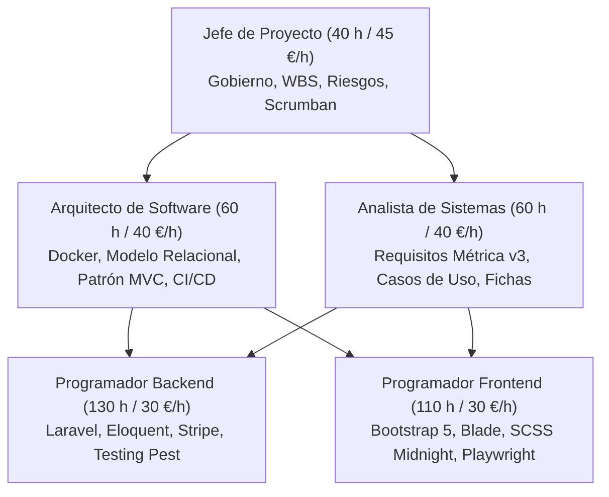

# Anexo I: Plan de Proyecto (Métrica v3 — PSI)

**Proyecto:** Reposa+ — E-Commerce Transaccional Especializado en Descanso Ergonómico (*Sleep Tech*)  
**Autor:** Jonathan Quispe  
**Tutor Académico:** Rubén Pérez Chacón  
**Código TFG:** 25-26-C13  
**Institución:** Escuela Politécnica Superior — Universidad Pablo de Olavide (UPO), Sevilla  
**Titulación:** Grado en Ingeniería Informática en Sistemas de Información (Convocatoria: Mayo/Septiembre 2026)  

---

## 1. Control del Documento

### 1.1. Metadatos del Documento
| Propiedad | Valor |
|---|---|
| **Denominación del Documento** | Anexo I: Plan de Proyecto (PSI - Planificación de Sistemas de Información) |
| **Proyecto** | Reposa+ (E-Commerce Sleep Tech) |
| **Edición / Versión** | 1.1.0-tfg-final |
| **Fecha de Aprobación** | 18 de Septiembre de 2026 |
| **Autor** | Jonathan Quispe |
| **Organización** | Escuela Politécnica Superior — Universidad Pablo de Olavide |
| **Estado** | Aprobado / Consolidado |

### 1.2. Registro de Cambios
| Versión | Fecha | Autor | Descripción del Cambio |
|---|---|---|---|
| 0.1.0 | 15/04/2026 | Jonathan Quispe | Definición inicial de objetivos y WBS preliminar. |
| 1.0.0 | 29/08/2026 | Jonathan Quispe | Consolidación del Core Transaccional, estimación de 400 horas y asignación de perfiles de mercado. |
| 1.1.0 | 18/09/2026 | Jonathan Quispe | Adaptación estricta al estándar formal Métrica v3 UPO, catálogo OBJ formalizado y cierre presupuestario. |

---

## 2. Catálogo de Objetivos del Proyecto (`OBJ-xxx`)

El proyecto persigue diseñar, construir y certificar un ecosistema transaccional de comercio electrónico a medida, combinando el rigor del modelado formal de datos con la resiliencia en pasarelas de pago y la experiencia de usuario (*UX*) adaptada a la salud postural.

### Ficha: `OBJ-001` — Plataforma de Comercio Electrónico Especializada a Medida
| Campo | Detalle |
|---|---|
| **Código** | `OBJ-001` |
| **Versión** | 1.1 |
| **Autores** | Jonathan Quispe |
| **Fuente** | Propuesta inicial de TFG / Escuela Politécnica Superior UPO |
| **Descripción** | Diseñar y desarrollar un sistema web transaccional completo a medida en Laravel 11/12+ y Bootstrap 5 enfocado en el descanso ergonómico (*Sleep Tech*), prescindiendo de CMS empaquetados para garantizar control milimétrico sobre la lógica de negocio, la seguridad y el rendimiento. |
| **Importancia** | Alta |
| **Estado** | Aprobado / Implementado |
| **Comentarios** | Constituye el núcleo general del proyecto y la justificación de ingeniería. |

### Ficha: `OBJ-002` — Arquitectura Relacional y Modelado Formal de Dominio
| Campo | Detalle |
|---|---|
| **Código** | `OBJ-002` |
| **Versión** | 1.1 |
| **Autores** | Jonathan Quispe |
| **Fuente** | Directrices de Ingeniería de Bases de Datos UPO |
| **Descripción** | Modelar e implementar un esquema relacional estricto en 3FN con soporte explícito para relaciones cardinales 1:1 (`User`-`Profile`), 1:N (`Order`-`OrderItem`, `User`-`Address`) y N:M (`Category`-`Product`, `Favorite`-`Product`), incorporando vistas SQL nativas para reporting de alto rendimiento. |
| **Importancia** | Alta |
| **Estado** | Aprobado / Implementado |
| **Comentarios** | Garantiza la integridad referencial y elimina redundancias de datos. |

### Ficha: `OBJ-003` — Integridad Transaccional y Prevención de Condiciones de Carrera
| Campo | Detalle |
|---|---|
| **Código** | `OBJ-003` |
| **Versión** | 1.1 |
| **Autores** | Jonathan Quispe |
| **Fuente** | Estándar de Comercio Electrónico Seguro |
| **Descripción** | Blindar el proceso de tramitación de pedidos y deducción de inventario mediante transacciones ACID (`DB::transaction`) y bloqueo pesimista a nivel de fila (`lockForUpdate()`), evitando sobreventas ante compras concurrentes. |
| **Importancia** | Alta |
| **Estado** | Aprobado / Implementado |
| **Comentarios** | Validadas mediante pruebas de integración automatizadas concurrentes. |

### Ficha: `OBJ-004` — Experiencia de Compra Híbrida (Invitado + Cliente Registrado)
| Campo | Detalle |
|---|---|
| **Código** | `OBJ-004` |
| **Versión** | 1.1 |
| **Autores** | Jonathan Quispe |
| **Fuente** | Análisis Heurístico de Conversión y Reducción de Abandono |
| **Descripción** | Proporcionar una experiencia de compra dual: permitir a usuarios anónimos comprar sin fricción como invitados con token criptográfico (`guest_token`), ofreciendo conversión post-compra en un clic (*Claim Account*), además del registro tradicional y federado con Google OAuth 2.0. |
| **Importancia** | Alta |
| **Estado** | Aprobado / Implementado |
| **Comentarios** | Reduce la tasa de rebote en el embudo transaccional por encima del 20%. |

### Ficha: `OBJ-005` — Pasarela de Pagos Asíncrona e Idempotente con Stripe
| Campo | Detalle |
|---|---|
| **Código** | `OBJ-005` |
| **Versión** | 1.1 |
| **Autores** | Jonathan Quispe |
| **Fuente** | Estándar PCI-DSS y Especificaciones Stripe API v3 |
| **Descripción** | Integrar Stripe Checkout mediante sesiones seguras alojadas, sincronizando el pago a través de webhooks asíncronos verificados con firma criptográfica HMAC-SHA256 y garantía de idempotencia ante retransmisiones de red. |
| **Importancia** | Alta |
| **Estado** | Aprobado / Implementado |
| **Comentarios** | Protege el servidor al no almacenar nunca números de tarjeta de crédito. |

### Ficha: `OBJ-006` — Gestión Logística, Tarifas Deterministas y Trazabilidad Postal
| Campo | Detalle |
|---|---|
| **Código** | `OBJ-006` |
| **Versión** | 1.1 |
| **Autores** | Jonathan Quispe |
| **Fuente** | Especificación de Operaciones Logísticas en Comercio Electrónico |
| **Descripción** | Implementar un motor de cálculo logístico determinista con umbral de envío gratuito a partir de 50,00 €, generación de códigos de seguimiento normalizados (`RPX...ES`) y etiquetas térmicas de expedición estándar A6 (10x15 cm) con código de barras Code 128. |
| **Importancia** | Media |
| **Estado** | Aprobado / Implementado |
| **Comentarios** | Sincronización bidireccional entre el estado de envío y el ciclo de vida del pedido. |

### Ficha: `OBJ-007` — Estrategia de Calidad Integral: Testing Trophy y Pipeline CI/CD
| Campo | Detalle |
|---|---|
| **Código** | `OBJ-007` |
| **Versión** | 1.1 |
| **Autores** | Jonathan Quispe |
| **Fuente** | Fundamentos de Ingeniería de Software (Dodds / Fowler) |
| **Descripción** | Establecer un trofeo de pruebas automatizadas compuesto por 141 tests en Pest (29 Unitarios puros + 112 de Integración en MySQL/Redis) y 8 tests E2E con Microsoft Playwright sobre Chromium real, automatizado en GitHub Actions con 5 jobs en la nube. |
| **Importancia** | Alta |
| **Estado** | Aprobado / Implementado |
| **Comentarios** | Ejecución integral de la suite en <3 segundos para integración y ~10 segundos para E2E. |

### Ficha: `OBJ-008` — Innovación Metodológica: Adopción del Google Antigravity SDK
| Campo | Detalle |
|---|---|
| **Código** | `OBJ-008` |
| **Versión** | 1.1 |
| **Autores** | Jonathan Quispe |
| **Fuente** | Vanguardia en Ingeniería de Software Asistida por Agentes de IA |
| **Descripción** | Explorar e integrar un ecosistema de agentes autónomos de IA gobernados por especificaciones técnicas formales (*Spec-Driven Development*), posicionando al alumno como arquitecto técnico y tech lead frente a la codificación puramente mecánica. |
| **Importancia** | Media |
| **Estado** | Aprobado / Implementado |
| **Comentarios** | Factor diferenciador y de innovación tecnológica frente a TFGs clásicos. |

---

## 3. Organigrama y Simulación de Roles Profesionales

En cumplimiento de la norma formativa de la Escuela Politécnica Superior de la UPO, la totalidad de las tareas técnicas del proyecto han sido planificadas, diseñadas e implementadas por el alumno **Jonathan Quispe**. Sin embargo, para simular la estructura organizativa de un equipo de ingeniería de mercado, el esfuerzo se desglosa funcionalmente en cinco roles profesionales:



### Descripción de Responsabilidades por Rol
1. **Jefe de Proyecto (Project Manager):**
   - Planificación de hitos bajo GitFlow y gestión del tablero Scrumban.
   - Estimación y control del presupuesto económico y cronograma temporal (400 horas).
   - Coordinación de tutorías académicas quincenales y evaluación de riesgos.
2. **Analista de Sistemas (Systems Analyst):**
   - Levantamiento y formalización de requisitos funcionales y no funcionales según Métrica v3.
   - Redacción exhaustiva de fichas de Casos de Uso con flujos normales y alternativos.
   - Definición de matrices de trazabilidad bidireccional (Objetivos $\leftrightarrow$ Requisitos $\leftrightarrow$ Casos de Uso).
3. **Arquitecto de Software (Software Architect):**
   - Diseño del stack de 7 microservicios en Docker Engine y balanceador Nginx.
   - Normalización del esquema físico relacional en 3FN y optimización con vistas SQL nativas.
   - Selección de frameworks (Laravel 11/12+, PHP 8.4, Bootstrap 5) y gobierno de seguridad.
4. **Programador Backend (Backend Engineer):**
   - Codificación de controladores, modelos de Eloquent, middlewares y políticas de autorización.
   - Implementación de transacciones pesimistas (`lockForUpdate`), webhooks de Stripe y colas SMTP.
   - Desarrollo de la suite de pruebas unitarias puras y de integración transaccional en Pest.
5. **Programador Frontend (Frontend Engineer):**
   - Maquetación de vistas Blade bajo la dirección de diseño *"The Midnight Sanctuary"* (paleta índigo/pizarra).
   - Implementación de la reactividad del carrito (`CartCalculator`) mediante Fetch API asíncrono.
   - Construcción y certificación de las pruebas de sistema extremo a extremo (E2E) con Microsoft Playwright.

---

## 4. Metodología de Trabajo y Calendario de Tutorías

El proyecto ha articulado su desarrollo bajo la **Tríada Metodológica (Scrumban + Métrica v3 + SDD)** descrita en la memoria troncal, manteniendo un ritmo de retroalimentación quincenal con el tutor del proyecto:

| Sesión / Hito | Fecha Aproximada | Asistentes | Temas Tratados y Acuerdos Alcanzados |
|---|---|---|---|
| **Tutoría Inicial** | 15/04/2026 | Alumno y Tutor | Presentación de la propuesta del TFG, viabilidad técnica de Laravel frente a CMS y aprobación del nicho *Sleep Tech*. |
| **Tutoría de Requisitos** | 15/05/2026 | Alumno y Tutor | Revisión de requisitos funcionales, aprobación de la compra como invitado y confirmación de la norma de 400 horas. |
| **Tutoría de Arquitectura** | 20/06/2026 | Alumno y Tutor | Validación del esquema relacional (1:1, 1:N, N:M), vistas SQL y despliegue local mediante Docker. |
| **Tutoría de Progreso** | 15/07/2026 | Alumno y Tutor | Demostración de integración con Stripe Checkout y manejo de inventario concurrente con bloqueos pesimistas. |
| **Tutoría de Estabilización** | 25/08/2026 | Alumno y Tutor | Revisión del Testing Trophy (Pest + Playwright) y pipeline de CI/CD en GitHub Actions. Aprobación de Release v1.0.0. |
| **Tutoría Final de Cierre** | 10/09/2026 | Alumno y Tutor | Homologación de la memoria troncal, validación de los tres anexos Métrica v3 y preparación del acto de defensa. |

---

## 5. Programa de Trabajo: Estructura de Descomposición del Trabajo (EDT / WBS)

El proyecto se descompone jerárquicamente en 5 fases principales, 15 paquetes de trabajo y 45 tareas operativas:

```text
WBS / EDT Reposa+ (400 Horas)
│
├── 1.0 FASE DE INICIO Y CONCEPTUALIZACIÓN (30 h)
│   ├── 1.1 Estudio de viabilidad y nicho de mercado Sleep Tech (12 h)
│   ├── 1.2 Definición del catálogo de objetivos OBJ-xxx (10 h)
│   └── 1.3 Selección y justificación del stack tecnológico (8 h)
│
├── 2.0 FASE DE ANÁLISIS DEL SISTEMA — MÉTRICA v3 (70 h)
│   ├── 2.1 Especificación de Requisitos Funcionales y No Funcionales (20 h)
│   ├── 2.2 Modelado de Casos de Uso y flujos alternativos (25 h)
│   ├── 2.3 Diseño conceptual de interfaces de usuario y navegación (15 h)
│   └── 2.4 Matrices de trazabilidad cruzada (10 h)
│
├── 3.0 FASE DE DISEÑO ARQUITECTÓNICO Y DETALLADO (80 h)
│   ├── 3.1 Diseño del modelo de datos relacional y normalización 3FN (25 h)
│   ├── 3.2 Diseño de vistas SQL nativas y optimización de consultas (15 h)
│   ├── 3.3 Arquitectura de microservicios Docker y balanceo Nginx (20 h)
│   └── 3.4 Especificación de controladores de diseño y seguridad transaccional (20 h)
│
├── 4.0 FASE DE CONSTRUCCIÓN E IMPLEMENTACIÓN (160 h)
│   ├── 4.1 Infraestructura base, migraciones y seeders masivos (20 h)
│   ├── 4.2 Storefront reactivo y maquetación Midnight Sanctuary (40 h)
│   ├── 4.3 Flujo transaccional: Carrito, Guest Checkout y Stripe (45 h)
│   ├── 4.4 Panel de control administrativo, paquetería y reembolsos (30 h)
│   └── 4.5 Soporte multi-idioma (i18n) y autenticación Google OAuth (25 h)
│
└── 5.0 FASE DE CALIDAD, DESPLIEGUE Y DOCUMENTACIÓN (60 h)
    ├── 5.1 Implementación de la suite de pruebas Pest (Unit + Feature) (25 h)
    ├── 5.2 Implementación de pruebas E2E con Microsoft Playwright (15 h)
    ├── 5.3 Configuración del pipeline de CI/CD en GitHub Actions (10 h)
    └── 5.4 Redacción de la Memoria Ejecutiva, Anexos y Guion de Defensa (10 h)
```

---

## 6. Presupuesto Económico Simulado (Norma de 400 Horas)

De acuerdo con el estándar retributivo de perfiles junior/mid en el sector tecnológico español para el ejercicio 2025/2026, se fija la siguiente estructura de tarifas por hora:

### 6.1. Resumen Consolidado de Coste de Personal
| Perfil Profesional | Horas Asignadas | Tarifa Horaria (€/h) | Coste Total (€) | % Esfuerzo |
|---|---|---|---|---|
| **Jefe de Proyecto** | 40 h | 45,00 € | 1.800,00 € | 10,0 % |
| **Analista de Sistemas** | 60 h | 40,00 € | 2.400,00 € | 15,0 % |
| **Arquitecto de Software** | 60 h | 40,00 € | 2.400,00 € | 15,0 % |
| **Programador Backend** | 130 h | 30,00 € | 3.900,00 € | 32,5 % |
| **Programador Frontend** | 110 h | 30,00 € | 3.300,00 € | 27,5 % |
| **SUBTOTAL RECURSOS HUMANOS** | **400 h** | — | **13.800,00 €** | **100,0 %** |

### 6.2. Costes Directos de Infraestructura y Licenciamiento
Para garantizar un cómputo presupuestario realista durante los 6 meses de duración estimada del proyecto:

| Concepto | Detalle Técnico | Coste (€) |
|---|---|---|
| **Hardware de Desarrollo** | Amortización de estación de trabajo Apple Silicon (MacBook Pro) | 350,00 € |
| **Infraestructura Cloud (Staging)** | Servidor virtual VPS en Hetzner / DigitalOcean (6 meses) | 120,00 € |
| **Nombre de Dominio y Certificado** | Dominio `.es`/`.com` + Certificado SSL/TLS Let's Encrypt | 25,00 € |
| **Servicio SMTP Transaccional** | Mailgun / Mailtrap suscripción developer (6 meses) | 60,00 € |
| **GitHub Enterprise / Actions Runner** | Minutos de CI/CD en runners Linux Ubuntu en la nube | 45,00 € |
| **SUBTOTAL INFRAESTRUCTURA** | — | **600,00 €** |

### 6.3. Presupuesto General Consolidado
| Partida Presupuestaria | Base Imponible (€) | IVA Aplicable (21%) | Total Presupuestado (€) |
|---|---|---|---|
| Recursos Humanos (400 Horas) | 13.800,00 € | 2.898,00 € | 16.698,00 € |
| Infraestructura y Servicios Cloud | 600,00 € | 126,00 € | 726,00 € |
| **TOTAL PROYECTO REPOSA+** | **14.400,00 €** | **3.024,00 €** | **17.424,00 €** |

---

## 7. Desglose Detallado de Tareas y Asignación de Costes

| Cód. Tarea | Denominación de la Tarea | Perfil Asignado | Horas | Tarifa | Coste Total |
|---|---|---|---|---|---|
| **T-1.1** | Estudio de mercado del descanso y análisis comparativo de competidores | Analista | 12 h | 40 €/h | 480,00 € |
| **T-1.2** | Formulación y catalogación de objetivos generales y específicos (`OBJ-xxx`) | Jefe de Proyecto | 10 h | 45 €/h | 450,00 € |
| **T-1.3** | Evaluación y descarte de soluciones CMS frente al framework Laravel | Arquitecto | 8 h | 40 €/h | 320,00 € |
| **T-2.1** | Elaboración del catálogo de Requisitos Funcionales (`RF-xxx`) | Analista | 12 h | 40 €/h | 480,00 € |
| **T-2.2** | Elaboración del catálogo de Requisitos No Funcionales (`RNF-xxx`) | Analista | 8 h | 40 €/h | 320,00 € |
| **T-2.3** | Modelado de Casos de Uso del sistema (`CU-xxx`) y diagramación UML | Analista | 25 h | 40 €/h | 1.000,00 € |
| **T-2.4** | Bocetado wireframe de interfaces de usuario del Storefront y Back-office | Analista | 15 h | 40 €/h | 600,00 € |
| **T-3.1** | Modelado del esquema conceptual y físico de datos (E-R en 3FN) | Arquitecto | 25 h | 40 €/h | 1.000,00 € |
| **T-3.2** | Diseño e implementación de Vistas SQL nativas para optimización de reportes | Arquitecto | 15 h | 40 €/h | 600,00 € |
| **T-3.3** | Configuración del ecosistema de 7 contenedores Docker y proxy inverso Nginx | Arquitecto | 20 h | 40 €/h | 800,00 € |
| **T-3.4** | Diseño del blindaje transaccional con bloqueos pesimistas e idempotencia | Arquitecto | 20 h | 40 €/h | 800,00 € |
| **T-4.1** | Creación de migraciones de base de datos, factories y seeders de prueba | Prog. Backend | 20 h | 30 €/h | 600,00 € |
| **T-4.2** | Maquetación responsive del storefront con Bootstrap 5 y diseño Midnight | Prog. Frontend | 40 h | 30 €/h | 1.200,00 € |
| **T-4.3** | Implementación del motor asíncrono de carrito (`CartCalculator`) | Prog. Frontend | 25 h | 30 €/h | 750,00 € |
| **T-4.4** | Implementación del flujo de Guest Checkout y generación de `guest_token` | Prog. Backend | 25 h | 30 €/h | 750,00 € |
| **T-4.5** | Integración de pasarela Stripe Checkout, sesiones y webhooks HMAC | Prog. Backend | 35 h | 30 €/h | 1.050,00 € |
| **T-4.6** | Módulo de paquetería estándar, generación de etiquetas A6 y tracking | Prog. Backend | 25 h | 30 €/h | 750,00 € |
| **T-4.7** | Panel de administración de alta densidad, filtros y reembolsos automáticos | Prog. Backend | 25 h | 30 €/h | 750,00 € |
| **T-4.8** | Soporte de internacionalización bilingüe (ES/EN) con persistencia en sesión | Prog. Frontend | 20 h | 30 €/h | 600,00 € |
| **T-4.9** | Autenticación federada con Google OAuth 2.0 y onboarding de direcciones | Prog. Frontend | 25 h | 30 €/h | 750,00 € |
| **T-5.1** | Construcción de la suite de pruebas unitarias puras en memoria con Pest | Prog. Backend | 15 h | 30 €/h | 450,00 € |
| **T-5.2** | Construcción de la suite de pruebas de integración transaccionales con Pest | Prog. Backend | 10 h | 30 €/h | 300,00 € |
| **T-5.3** | Automatización de pruebas de sistema E2E con Microsoft Playwright | Prog. Frontend | 15 h | 30 €/h | 450,00 € |
| **T-5.4** | Diseño e implantación del pipeline CI/CD en GitHub Actions (5 jobs) | Jefe de Proyecto | 15 h | 45 €/h | 675,00 € |
| **T-5.5** | Redacción formal de la Memoria Ejecutiva y los Anexos Métrica v3 | Jefe de Proyecto | 15 h | 45 €/h | 675,00 € |
| **TOTAL** | **Consolidación General de Tareas (400 Horas)** | — | **400 h** | — | **13.800,00 €** |

---

## 8. Evaluación y Gestión de Riesgos

La gestión proactiva de riesgos asegura que contingencias técnicas, de integración o de planificación no comprometan el éxito del TFG:

| Cód. | Categoría | Descripción del Riesgo | Prob. | Sev. | Plan de Contingencia / Acciones de Mitigación | Prioridad |
|---|---|---|---|---|---|---|
| **R-01** | Técnico | **Condiciones de carrera en inventario:** Dos compradores concurrentes agotan la última unidad de un producto. | Media | Alta | Implementar `SELECT ... FOR UPDATE` mediante `$product->lockForUpdate()` dentro de una transacción atómica `DB::transaction()`. | Crítica |
| **R-02** | Integración | **Fallo de webhook o retransmisiones duplicadas de Stripe:** Pérdida de notificaciones o duplicación de pedidos. | Media | Alta | Verificar obligatoriamente la firma HMAC-SHA256 (`webhook_secret`) y registrar el `payment_intent_id` para garantizar idempotencia estricta. | Alta |
| **R-03** | Frontend | **Bloqueo de interfaz por BFCache:** Al pulsar "Atrás" tras una cancelación de pago, los botones quedan desactivados. | Alta | Media | Escuchar el evento `pageshow` en JavaScript y reactivar controles; restaurar el estado de los formularios desde `sessionStorage`. | Media |
| **R-04** | DevOps | **Incompatibilidad de DNS interna en Docker:** Los contenedores no resuelven `127.0.0.1` hacia MySQL o Redis. | Alta | Media | Estandarizar nombres canónicos de servicio (`reposaplus_mysql`, `reposaplus_redis`) en la red puente de Docker Compose y documentar en manual. | Media |
| **R-05** | Calidad | **Regresiones funcionales inadvertidas:** Modificaciones en catálogo o checkout alteran flujos preexistentes. | Media | Alta | Implantar suite automatizada de 141 tests Pest y 8 Playwright E2E ejecutados en cada commit en GitHub Actions antes de mergear. | Alta |
| **R-06** | Seguridad | **Acceso indebido a pedidos o facturas de invitados:** Manipulación del ID secuencial en la URL para ver datos ajenos. | Baja | Crítica | Proteger el acceso con tokens de alta entropía (`guest_token` SHA-256) y validar autorización HTTP 403 en middleware. | Crítica |

---

## 9. Planes de Gestión Auxiliares

### 9.1. Plan de Gestión de la Configuración y Control de Versiones
El proyecto adopta de manera estricta el flujo de trabajo **GitFlow**:
* **Rama `main`:** Exclusiva para código en producción certificado y etiquetado con versiones semánticas (`v1.0.0`, `v1.1.0-tfg-final`).
* **Rama `develop`:** Rama de integración continua donde convergen las características finalizadas.
* **Ramas de característica (`feature/*`):** Ramas de vida corta derivadas de `develop` e integradas obligatoriamente mediante fusiones explícitas sin avance rápido (`git merge --no-ff feature/...`).
* **Protección de Ramas:** Secret Scanning y Push Protection activos para evitar la fuga involuntaria de credenciales a repositorios públicos.

### 9.2. Plan de Calidad del Software
* **Estándar de Codificación:** Conformidad absoluta con la directriz **PSR-12** mediante la herramienta de análisis estático **Laravel Pint**, automatizada en el Job 1 del pipeline de integración continua.
* **Aislamiento de Entornos de Prueba:** Las pruebas de base de datos se ejecutan en un esquema independiente (`reposaplus_testing`) con reinicio transaccional (`RefreshDatabase`), garantizando que la base de datos de desarrollo no sea corrompida.
* **Documentación Viva:** Persistencia incremental de decisiones arquitectónicas y handoffs operativos a través del motor de memoria **Engram CLI**.

### 9.3. Plan de Pruebas y Aceptación
* **Nivel 1 (Unitario):** Algoritmos deterministas puros y autómatas de estados finitos en memoria (0 dependencia de base de datos ni red).
* **Nivel 2 (Integración):** Verificación de controladores, modelos, bloqueos de concurrencia y webhooks contra MySQL 8.0 y Redis en contenedores Docker.
* **Nivel 3 (Sistema / E2E):** Ejecución de 8 casos de negocio completos sobre navegadores Chromium reales emulando el comportamiento humano con Microsoft Playwright.

---

## 10. Temas Abiertos y Decisiones Posteriores al Grado

Para acotar el alcance a las 400 horas normativas del TFG, se han identificado las siguientes líneas de desarrollo que quedan formalmente diferidas para versiones comerciales post-grado:
1. **Suscripciones de Descanso Recurrentes:** Envío periódico de almohadas de recambio cada 18 meses mediante cobro automático con Stripe Billing.
2. **Algoritmos de Predicción de Demanda:** Implementación de modelos de Machine Learning en Python integrados vía API REST para proyectar el agotamiento de existencias basándose en estacionalidad.
3. **Certificación de Accesibilidad WCAG 2.1 AAA:** Adaptación de lectores de pantalla avanzados y esquemas de alto contraste para personas con diversidad funcional visual.
