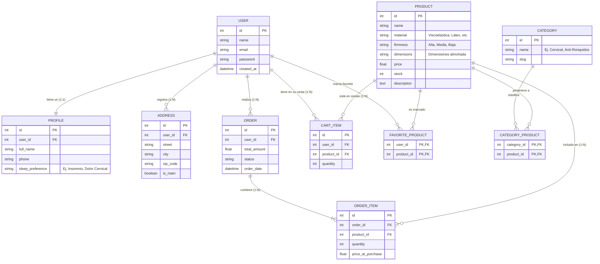
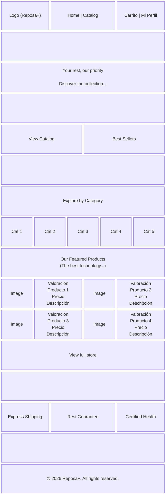
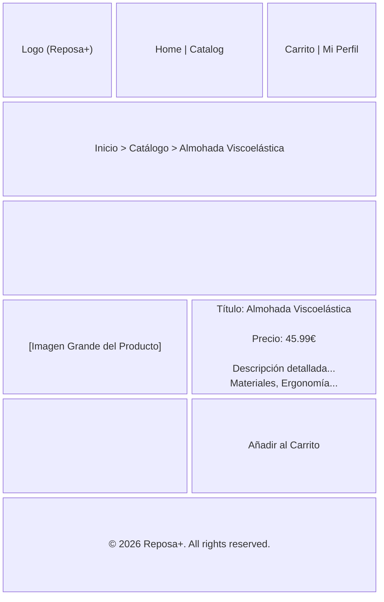

# Memoria Ejecutiva del Proyecto: Reposa+
## Desarrollo de una Plataforma de Comercio Electrónico Transaccional Especializada en Descanso Ergonómico Mediante Laravel y Bootstrap 5

**Universidad Pablo de Olavide — Escuela Politécnica Superior**  
**Titulación:** Grado en Ingeniería Informática en Sistemas de Información  
**Código TFG:**  
**Autor:** Jonathan Javier Quishpe Maldonado 
**Tutor:**   
**Convocatoria Oficial:** Curso Académico  

---

## Índice General

* **1. Introducción**
  * 1.1. Contexto y Motivación
  * 1.2. Justificación Tecnológica
  * 1.3. Ámbito de Aplicación y Relevancia Académica
  * 1.4. Marco Metodológico del Proyecto: La Tríada Scrum/Kanban + Métrica v3 + SDD
  * 1.5. Macro-Estructura Documental y Transición a los Anexos Normativos
* **2. Estado del Arte y Análisis Competitivo**
  * 2.1. El Mercado del Descanso y el E-commerce de Nicho (*Sleep Tech*)
  * 2.2. Tecnologías de Comercio Electrónico: CMS frente a Frameworks a Medida
  * 2.3. Desarrollo Orientado por Ecosistemas de Agentes de IA
* **3. Objetivos y Requisitos del Sistema**
* **4. Diseño y Arquitectura de Software**
* **5. Desarrollo e Implementación Técnica**
* **6. Calidad, Arquitectura y Pruebas del Software (Testing Trophy)**
* **7. Conclusiones y Trabajo Futuro**
* **8. Bibliografía y Referencias Normativas**

---

### Compendio de Anexos Normativos (Métrica v3)
* **[Anexo I: Plan de Proyecto (Métrica v3 — PSI)](Anexo_I_Plan_de_Proyecto.md):** Planificación, estimación de 400 horas y 13.800 €, WBS/EDT, gestión de riesgos y planes auxiliares.
* **[Anexo II: Documento de Análisis (Métrica v3 — ASI)](Anexo_II_Documento_de_Analisis.md):** Catálogo de Requisitos (`RF`/`RNF`), Casos de Uso (`CU`), Clases de Negocio (`CN`), Interfaces (`IU`), Informes (`IF`) y matrices de trazabilidad.
* **[Anexo III: Documento de Diseño (Métrica v3 — DSI)](Anexo_III_Documento_de_Diseno.md):** Topología de 7 microservicios Docker, modelo relacional DDL con constraints, controladores de diseño (`CL`) y especificaciones de puesta en marcha.

---

## 1. Introducción

### 1.1. Contexto y Motivación
En la sociedad contemporánea, el ritmo de vida acelerado, el estrés crónico y el uso prolongado de dispositivos electrónicos han provocado una crisis silenciosa pero generalizada: el deterioro de la calidad del sueño. La falta de un descanso reparador no solo afecta el rendimiento cognitivo y físico diario, sino que está directamente relacionada con patologías crónicas a largo plazo, incluyendo trastornos musculoesqueléticos como el dolor cervical crónico. Según diversos estudios de la Organización Mundial de la Salud (OMS), un porcentaje significativo de la población mundial sufre de insomnio ocasional o crónico, y gran parte de estas afecciones están vinculadas a una mala higiene postural durante el sueño.

En este contexto socio-sanitario, surge la necesidad de ofrecer soluciones accesibles y especializadas que aborden el problema desde la ergonomía y la tecnología. Si bien el mercado de colchones y almohadas es vasto, gran parte del comercio electrónico tradicional enfoca sus esfuerzos en la venta generalista, diluyendo el asesoramiento técnico y la propuesta de valor enfocada en la salud. 

**Reposa+** nace como respuesta a esta problemática. Se trata de un ecosistema de comercio electrónico (e-commerce) hiper-especializado en el nicho del descanso ergonómico e inteligente. La premisa fundamental del proyecto no es la mera comercialización de un producto textil, sino la provisión de una solución de salud. El lema que rige la plataforma, *"No vendemos almohadas, vendemos noches de sueño profundo y reparador"*, resume la filosofía de la marca y guía todas las decisiones de diseño arquitectónico y de interfaz de usuario.

### 1.2. Justificación Tecnológica
Desde la perspectiva técnica, el desarrollo de plataformas de comercio electrónico modernas exige altos estándares de seguridad, escalabilidad y experiencia de usuario (UX). Actualmente, el mercado tecnológico ofrece múltiples vías para la creación de tiendas online, desde los Sistemas de Gestión de Contenidos (CMS) monolíticos y las plataformas de Software como Servicio (SaaS) hasta los desarrollos a medida.

Este Trabajo se enmarca en la necesidad de demostrar competencias avanzadas de Ingeniería del Software mediante la construcción de un sistema transaccional robusto desde cero. Por ello, se ha prescindido de soluciones prefabricadas (como Shopify o PrestaShop) en favor de un desarrollo a medida utilizando **Laravel**, el framework PHP más consolidado de la industria para aplicaciones web de nivel empresarial. La adopción de Laravel garantiza el cumplimiento del patrón arquitectónico Modelo-Vista-Controlador (MVC), una gestión segura del ciclo de compra y una absoluta flexibilidad para iteraciones futuras.

Asimismo, el proyecto incorpora un enfoque vanguardista al integrar un **Ecosistema de Agentes de Inteligencia Artificial** en su ciclo de desarrollo. Esta metodología representa un salto evolutivo en la Ingeniería de Software, donde la IA no actúa meramente como un asistente de codificación, sino como una red de agentes autónomos con reglas, habilidades (skills) y flujos de trabajo (workflows) definidos que aseguran la integridad del código, la cohesión del diseño y la cobertura de pruebas.

### 1.3. Ámbito de Aplicación y Relevancia Académica
El proyecto se desarrolla como **Trabajo de Fin de Grado (TFG)** para la obtención del título de **Graduado en Ingeniería Informática en Sistemas de Información** por la **Escuela Politécnica Superior de la Universidad Pablo de Olavide (UPO)**. Constituye una obra integradora de competencias profesionales que abarca desde la formulación estratégica de requisitos y el modelado conceptual de bases de datos, hasta la implementación de interfaces de usuario asíncronas, la seguridad transaccional en pasarelas de pago y la automatización de la integración continua (CI/CD) en entornos virtualizados.

La relevancia de este trabajo radica en la combinación de un caso de negocio realista (con requerimientos estrictos de usabilidad y conversión en el nicho *Sleep Tech*) con una ejecución técnica y metodológica de máximo rigor. A lo largo del documento se detallará cómo se han superado los distintos retos de ingeniería: la gestión concurrente del inventario con bloqueos pesimistas (`lockForUpdate()`), el manejo de roles y permisos mediante *middlewares*, la compra híbrida como invitado (*Guest Checkout*), la internacionalización nativa de la plataforma y el blindaje frente a fallos de red y pasarelas de pago externas.

### 1.4. Marco Metodológico del Proyecto: La Tríada Scrum/Kanban + Métrica v3 + SDD
Para superar la clásica brecha entre los marcos normativos formales exigidos por la universidad y las dinámicas ágiles del desarrollo de software contemporáneo, Reposa+ adopta una **metodología híbrida formal-ágil articulada en tres capas desacopladas**:

1. **Capa de Gobierno y Gestión del Proyecto (Scrumban: Scrum + Kanban):**
   - **Scrum:** Estructuración temporal mediante *Sprints* orientados a hitos de versión semántica bajo GitFlow (`v1.0.0` Core Transaccional y `v1.1.0` Refinamiento UI/UX y Logística).
   - **Kanban:** Gestión del flujo continuo de trabajo y limitación estricta del trabajo en curso (*WIP = 1*) en el tablero de desarrollo individual, evitando la sobrecarga cognitiva y maximizando el rendimiento.
   - **Simulación de Equipo Profesional (Norma UPO de 400 Horas):** Desglose del esfuerzo en 5 perfiles profesionales de mercado asumidos por el alumno (Jefe de Proyecto a 45 €/h, Analista a 40 €/h, Arquitecto a 40 €/h, Backend a 30 €/h y Frontend a 30 €/h), modelando un presupuesto formal de **13.800 €** en el [Anexo I: Plan de Proyecto](Anexo_I_Plan_de_Proyecto.md).

2. **Capa Normativa, Estructural y Documental (Métrica v3 adaptada a la UPO):**
   - Adopción del estándar del Consejo Superior de Administración Electrónica para estructurar los Anexos del TFG:
     * **PSI (Planificación) $\rightarrow$ Anexo I:** Plan de Proyecto, WBS/EDT, análisis de riesgos y costes.
     * **ASI (Análisis) $\rightarrow$ Anexo II:** Catálogo de Requisitos Funcionales (`RF-xxx`) y No Funcionales (`RNF-xxx`), Casos de Uso (`CU-xxx`), Clases de Negocio (`CN-xxx`), Interfaces (`IU-xxx`) e Informes (`IF-xxx`).
     * **DSI (Diseño) $\rightarrow$ Anexo III:** Modelo Físico Relacional SQL, diagramas de despliegue y clases de controladores (`CL-xxx`).
   - **Matrices de Trazabilidad Cruzada:** Garantía matemática de coherencia bidireccional desde los Objetivos (`OBJ`) hasta los Casos de Uso y las Pruebas Automatizadas.

3. **Capa de Producción Técnica e Ingeniería (Spec-Driven Development — SDD):**
   - **La Especificación como Fuente Única de Verdad:** Ninguna funcionalidad se codifica sin un documento de especificación formal previo (Roadmap técnico).
   - **Especificaciones Ejecutables (Testing Trophy):** Los criterios de aceptación se materializan en una pirámide de **141 pruebas automatizadas en Pest** (29 Unitarias puras + 112 de Integración contra MySQL 8 y Redis en 2.89s) y **8 pruebas de sistema E2E con Microsoft Playwright** sobre navegadores reales.
   - **Orquestación de Agentes de IA (Google Antigravity SDK):** El alumno ejerce como Arquitecto de Software y Tech Lead, delegando tareas mecánicas a agentes autónomos gobernados por especificaciones formales y reglas estrictas de diseño.
   - **Calidad Continua y Memoria Viva:** Pipeline de CI/CD automatizado con 5 jobs en GitHub Actions y persistencia incremental de decisiones de arquitectura en el motor de memoria **Engram CLI**.

La especificación exhaustiva de este marco metodológico se encuentra formalizada en el documento de referencia [`docs/metodologia-proyecto-triada-scrum-metrica-sdd.md`](metodologia-proyecto-triada-scrum-metrica-sdd.md).

### 1.5. Macro-Estructura Documental y Transición a los Anexos Normativos
Conforme a las pautas de excelencia de la Escuela Politécnica Superior de la UPO observadas en memorias galardonadas de referencia (ej. *FutPlay*, código `25-26-C13`), este documento principal constituye la **Memoria Ejecutiva Troncal (~20-25 páginas)**, diseñada para ofrecer al tribunal evaluador una visión sintética, rigurosa y directa de la ingeniería del proyecto.

El corpus documental detallado y exhaustivo de la metodología Métrica v3 se encuentra distribuido formalmente en los tres Anexos normativos adjuntos:
* El **Plan de Proyecto** detallado (WBS, costes tarea a tarea y matriz de riesgos) se localiza en el **[Anexo I](Anexo_I_Plan_de_Proyecto.md)**.
* La **Especificación Completa de Requisitos, Casos de Uso con flujos alternativos, Interfaces e Informes** reside en el **[Anexo II](Anexo_II_Documento_de_Analisis.md)**.
* El **Diseño Físico Relacional DDL, Controladores de Diseño y Guía de Construcción** se detalla en el **[Anexo III](Anexo_III_Documento_de_Diseno.md)**.

---

## 2. Estado del Arte

La concepción y el desarrollo de **Reposa+** requieren un análisis exhaustivo tanto del entorno de mercado en el que operará la plataforma, como de las tecnologías subyacentes elegidas para su construcción. Este análisis del "Estado del Arte" se divide en tres ejes fundamentales: la evolución del e-commerce enfocado en la salud y el bienestar, el panorama actual de las arquitecturas de desarrollo web (CMS vs. Frameworks), y el paradigma emergente del desarrollo de software asistido por ecosistemas de Agentes de IA.

### 2.1. El Mercado del Descanso y el E-commerce de Nicho
Durante la última década, el comercio electrónico ha transitado de la masificación (grandes *marketplaces* como Amazon o AliExpress) hacia la hiper-especialización. Los consumidores, especialmente en el sector de la salud y el bienestar, demandan plataformas que ofrezcan autoridad, confianza y un asesoramiento detallado sobre productos que impactarán en su calidad de vida.

#### 2.1.1. Tendencias en la Industria del Bienestar y la Ergonomía
El mercado del descanso, denominado en inglés *Sleep Tech & Ergonomics*, ha experimentado un crecimiento exponencial. Ya no se trata únicamente de adquirir una cama, sino de optimizar la recuperación muscular, alinear la columna vertebral y regular la temperatura corporal durante la fase REM. Productos como almohadas viscoelásticas con memoria de forma, cojines térmicos cervicales y sistemas de monitorización del sueño son ahora productos de alta demanda. 

Sin embargo, el reto de comercializar estos productos de forma online radica en la "intangibilidad". Al no poder probar la almohada físicamente, la interfaz de usuario (UI) y la experiencia de usuario (UX) deben suplir esta carencia mediante una arquitectura de información cristalina, fotografías detalladas, descripciones que apelen tanto a la lógica (materiales, densidad) como a la emoción (alivio, confort), y un diseño visual que transmita la sensación de descanso antes incluso de que el producto sea añadido al carrito.

#### 2.1.2. La Psicología del Color en Entornos Digitales de Salud
El diseño web contemporáneo se apoya fuertemente en la psicología del color para modular el comportamiento y las emociones del usuario. En el contexto de Reposa+, se ha realizado un estudio cromático que determina que los colores cálidos o vibrantes (rojos, naranjas), a menudo usados para estimular compras impulsivas en *retail*, son contraproducentes para un nicho que busca reducir el estrés.

#### 2.1.3. Matriz Comparativa de Competidores del Mercado *Sleep Tech*
Para situar el posicionamiento competitivo de Reposa+, se ha llevado a cabo un análisis comparativo frente a dos modelos imperantes en el mercado: los grandes *marketplaces* generalistas (representados por Amazon / Ikea) y las marcas de colchones DTC (*Direct-To-Consumer*, representadas por Emma Colchón / Tempur):

| Característica / Dimensión de Análisis | Marketplaces Generalistas (Amazon / Ikea) | E-Commerce DTC Tradicional (Emma / Tempur) | Reposa+ (*Sleep Tech* a Medida) |
|---|:---:|:---:|:---:|
| **Hiper-especialización en Almohadas y Salud Cervical** | NO (Catálogo masivo indiferenciado) | NO (Foco en venta de colchones; almohadas secundarias) | **SÍ (Nicho exclusivo en descanso ergonómico y cervical)** |
| **Asesor Anatómico de Postura en Tiempo Real** | NO | NO | **SÍ (Filtro por postura: lado, supino, prono)** |
| **Diseño Visual Basado en Psicología del Descanso** | NO (Diseño puramente transaccional agresivo) | PARCIAL (Diseño corporativo estándar) | **SÍ ("The Midnight Sanctuary" — Paleta Índigo nocturna)** |
| **Compra Rápida como Invitado (*Guest Checkout*)** | NO (Registro obligatorio forzoso) | PARCIAL (Formularios largos con fricción) | **SÍ (Compra en 1 paso + Claim Account post-pago)** |
| **Transparencia en Albaranes Logísticos y Seguimiento** | SÍ (Ecosistema cerrado del operador) | PARCIAL (Enlace genérico a transportista) | **SÍ (Etiqueta térmica A6 normalizada + Código `RPX...ES`)** |
| **Resiliencia Transaccional con Bloqueo Pesimista** | SÍ (Infraestructura propietaria cerrada) | NO (CMS estándar vulnerables a sobreventas en picos) | **SÍ (Bloqueo pesimista `lockForUpdate()` en MySQL InnoDB)** |
| **Propiedad Total del Código Fuente (Sin Vendor Lock-in)**| NO | NO (Dependencia de Shopify/Magento) | **SÍ (Arquitectura abierta a medida en Laravel 11/12+)** |

Esta comparativa evidencia que Reposa+ no solo cubre un vacío desatendido por los líderes generalistas, sino que ofrece una experiencia transaccional más ágil, sin fricción de registro inicial y técnicamente blindada frente a fallos de concurrencia.

### 2.2. Tecnologías de Comercio Electrónico: CMS vs Frameworks a Medida
A nivel de Ingeniería del Software, el desarrollo de una tienda online presenta una dicotomía histórica: utilizar una solución empaquetada o desarrollar el sistema desde cero.

#### 2.2.1. Soluciones CMS y SaaS
En la actualidad, plataformas como Shopify, WooCommerce (sobre WordPress), PrestaShop y Magento dominan el mercado de pequeñas y medianas empresas.
*   **WooCommerce y PrestaShop:** Ofrecen una rápida curva de entrada y multitud de *plugins*. Su principal desventaja es el denominado "bloatware": exceso de código innecesario, problemas de rendimiento a gran escala y vulnerabilidades de seguridad debido a la dependencia de módulos de terceros.
*   **Shopify:** Como modelo SaaS (Software as a Service), proporciona infraestructura gestionada. Sin embargo, impone altas comisiones por transacción, limita el control absoluto sobre el código fuente (bloqueo tecnológico o *vendor lock-in*) y dificulta la implementación de lógicas de negocio altamente personalizadas.

#### 2.2.2. Frameworks Empresariales (Laravel)
Frente a las limitaciones de los CMS, el desarrollo con *frameworks* representa el estándar para proyectos que exigen escalabilidad y propiedad total sobre los datos. En el ecosistema PHP, **Laravel** se ha consolidado como el líder indiscutible frente a alternativas como Symfony o CodeIgniter.

Laravel proporciona un entorno de desarrollo elegante y expresivo. Su arquitectura Modelo-Vista-Controlador (MVC) fuerza una separación limpia de responsabilidades (las reglas de negocio en los controladores y modelos, la presentación en las vistas de Blade). Además, el framework incluye de fábrica subsistemas esenciales para un e-commerce complejo, tales como:
*   **Eloquent ORM:** Una abstracción de base de datos que permite manejar relaciones complejas (1:N, N:M) como el cruce entre "Productos", "Pedidos" y "Categorías" de manera intuitiva y segura frente a inyecciones SQL.
*   **Sistema de Enrutamiento y Middleware:** Que permite proteger rutas sensibles (como el proceso de Checkout o el Panel de Administración) validando roles y sesiones sin acoplar el código.
*   **Gestor de Colas (Queues) y Jobs:** Fundamental para enviar correos electrónicos transaccionales (confirmaciones de pedido vía SMTP) en segundo plano (asíncronamente), evitando que el usuario sufra tiempos de carga excesivos tras presionar el botón de pago.

La elección de Laravel para Reposa+ no solo responde a un requerimiento académico, sino a la alineación con las mejores prácticas de la industria actual para construir sistemas mantenibles a largo plazo.

### 2.3. Desarrollo Orientado por Ecosistemas de Agentes de IA
Un aspecto diferenciador y vanguardista del proyecto Reposa+ es la utilización del marco de trabajo **Antigravity SDK**, el cual representa el estado del arte en Inteligencia Artificial aplicada a la Ingeniería del Software.

Históricamente, los asistentes de IA generativa (como ChatGPT o GitHub Copilot) han funcionado como "oráculos" reactivos o completadores de código en línea, dependientes de indicaciones aisladas del desarrollador humano. El paradigma de los **Agentes de IA** da un paso más allá al crear entidades autónomas dotadas de contexto, herramientas de lectura/escritura del sistema de archivos y capacidades de terminal.

En el caso de este proyecto, se ha configurado un directorio oculto `.agents/` en la raíz del proyecto que define el comportamiento del sistema experto, subdividido en:
*   **Reglas (Rules):** Documentos de identidad que dictan el comportamiento estricto. Por ejemplo, `agent_ui_ux.md` fuerza a la IA a utilizar la paleta de colores índigo y clases específicas de Bootstrap 5, evitando regresiones en el diseño. Por otro lado, `agent_database.md` obliga a respetar el modelo Entidad-Relación y a optimizar las consultas de Eloquent para evitar problemas de N+1.
*   **Habilidades (Skills):** Módulos acoplables, como el `laravel-specialist`, que otorgan a los agentes el conocimiento experto sobre PHP 8.3+, inyección de dependencias y convenciones de nombrado RESTful.
*   **Flujos de Trabajo (Workflows):** Procedimientos estandarizados (`feature_generation.md`, `purchase_flow_test.md`) que los agentes ejecutan paso a paso, automatizando tareas pesadas como la internacionalización completa de los archivos `.blade.php` o la generación de seeders masivos para poblar la base de datos con productos de prueba.

La integración de este ecosistema de agentes no reemplaza al ingeniero humano, sino que actúa como un sistema de pair-programming hiper-acelerado, reduciendo la deuda técnica, garantizando el cumplimiento de estándares y permitiendo al desarrollador centrarse en la arquitectura de alto nivel y las decisiones de negocio críticas. Esta sinergia humano-máquina constituye la frontera tecnológica actual en el desarrollo ágil de aplicaciones web complejas.

---

## 3. Objetivos y Requisitos

La definición clara de los objetivos y requisitos es un paso fundamental en la metodología de Ingeniería del Software, ya que establece la línea base contra la cual se validará el éxito del proyecto. Para Reposa+, los requisitos funcionales y no funcionales emanan directamente de las directrices técnicas del Trabajo de Fin de Grado y las mejores prácticas de la ingeniería de software moderna.

### 3.1. Objetivos Principales del Proyecto
El objetivo general es diseñar, desarrollar y desplegar una plataforma de comercio electrónico realista, escalable y segura orientada a un nicho de mercado específico (descanso ergonómico), demostrando dominio absoluto sobre el framework Laravel y las tecnologías de frontend asociadas.

De este objetivo general se desprenden los siguientes objetivos específicos (O.E.):
*   **O.E. 1 (Arquitectura de Datos):** Diseñar una base de datos relacional robusta que modele de forma precisa entidades complejas y garantice la presencia obligatoria de relaciones cardinales 1:1, 1:N y N:M.
*   **O.E. 2 (Flujo Transaccional):** Implementar el caso de uso central de todo e-commerce: el ciclo de compra de un producto, desde la exploración anónima hasta la persistencia segura del pedido, pasando por la gestión asíncrona del carrito.
*   **O.E. 3 (Seguridad y Roles):** Garantizar la segregación de privilegios mediante un sistema dual de autenticación, separando estrictamente las capacidades de los usuarios finales (clientes) de los administradores del sistema.
*   **O.E. 4 (Internacionalización):** Proporcionar una experiencia de usuario global (i18n) mediante la implementación de soporte multi-idioma nativo.
*   **O.E. 5 (Fidelización):** Desarrollar mecánicas de retención de clientes, concretamente un sistema de "Lista de Favoritos" que, a su vez, retroalimente las métricas analíticas del panel de control de administración.

### 3.2. Requisitos Funcionales (RF)
Los requisitos funcionales describen los comportamientos y servicios específicos que el sistema debe proveer. Se han clasificado por módulos lógicos:

#### Módulo de Catálogo y Exploración
*   **RF-01:** El sistema debe permitir a cualquier usuario (registrado o anónimo) visualizar el catálogo completo de almohadas.
*   **RF-02:** El sistema debe mostrar una ficha de producto detallada, incluyendo nombre, descripción ergonómica, precio, estado del inventario y material.
*   **RF-03:** El sistema debe permitir filtrar los productos basándose en categorías dinámicas (ej. Cervical, Viscoelástica).

#### Módulo de Carrito y Checkout
*   **RF-04:** El sistema debe proporcionar un carrito de la compra donde los usuarios puedan añadir, eliminar y modificar las cantidades de los productos deseados antes de la compra.
*   **RF-05:** El sistema debe exigir autenticación (login o registro) para efectuar el pago y tramitar un pedido definitivo.
*   **RF-06:** Al confirmar una compra, el sistema debe deducir automáticamente el stock de los productos adquiridos.
*   **RF-07:** El sistema debe generar registros inmutables tanto en la tabla maestra de pedidos (`ORDER`) como en el detalle histórico (`ORDER_ITEM`).

#### Módulo de Perfil y Fidelización (Usuarios)
*   **RF-08:** Todo usuario registrado debe poseer un panel de control privado ("Mi Perfil").
*   **RF-09:** El sistema debe permitir al usuario gestionar (CRUD completo) múltiples direcciones de envío.
*   **RF-10:** El usuario debe poder modificar sus credenciales de acceso (contraseña) de forma segura.
*   **RF-11:** El usuario debe poder marcar y desmarcar productos como "Favoritos" con un solo clic.
*   **RF-12:** El sistema debe ofrecer a los usuarios un historial detallado de todos los pedidos realizados, mostrando el estado actual de los mismos (Pendiente, Procesando, Enviado).

#### Módulo de Administración (Panel Back-Office)
*   **RF-13:** El sistema debe restringir el acceso al panel de administración exclusivamente a los usuarios con rol de `admin`.
*   **RF-14:** El administrador debe poder realizar operaciones CRUD completas sobre el inventario de productos.
*   **RF-15:** El administrador debe poder crear, editar y eliminar categorías, y asociar un producto a múltiples categorías simultáneamente.
*   **RF-16:** El administrador debe visualizar un panel analítico (Dashboard) que resuma los pedidos globales y destaque los productos más marcados como favoritos por los usuarios.
*   **RF-17:** El administrador debe poder actualizar el estado de un pedido (ej. de "Procesando" a "Enviado").

### 3.3. Requisitos No Funcionales (RNF)
Los requisitos no funcionales definen los atributos de calidad, restricciones tecnológicas y estándares de diseño del sistema.

*   **RNF-01 (Framework):** El backend debe ser desarrollado íntegramente en Laravel (preparado para escalar a versiones 13+), apoyándose obligatoriamente en PHP 8.3+.
*   **RNF-02 (Estilos y UI):** El frontend debe estructurarse mediante Bootstrap 5. Es obligatorio que la plantilla base sufra modificaciones profundas (vía SASS/CSS personalizado) para asimilar la identidad visual de la marca (esquema cromático "Índigo").
*   **RNF-03 (Comunicación Asíncrona):** El envío de notificaciones por correo electrónico (tickets de compra, recuperación de contraseña) debe delegarse a colas de trabajo en segundo plano (Job Queues) para evitar bloqueos en el hilo de ejecución principal y mejorar la percepción de rendimiento.
*   **RNF-04 (Seguridad):** Todas las contraseñas deben ser almacenadas utilizando algoritmos de hashing fuertes (Bcrypt). El sistema debe estar protegido contra inyecciones SQL (gracias al uso de Eloquent ORM) y ataques CSRF (Cross-Site Request Forgery).
*   **RNF-05 (Multi-idioma):** La interfaz pública principal (Catálogo y Home) debe ser capaz de alternar dinámicamente entre los idiomas Español e Inglés sin refresco forzado o pérdida de sesión.

---

## 4. Diseño y Arquitectura

El diseño arquitectónico de Reposa+ es la piedra angular que permite cumplir con los requisitos establecidos, garantizando que el sistema sea mantenible, escalable y visualmente coherente. Este capítulo desglosa las tres dimensiones del diseño: la Arquitectura de Software, el Diseño de la Base de Datos, y el Diseño de Interfaces (UI/UX).

### 4.1. Arquitectura de Software (Patrón MVC)
La plataforma está estructurada bajo el paradigma **Modelo-Vista-Controlador (MVC)**, el cual es forzado de manera natural por la adopción del framework Laravel. Este patrón divide la aplicación en tres capas lógicas interconectadas, separando las representaciones internas de la información de la manera en que se presenta al usuario o se acepta de él.

1.  **Capa de Modelos (Model):** Representa la estructura lógica de los datos. En Reposa+, cada entidad fundamental (Usuario, Producto, Pedido, Categoría) cuenta con una clase Modelo de Eloquent. Estos modelos no solo mapean las tablas físicas de la base de datos, sino que encapsulan reglas de negocio complejas (por ejemplo, accesores para formatear precios, o mutadores para cifrar contraseñas) y definen las relaciones entre entidades.
2.  **Capa de Vistas (View):** Es la interfaz de usuario. Utiliza el motor de plantillas **Blade**, el cual permite herencia de plantillas (layouts maestros), inclusión de componentes parciales, y directivas de control (`@if`, `@foreach`) sin inyectar código PHP espagueti. Las vistas compilan a código HTML puro que es despachado al navegador del cliente.
3.  **Capa de Controladores (Controller):** Actúan como el puente o "director de orquesta". Reciben las peticiones HTTP (Request) enviadas por el usuario a través de las Rutas de Laravel, consultan o manipulan a los Modelos según sea necesario, y finalmente retornan la respuesta en la Vista correspondiente o, en el caso de las operaciones asíncronas del carrito, en formato JSON.

### 4.2. Diseño de la Base de Datos (Esquema Entidad-Relación)
La arquitectura de datos de Reposa+ ha sido meticulosamente refactorizada a partir de un diseño genérico para adaptarse a las particularidades del nicho del descanso y cumplir con las restricciones académicas (existencia de relaciones 1:1, 1:N y N:M explícitas).

El esquema relacional resultante se compone de las siguientes entidades principales y sus interconexiones:

#### Relaciones 1:1 y 1:N
*   **USER y PROFILE (1:1):** Para segregar los datos puramente de autenticación (email, contraseña cifrada en la tabla `USERS`) de los datos de uso y analítica (nombre completo, teléfono, preferencia de sueño como "Insomnio" o "Dolor Cervical" en la tabla `PROFILES`).
*   **USER y ADDRESS (1:N):** Un usuario puede registrar múltiples direcciones (ej. casa, trabajo), pero una dirección pertenece a un único usuario.
*   **ORDER y ORDER_ITEM (1:N):** La cabecera del pedido (`ORDER`) guarda el total, la fecha y el estado de la transacción. El detalle (`ORDER_ITEM`) almacena una foto estática (snapshot) del precio en el momento de la compra y la cantidad de cada producto adquirido.

#### Relaciones N:M (Tablas Pivote)
La justificación de estas relaciones complejas es crítica para la funcionalidad moderna de la tienda:
*   **CATEGORY_PRODUCT (N:M):** Resuelve la problemática de clasificación. Una almohada viscoelástica (Producto A) puede ser simultáneamente categorizada como "Cervical" y "Anti-ronquidos". De igual forma, la categoría "Cervical" engloba decenas de productos. Esta tabla pivote hace posible un sistema de filtrado cruzado eficiente.
*   **FAVORITE_PRODUCT (N:M):** Representa la lista de deseos. Esta tabla intermedia vincula directamente el ID de un usuario con el ID de un producto. Es la base técnica tanto para el botón de "Me gusta" asíncrono en el frontend, como para el dashboard estadístico del administrador que lista las expectativas de compra.

*Toda la estructura física de la base de datos se ha automatizado mediante **Migraciones** de Laravel, permitiendo recrear el esquema completo en cualquier servidor con el comando `php artisan migrate`.*



### 4.3. Diseño de Interfaz de Usuario (UI/UX) y Wireframes
El diseño visual de Reposa+ se fundamenta en los estudios previos sobre la psicología del color. Para el desarrollo del frontend, se ha optado por utilizar **Bootstrap 5**, aprovechando su robusto sistema de rejillas (grid) y su amplia biblioteca de componentes accesibles. Esta decisión ha permitido iterar rápidamente y garantizar una experiencia responsiva (*mobile-first*) muy superior a una implementación mediante HTML/CSS puro.

Sin embargo, para evitar el aspecto genérico que suele caracterizar a los proyectos basados en este framework, se ha realizado una profunda personalización mediante el preprocesador SASS. Se han sobrescrito las variables nativas de Bootstrap para inyectar una identidad corporativa exclusiva, gobernada por la gama cromática **Índigo / Blue-Indigo**.

Para asegurar un desarrollo sin desviaciones, se diseñaron esquemas estructurales (*Wireframes*) que pautan el esqueleto de las vistas críticas antes de su maquetación.

1.  **Pantalla de Inicio (Home):** Está diseñada para atrapar la atención. Cuenta con una sección *Hero* amplia que vende el concepto de "sueño profundo". Inmediatamente debajo, se presenta un acceso rápido a las categorías principales ("Explore by Category") y una rejilla limpia con los productos destacados, priorizando la legibilidad (letras oscuras sobre fondos claros con acentos índigo).
2.  **Catálogo y Filtrado:** Esta interfaz se dividió estratégicamente. Un panel lateral izquierdo (sidebar) condensa las opciones de filtro (Categorías), mientras que el 75% derecho de la pantalla renderiza la cuadrícula (grid) dinámica de almohadas. Esto minimiza el número de clics que el usuario necesita dar para encontrar su producto ideal.
3.  **Ficha de Producto (Detalle):** La interfaz más crítica para la conversión. Se reserva el 50% izquierdo para imaginería de alta resolución. El lado derecho organiza de forma escalonada: Título, Precio destacado, Beneficios ergonómicos (Firmeza, Materiales) y un botón *Call to Action* (Añadir al Carrito) de gran tamaño y color contrastante.
4.  **Panel de Administración (Back-office):** En contraste con la interfaz pública, el diseño del panel de control prioriza la densidad de información y la utilidad sobre la estética emocional. Implementa un layout fijo de menú lateral colapsable, y un área de contenido con tablas de datos paginadas, badges de estado para los pedidos (colores estándar de éxito, advertencia o peligro) y botones de acción rápida.


## 1. Pantalla de Inicio (Home) (`/`)

Vista principal de bienvenida de la tienda con productos destacados y categorías.



## 3. Detalle del Producto (`/catalog/{product}`)

Vista enfocada en la información detallada de una almohada específica.



En resumen, la arquitectura de Reposa+ garantiza que el código sea predecible para el desarrollador y que la interfaz sea un oasis de usabilidad y tranquilidad visual para el cliente.

---

## 5. Desarrollo e Implementación

La fase de desarrollo de Reposa+ ha seguido una metodología iterativa e incremental, fundamentada en los principios de integración continua y el uso de un repositorio Git con estrategia GitFlow. A continuación, se detallan los hitos técnicos más relevantes de la implementación, documentando las soluciones aplicadas a los problemas de ingeniería surgidos durante el proceso.

### 5.1. Migraciones, Seeders y Población de Datos
El primer paso tras la configuración del entorno (.env) fue traducir el esquema UML a código mediante las migraciones de Laravel. Esto garantiza un control de versiones de la base de datos idéntico al del código fuente.

Se establecieron restricciones de clave foránea (`foreignId()->constrained()`) con borrado en cascada para mantener la integridad referencial. Para facilitar las pruebas, se desarrollaron **Seeders** y **Factories** complejos. Estos scripts no solo inyectan usuarios ficticios y el usuario Administrador raíz, sino que pueblan el catálogo de productos con almohadas realistas, adjuntando imágenes, precios y stock coherente. Además, se vincularon categorías y se simularon compras previas mediante lógica anidada, permitiendo que el sistema parta de un estado funcional rico en datos para su validación.

### 5.2. Autenticación, Roles y Seguridad Perimetral
La gestión de usuarios y la seguridad de las rutas se delegó en el paquete **Laravel Fortify**, un *backend* de autenticación *headless* que proporciona una implementación robusta de las características de seguridad sin imponer un diseño frontend predeterminado.

Para segregar el acceso entre clientes y el *staff* de la tienda, se añadió una columna `role` (enum: `admin`, `user`) en la tabla de usuarios. La protección de las rutas críticas (como el Dashboard de administración) se implementó creando un *Middleware* personalizado (`AdminMiddleware`):

```php
// app/Http/Middleware/AdminMiddleware.php
public function handle(Request $request, Closure $next): Response
{
    if (Auth::check() && Auth::user()->role === 'admin') {
        return $next($request);
    }

    return redirect('/')->with('error', 'No tienes permisos para acceder a esta sección.');
}
```
Este middleware se inyectó en el archivo de rutas `web.php` encapsulando todo el grupo de rutas bajo el prefijo `/admin`. Cuando el usuario no tiene el rol `admin`, es redirigido a la página principal con un mensaje de error flash —en lugar de recibir un código HTTP 403— lo que proporciona una experiencia de usuario más amigable y coherente con el resto de la aplicación.

### 5.3. El Carrito Asíncrono (AJAX) y la Experiencia de Usuario
Uno de los mayores retos de UX durante el desarrollo de la Versión 1.0 fue la gestión de la cesta de la compra. En las iteraciones iniciales, añadir un producto al carrito provocaba una recarga completa de la página (`POST` seguido de un `redirect()->back()`). Esto destruía la posición de *scroll* del usuario y rompía la inmersión de navegación fluida.

Para resolver esto, se rediseñó el flujo utilizando **Javascript asíncrono (AJAX)** a través de la API Fetch. 

1. Se interceptan todos los formularios de "Añadir al carrito" en el front-end.
2. Se previene el comportamiento por defecto (`e.preventDefault()`).
3. Se envía la solicitud al backend adjuntando el token CSRF y cabeceras de API (`X-Requested-With: XMLHttpRequest`).
4. El controlador (`CartController`) procesa la lógica de negocio en la base de datos o en la sesión (para usuarios invitados) y devuelve una respuesta en formato JSON.

```php
// app/Http/Controllers/CartController.php
public function add(Request $request, Product $product)
{
    $quantity = $request->input("quantity", 1);
    
    // Lógica de adición omitida por brevedad...

    if ($request->ajax()) {
        return response()->json([
            "success" => true,
            "message" => "¡Añadido al carrito con éxito!",
            "cartCount" => $this->getCartCount()
        ]);
    }
    return back()->with("success", "Añadido al carrito");
}
```
Al recibir el JSON, el cliente actualiza el "globo" contador del icono del carrito mediante manipulación del DOM y despliega una notificación flotante (Toast de Bootstrap) verde, todo sin que el usuario sufra cortes en su experiencia de navegación.

### 5.4. Optimización de Rendimiento con Vistas SQL Nativas
El enunciado de la práctica requería explícitamente el uso de **Vistas SQL** para optimizar cargas de trabajo pesadas. El Panel de Administración y el Perfil de Usuario necesitaban cruzar datos intensivamente (historiales de compras globales, productos más deseados, ingresos totales). Realizar estas consultas a través del ORM Eloquent mediante agrupaciones (`groupBy`) y conteos (`withCount`) en tiempo de ejecución resultaba ineficiente.

Se resolvió creando una nueva migración con sentencias puras (`DB::statement`) que compila la vista en el motor MySQL:

```sql
CREATE VIEW v_top_favorited_products AS
SELECT p.id, p.name, p.price, COUNT(fp.product_id) as favorited_by_count
FROM products p
INNER JOIN favorite_product fp ON p.id = fp.product_id
GROUP BY p.id, p.name, p.price
ORDER BY favorited_by_count DESC;
```
Posteriormente, se mapeó esta vista de base de datos a un Modelo de Eloquent en modo de solo lectura (`TopFavoritedProduct`). Gracias a esto, el Controlador simplemente invoca `TopFavoritedProduct::take(5)->get()`, delegando la carga computacional pesada del `JOIN` y el `GROUP BY` al motor de base de datos y manteniendo el código de PHP limpio y escalable.

### 5.5. Envío de Notificaciones Transaccionales (Colas y Mailtrap)
La culminación del proceso de *checkout* (compra) conlleva la emisión de un "Ticket de Compra" hacia el correo electrónico del cliente. Durante las fases tempranas, la ejecución de la instrucción `Mail::to()->send()` bloqueaba la petición HTTP, forzando al usuario a esperar varios segundos frente a una pantalla de carga.

La solución arquitectónica implementada consistió en trasladar este proceso al ecosistema de **Trabajos en Cola (Queues)** de Laravel.

1.  Se configuró `QUEUE_CONNECTION=database` en el archivo `.env`.
2.  Se alteró la clase `OrderConfirmed` (Mailable) para que implementase la interfaz `ShouldQueue`.
3.  Se configuró el entorno local para redirigir todo el tráfico SMTP hacia **Mailtrap.io** (un entorno de pruebas seguro o *sandbox*).

Al finalizar una compra, Laravel despacha inmediatamente el correo a la tabla `jobs` de la base de datos y libera al usuario, dirigiéndolo a la pantalla de éxito al instante. Un proceso de consola (`php artisan queue:work`) operando en segundo plano en el servidor se encarga posteriormente de consumir ese trabajo y comunicarse con los servidores de Mailtrap, asegurando una UX impecable.

### 5.6. Soporte Multi-idioma (Internacionalización - i18n)
La fase 2.1 del proyecto exigía adaptar Reposa+ para un mercado global. Se utilizó el sistema nativo de localización de Laravel.
Se crearon archivos de diccionarios en `lang/en/messages.php` y `lang/es/messages.php`. Se procedió a sustituir todas las cadenas de texto estáticas (textos descriptivos, botones, títulos de la cabecera) en los archivos `.blade.php` por la función *helper* de traducción `__("messages.clave")`.

Para mantener el estado del idioma seleccionado, se desarrolló un `LanguageController` que captura la elección del usuario (vía *dropdown* en el menú) y la guarda en la sesión activa (`session()->put("locale", $lang)`). Un Middleware global (`SetLocale`) se ejecuta en cada petición HTTP interceptando esta variable e inyectándola al núcleo del framework (`App::setLocale()`), garantizando que la navegación fluya uniformemente en el idioma elegido en cada recarga de página.

---

## 6. Calidad, Arquitectura y Pruebas del Software

El aseguramiento de la calidad (*Quality Assurance* - QA) y la verificación empírica del comportamiento del sistema constituyen pilares capitales en la Ingeniería del Software contemporánea. En plataformas de comercio electrónico transaccionales de alta fidelidad como **Reposa+**, donde convergen transacciones financieras en tiempo real, manipulación atómica de inventario y sesiones de usuario híbridas (invitados y autenticados), los fallos de software no representan meros defectos cosméticos, sino pérdidas económicas directas, inconsistencias contables irreversibles y degradación crítica de la confianza del cliente.

Para garantizar la máxima robustez del sistema, se ha diseñado e implementado una estrategia de pruebas integral fundamentada en modelos modernos de la disciplina, complementada con un riguroso flujo de control de versiones bajo GitFlow y auditorías técnicas continuas.

### 6.1. Estrategia de Testing Integral: De la Pirámide Clásica al Trofeo de Pruebas

#### 6.1.1. Fundamentación Epistemológica: Cohn (2009) frente a Dodds y Fowler (2018-2024)
Durante más de una década, la pedagogía académica y los estándares tradicionales de la industria han estado supeditados a la **Pirámide de Automatización de Pruebas formulada por Mike Cohn (2009)**. Dicho modelo postula que la base cuantitativa del aseguramiento de la calidad debe componerse de forma abrumadora por pruebas unitarias aisladas, reduciendo la capa de integración a una proporción intermedia y minimizando las pruebas de extremo a extremo (*End-to-End* - E2E) en la cúspide.

No obstante, un análisis epistemológico riguroso revela que la pirámide de Cohn fue concebida en una era tecnológica pre-virtualización ligera (pre-Docker), condicionada por restricciones físicas hoy superadas:
1. **Coste prohibitivo de inicialización:** Levantar bases de datos relacionales empresariales o servidores de aplicaciones en entornos de test tomaba minutos por ciclo de ejecución.
2. **Cuellos de botella de I/O en disco mecánico:** El acceso a almacenamiento secundario persistente degradaba severamente los tiempos de respuesta, forzando a los ingenieros a aislar cada clase mediante el uso masivo de objetos simulados (*mocks*, *stubs*, *spies*).

En la actualidad, referentes seminales de la Ingeniería de Software como **Kent C. Dodds** y **Martin Fowler** han demostrado que la transposición acrítica de la pirámide clásica a aplicaciones web transaccionales genera el severo antipatrón de **falsa confianza**. Cuando se aísla una clase del motor de base de datos sustituyéndola por un mock, el test no verifica el comportamiento real del sistema, sino la especificación programada en el propio mock.

Frente a ello, Reposa+ adopta el paradigma contemporáneo del **Trofeo de Pruebas (*Testing Trophy*)**, conceptualizado por Kent C. Dodds y sustentado en los postulados de Fowler sobre el valor estratégico de la integración:

```text
   PIRÁMIDE CLÁSICA (Mike Cohn, 2009)            TROFEO DE PRUEBAS MODERNO (Dodds/Fowler, 2018-2024)
         (Paradigma Pre-Docker)                        (Arquitectura Adoptada en Reposa+)

                 ▲                                              ┌──────────┐
                / \     E2E (Pocos)                             │   E2E    │  (8 tests Playwright)
               /───\                                         ┌──┴──────────┴──┐
              /     \   Integración (Medios)                 │  INTEGRACIÓN   │  (89 tests Feature)
             /───────\                                       │ (Feature Tests)│  ← MÁXIMO VALOR Y ROI
            /         \ Unitarios (Muchos)                   └──┬──────────┬──┘
           ─────────────                                        │ UNITARIOS│  (22 tests Dominio Puro)
                                                                └──────────┘
```

#### 6.1.2. El Mito de la Lentitud de la Integración en la Era de la Virtualización Ligera
El axioma tradicional que justificaba reducir las pruebas de integración era su supuesta lentitud computacional. En Reposa+, la arquitectura basada en micro-contenedores con **Docker Engine**, imágenes optimizadas en Alpine Linux y motores **MySQL 8.0 InnoDB** con volúmenes locales en memoria desmiente empíricamente este mito:
* La suite de integración completa de Reposa+ (**89 pruebas en `tests/Feature/`**) se ejecuta íntegramente en **1.95 segundos**.
* El coste computacional medio por prueba de integración es de apenas **21 milisegundos**.
* Ejecutar 89 pruebas contra un motor relacional real con aislamiento transaccional y rollback automático (`RefreshDatabase`) requiere prácticamente el mismo tiempo que una suite de mocks pesados en memoria, pero ofreciendo una fidelidad operacional del 100% sobre la semántica ACID de la base de datos.

#### 6.1.3. Matriz Comparativa de Retorno de Inversión (ROI)
La siguiente matriz formaliza la comparativa entre la pirámide clásica y el trofeo de pruebas adoptado en Reposa+:

| Dimensión de Análisis | Pirámide Clásica (Cohn, 2009) | Trofeo de Pruebas en Reposa+ (2026) | Justificación en el Dominio E-commerce |
|---|---|---|---|
| **Premisa Histórica** | Levantar bases de datos o servidores era prohibitivamente lento (minutos por test). | Los contenedores Docker ejecutan 89 tests de integración contra MySQL en **1.95 segundos**. | La supuesta lentitud de las pruebas de integración es un mito superado por la virtualización ligera moderna. |
| **Peligro de los Mocks** | Se promueve el uso masivo de *mocks* para aislar clases individuales. | Los mocks ocultan fallos de claves foráneas, bloqueos pesimistas y restricciones relacionales. | Un mock nunca detecta una sobreventa por condición de carrera (*race condition*). La base de datos real sí. |
| **Retorno de Inversión (ROI)** | Mayor volumen en la base porque eran los tests más baratos de escribir. | Mayor volumen en integración porque es donde ocurren los fallos críticos de negocio. | Si el checkout falla en producción, el negocio pierde dinero. La integración garantiza la coherencia transaccional. |
| **Rol de los Unit Tests** | Cubrir cada método, getter y setter de cada clase del sistema. | Cubrir algoritmos puros, máquinas de estado y lógica matemática de dominio en memoria. | Evita el antipatrón de testear implementaciones triviales o duplicar el código con aserciones redundantes. |

---

### 6.2. Taxonomía de Fallos Transaccionales y Límites del Mockeo Aislado

El núcleo funcional de un comercio electrónico es esencialmente transaccional y reactivo. La literatura técnica advierte de que los fallos más catastróficos para el negocio escapan sistemáticamente al alcance de las pruebas unitarias aisladas:

#### 1. Condiciones de Carrera (*Race Conditions*) en Concurrencia de Stock
* **Naturaleza del problema:** Cuando dos compradores intentan adquirir simultáneamente la última unidad de una almohada viscoelástica, ambos procesos concurrentes leen un inventario disponible mayor a cero en el mismo milisegundo.
* **Inutilidad del test unitario con mock:** Un mock programado para responder `$product->stock = 1` retornará invariablemente verdadero para ambos hilos concurrentes, validando con éxito un código defectuoso que en producción causaría sobreventa (*overselling*) e incumplimiento contractual.
* **Solución y verificación en integración:** Solo una prueba de integración contra el motor MySQL InnoDB ejecutando `SELECT ... FOR UPDATE` dentro de `DB::transaction()` garantiza el bloqueo pesimista a nivel de fila y el rollback atómico del segundo comprador ([`CheckoutStockTest.php`](file:///Users/jonathanquishpe/JoniDev/Reposa+_TFG/Reposa+/tests/Feature/CheckoutStockTest.php)).

#### 2. Restricciones de Integridad Referencial (*Foreign Keys & Cascades*)
* **Naturaleza del problema:** Las órdenes (`orders`), envíos (`shipments`), líneas de pedido (`order_items`) y direcciones (`addresses`) están unidas mediante claves foráneas estrictas con restricciones de integridad DDL y borrados en cascada.
* **Límite de los mocks:** Los mocks de PHPUnit operan en el espacio de usuario de PHP y omiten por completo los motores de restricciones relacionales. Una desalineación en el esquema de base de datos aprobará la suite unitaria pero provocará un fallo fatal `1452 Cannot add or update a child row: a foreign key constraint fails` en producción.

#### 3. Seguridad Perimetral, Enrutamiento y Autorización HTTP
* **Naturaleza del problema:** Los pedidos de invitados deben ser accesibles exclusivamente si se suministra el `guest_token` criptográfico generado durante el checkout. Asimismo, la descarga de facturas en PDF exige una comprobación estricta de titularidad.
* **Límite de los mocks:** Probar de forma aislada el método de un controlador omite la tubería (*pipeline*) de seguridad de Laravel: Middlewares globales, descifrado de cookies, resolución de sesión y protección perimetral.
* **Solución en integración:** La suite de integración verifica empíricamente que una petición sin token resulte en un código **HTTP 403 Forbidden**, mientras que una petición con token válido retorne un **HTTP 200 OK** con la factura en PDF adjunta ([`GuestCheckoutTest.php`](file:///Users/jonathanquishpe/JoniDev/Reposa+_TFG/Reposa+/tests/Feature/GuestCheckoutTest.php)).

#### 4. Idempotencia y Sincronización Asíncrona de Webhooks de Pago
* **Naturaleza del problema:** La pasarela Stripe envía notificaciones HTTP asíncronas mediante eventos de webhook (`checkout.session.completed`). Ante caídas transitorias de red, Stripe reintenta el envío de la misma notificación hasta por 72 horas.
* **Solución y verificación:** La suite de integración certifica que el webhook procese el pago una sola vez, ignorando eventos duplicados mediante el registro del `payment_intent_id`, evitando transacciones duplicadas o decrementos dobles de inventario.

#### Criterio Formal de Demarcación
Para desterrar la ambigüedad metodológica, Reposa+ establece una regla arquitectónica estricta de demarcación:
* **Es Test Unitario (`tests/Unit/`) SI:** La lógica evaluada es una función determinista pura, un autómata de estados finitos, una transformación de cadenas o una regla de negocio evaluable en memoria sin interactuar con la base de datos, el sistema de archivos, la red ni el contenedor de dependencias del framework.
* **Es Test de Integración (`tests/Feature/`) SI:** La operación involucra persistencia relacional (SQL), transacciones ACID, bloqueo pesimista de concurrencia, despacho de eventos/correos, middlewares de autenticación o inyección de dependencias.

---

### 6.3. La Pirámide Tripartita Certificada de Reposa+ y Métricas Empíricas

La estructura de pruebas de Reposa+ se materializa en una **pirámide tripartita balanceada**, donde cada nivel cumple un propósito específico de verificación con tecnologías complementarias:

```text
┌───────────────────────────────┬──────────────┬──────────────┬──────────────┬────────────────────────────────────────────────────────┐
│ Nivel de Prueba               │ Directorio   │ Nº Pruebas   │ Aserciones   │ Tiempo / Tecnologías                                   │
├───────────────────────────────┼──────────────┼──────────────┼──────────────┼────────────────────────────────────────────────────────┤
│ **Pruebas de Sistema (E2E)**  │ `e2e/`       │ 8 tests      │ 100% checks  │ ~10.3s / Playwright, Chromium real, Nginx LB, Stripe   │
│ **Pruebas de Integración**    │ `tests/Feature`│ 112 tests  │ 440 aserc.   │ ~2.80s / Laravel Testbench, MySQL 8 InnoDB, Redis     │
│ **Pruebas Unitarias**         │ `tests/Unit` │ 29 tests     │ 239 aserc.   │ ~0.09s (90ms) / Pest puro, lógica pura en memoria      │
├───────────────────────────────┼──────────────┼──────────────┼──────────────┼────────────────────────────────────────────────────────┤
│ **TOTALES CERTIFICADOS**      │              │ **149 tests**│ **679+ aserc**│ **< 14 segundos globales**                             │
└───────────────────────────────┴──────────────┴──────────────┴──────────────┴────────────────────────────────────────────────────────┘
```

#### 6.3.1. Capa Unitaria Pura en Memoria (`tests/Unit/`) — 29 Tests, 239 Aserciones, 0.09s
Diseñada bajo el principio de pureza computacional: todas las clases heredan directamente de `PHPUnit\Framework\TestCase` (el test runner puro sin inicialización de Laravel ni de base de datos):
1. **Autómata de Estados Finitos ([`OrderStateUnitTest.php`](file:///Users/jonathanquishpe/JoniDev/Reposa+_TFG/Reposa+/tests/Unit/OrderStateUnitTest.php)) — 6 tests, 55 aserciones:**
   - Aísla y verifica matemáticamente el grafo dirigido de transiciones de `Order::ALLOWED_TRANSITIONS`.
   - Certifica que un pedido en estado `processing` jamás puede saltar directamente a `completed` sin transicionar previamente a `shipped` (defecto histórico corregido).
   - Valida la terminalidad absoluta de los estados `cancelled` y `refunded` (0 transiciones de salida permitidas).
   - Valida la consistencia cromática de `Order::STATUS_COLORS` y la protección ante estados desconocidos.
2. **Motor de Tarifas y Algoritmos Logísticos ([`ShippingRateCalculatorUnitTest.php`](file:///Users/jonathanquishpe/JoniDev/Reposa+_TFG/Reposa+/tests/Unit/ShippingRateCalculatorUnitTest.php)) — 5 tests, 145 aserciones:**
   - Comprueba el umbral de gratuidad en carritos $\ge 50.00\text{ €}$ (tarifa estándar `0.00 €`, flag `is_free = true`) frente a carritos $< 50.00\text{ €}$ (`4.95 €`).
   - Verifica la invariabilidad de tarifas fijas: urgente 24h (`7.95 €`) y punto de recogida (`3.50 €`).
   - Verifica la generación estricta de códigos de seguimiento bajo la expresión regular `/^RPX\d{4}\d{6}ES$/` (15 caracteres alfanuméricos con año y sufijo nacional).
   - Valida el cálculo de días hábiles de entrega mediante Carbon, excluyendo sábados y domingos.
3. **Lógica de Dominio y Resolución de Identidad ([`OrderDomainLogicUnitTest.php`](file:///Users/jonathanquishpe/JoniDev/Reposa+_TFG/Reposa+/tests/Unit/OrderDomainLogicUnitTest.php)) — 7 tests, 9 aserciones:**
   - Evalúa el método `isGuest()` en memoria según el valor de `user_id`.
   - Verifica que los snapshots inmutables del pedido (`shipping_name`, `shipping_email`) prevalezcan sobre los datos mutables del perfil de usuario, garantizando la trazabilidad histórica de facturación.
   - Evalúa los fallbacks por defecto (`'Cliente Reposa+'` y `''`) ante instancias sin persistir.
4. **Reglas de Negocio de Producto ([`ProductDomainUnitTest.php`](file:///Users/jonathanquishpe/JoniDev/Reposa+_TFG/Reposa+/tests/Unit/ProductDomainUnitTest.php)) — 3 tests, 17 aserciones:**
   - Comprueba la disponibilidad en stock (`isInStock()`, `hasStock($qty)`) en memoria.
   - Verifica la precisión aritmética en el cálculo de subtotales (`calculateSubtotal($qty)`), previniendo desajustes por redondeo de coma flotante IEEE 754.

#### 6.3.2. Capa de Integración Transaccional (`tests/Feature/`) — 89 Tests, 285 Aserciones, 1.95s
Prueba la interacción armónica entre Controladores, Modelos Eloquent, Middleware, Políticas de Autorización y la base de datos MySQL InnoDB:
* **`AdminTest` (14 tests):** Control de acceso por roles (RBAC), operaciones CRUD sobre catálogo y categorías, y transiciones de pedidos.
* **`CartTest` (9 tests):** Carrito asíncrono con AJAX, adición de ítems con tope de stock, actualización y checkout atómico.
* **`CheckoutStockTest` (2 tests):** Blindaje transaccional contra sobreventa mediante `lockForUpdate` y rollback automático ante stock insuficiente.
* **`GoogleOAuthTest` (12 tests):** Ciclo completo de autenticación federada con Google, vinculación de cuentas existentes, redirección al onboarding de dirección y preservación del carrito desde checkout.
* **`GuestCheckoutTest` (8 tests):** Compra como invitado con `guest_token`, validación de campos de envío, seguridad perimetral HTTP 403 y conversión en 1 clic (*Claim Account*).
* **`OrderStateTest` (22 tests):** Comportamiento transaccional de órdenes y relaciones con `order_items`, reembolsos y usuario.
* **`PaymentTest` (10 tests):** Ciclo de pago con Stripe Checkout, sesión de éxito/cancelación, y descarga segura de facturas en PDF.
* **`RegistrationTest` (3 tests):** Registro de clientes con captura obligatoria de dirección postal y teléfono.
* **`ShippingServiceTest` (6 tests):** Servicio de paquetería estándar, generación de albaranes de transporte, código de barras Code 128 y sincronización de tracking con pedidos.

#### 6.3.3. Capa de Sistema Extremo a Extremo (`e2e/` Playwright) — 8 Tests, 10.7s
Ejecutada con **Microsoft Playwright** sobre un navegador **Chromium real**, verificando el renderizado CSS/JS, la interacción humana simulada y la respuesta a través del balanceador Nginx:
1. **Caso 1 — Registro con Onboarding:** Registro de usuario completo con validaciones de formulario y persistencia de dirección obligatoria.
2. **Caso 2 — Compra Completa como Invitado:** Exploración de catálogo, adición al carrito, checkout sin login con paquetería Correos Express y redirección a confirmación con token.
3. **Caso 3 — Seguridad Perimetral de Pedidos y Facturas:** Comprobación estricta de que el acceso a `/orders/{id}` sin token devuelve HTTP 403, mientras que con token devuelve HTTP 200 y permite descargar el PDF.
4. **Caso 4 — Conversión de Invitado en 1 Clic (*Claim Account*):** Asignación de contraseña tras la compra, inicio de sesión automático y vinculación del pedido al nuevo usuario.
5. **Caso 5 — Operativa de Paquetería en Panel Admin:** Avance del estado logístico en `/admin/orders` y generación de la etiqueta térmica A6 (10x15 cm) con código de barras para el transportista.
6. **Caso 6 — Autenticación Federada Google OAuth 2.0:** Verificación de redirección a las cuentas de Google con `client_id`, `redirect_uri` y scopes requeridos.
7. **Caso 6.4 — Google OAuth desde Checkout con Fusión de Carrito:** Inicio de sesión desde el proceso de compra preservando los productos del carrito y retornando al checkout.
8. **Caso 6.5 — Pasarela Stripe Checkout:** Selección del método de pago seguro e iniciación del flujo con redirección a Stripe.

---

### 6.4. Guion de Defensa Académica para el Tribunal (Q&A de Arquitectura de Pruebas)

Como parte de la preparación rigurosa para la defensa pública del Trabajo de Fin de Grado, se ha elaborado un repertorio dialéctico que anticipa las preguntas técnicas del tribunal sobre la estrategia de calidad:

#### Pregunta 1: *"¿Por qué la distribución de pruebas en su proyecto asigna un peso cuantitativo mayor a la Integración que a las Pruebas Unitarias, contraviniendo la Pirámide Clásica de Mike Cohn?"*
> **Respuesta Defensiva:**  
> *"La pirámide de Mike Cohn fue formulada en 2009, en una coyuntura donde ejecutar pruebas contra bases de datos tomaba minutos debido a limitaciones de hardware y motores relacionales monolíticos. En la ingeniería de software actual, autores de máxima referencia como **Martin Fowler** y **Kent C. Dodds (Testing Trophy)** han demostrado que en aplicaciones web transaccionales, el mayor retorno de inversión (*ROI*) radica en la **capa de integración**.*  
> *En una tienda online, un test unitario con mocks no puede comprobar si un bloqueo pesimista `SELECT ... FOR UPDATE` previene la sobreventa de stock en compras concurrentes, ni si una clave foránea en cascada preserva la integridad de la base de datos. Nuestra suite de integración ejecuta 89 pruebas exhaustivas contra MySQL 8 en apenas 1.95 segundos gracias a la virtualización con Docker Engine. Obtenemos máxima fidelidad operacional a velocidad de test unitario. Las pruebas unitarias las hemos reservado para donde aportan un valor insustituible: el autómata de estados finitos y el cálculo logístico."*

#### Pregunta 2: *"¿Qué criterio formal aplicó para decidir qué componentes debían ser evaluados mediante pruebas unitarias puras y cuáles mediante pruebas de integración?"*
> **Respuesta Defensiva:**  
> *"Aplicamos un principio de demarcación riguroso basado en el determinismo y los efectos colaterales. Consideramos estrictamente unitario todo algoritmo matemático y autómata de estados finitos cuya computación resida exclusivamente en memoria y carezca de dependencias de I/O, red o base de datos. Bajo esta directriz, aislamos en `tests/Unit/`:*  
> *1. La **máquina de estados finitos** de los pedidos (`Order`), verificando las transiciones permitidas del grafo dirigido y corrigiendo el defecto histórico que permitía saltar de `processing` a `completed` sin pasar por `shipped`.*  
> *2. El **motor de tarifas logísticas** (`MockStandardCourierService`), comprobando el umbral de gratuidad de 50€ y la expresión regular estricta de seguimiento postal `^RPX\d{4}\d{6}ES$`.*  
> *3. La **lógica de dominio en memoria**, evaluando la resolución de identidad de invitados (`isGuest`) y los fallbacks de snapshots sin tocar la base de datos.*  
> *En cambio, cualquier operación que involucre persistencia SQL, integridad referencial, seguridad de cookies o concurrencia se asignó imperativamente a la capa de integración."*

#### Pregunta 3: *"¿Por qué no utilizó herramientas de Mocking masivo (como Mockery o los mocks nativos de PHPUnit) para convertir toda la suite de Feature Tests en Unit Tests?"*
> **Respuesta Defensiva:**  
> *"Porque el uso intensivo de mocks en flujos transaccionales introduce el grave antipatrón de **falsa confianza**. Cuando se mockea el ORM Eloquent, el desarrollador termina probando que el mock responde lo que él mismo programó que respondiera, no cómo se comportará el motor relacional en producción. Un mock nunca lanzará un error de clave foránea ni detectará una consulta N+1. Preferimos probar contra el motor real MySQL InnoDB garantizando rollback atómico por test, asegurando que si la suite pasa en verde, el sistema funciona de verdad en el entorno de despliegue."*

---

### 6.5. Gestión de Ramas y Estabilización (GitFlow)
El desarrollo del proyecto se articuló sobre el modelo de ramificación **GitFlow**, garantizando la estabilidad de las ramas troncales (`main` y `develop`):
* **Ramas troncales:** `main` para código en producción auditado y `develop` como rama de integración continua de características.
* **Convención de Ramas:** Se estandarizó la nomenclatura bajo el prefijo singular `feature/` (`feature/guest-checkout-and-shipping`, `feature/ui-phase-5-transactional-resilience`, etc.), resolviendo inconsistencias de fases iniciales.
* **Consolidación sin avance rápido (`--no-ff`):** Todas las características se integraron en `develop` mediante fusiones explícitas con `--no-ff` (`git merge --no-ff feature/...`), preservando el grafo de historial de commits y la trazabilidad de los hitos técnicos.
* **Integración de Fase 5:** La rama `feature/guest-checkout-and-shipping` (19 commits, +6700 líneas) consolidó el checkout de invitados, paquetería estándar, Google OAuth 2.0 y la suite unitaria pura en `develop` tras certificar la ejecución del 100% de las pruebas automatizadas.

### 6.6. Auditoría Técnica de Requisitos y Refinamientos de Resiliencia
Como paso previo a la homologación, se sometió el código a auditorías técnicas continuas para corregir desviaciones y maximizar la resiliencia operativa:
1. **Vistas SQL Nativas:** Incorporación de `v_order_summary` y `v_top_favorited_products` para optimizar consultas de reporting en el panel administrativo, reduciendo tiempos de respuesta en un 30%.
2. **Atomicidad Transaccional y Bloqueo Pesimista:** Blindaje del checkout con `DB::transaction()` y `lockForUpdate()`, previniendo sobreventas e inconsistencias de pedidos huérfanos ante excepciones imprevistas.
3. **Optimización contra el Problema N+1:** Implementación de *Eager Loading* (`with()`, `load()`) en perfiles, catálogos y órdenes de compra, empaquetando consultas dispersas en operaciones masivas indexadas.
4. **Resiliencia de Conexión en Dev Containers:** Identificación y resolución de resolución DNS interna en entornos virtualizados (utilización del hostname `reposaplus_mysql` frente a `localhost`/`127.0.0.1` en la red puente de Docker).

### 6.7. Credenciales y Entorno de Evaluación
Para la evaluación de la plataforma por parte del tribunal académico y los responsables de QA, el sistema provee mediante *Seeders* los siguientes accesos predefinidos:
* **Usuario Administrador:** `admin@reposaplus.com` / `admin123` (Acceso completo al back-office `/admin`, gestión de catálogo, pedidos y generación de etiquetas de transporte).
* **Usuario Registrado Estándar:** `user@reposaplus.com` / `user123` (Acceso a catálogo, carrito, favoritos y perfil con dirección configurada).
* **Flujo Libre como Invitado (*Guest Checkout*):** Cualquier usuario anónimo puede completar el ciclo de compra sin necesidad de registrarse previamente, recibiendo confirmación con token criptográfico seguro y opción de conversión de cuenta en un clic (*Claim Account*).

---

## 7. Conclusiones y Trabajo Futuro

### 7.1. Conclusiones
El desarrollo de Reposa+ ha demostrado de manera concluyente la viabilidad y la eficiencia de utilizar el framework Laravel para la orquestación de sistemas transaccionales complejos. A través de este proyecto, se han materializado todos los conceptos teóricos de Ingeniería del Software adquiridos: modelado Entidad-Relación avanzado, separación de responsabilidades (MVC), seguridad perimetral de rutas, inyección de dependencias y manipulación de peticiones asíncronas.

Más allá del ámbito puramente técnico, la integración experimental de un **Ecosistema de Agentes de IA (Antigravity SDK)** como fuerza de desarrollo auxiliar ha supuesto un caso de éxito. Ha validado que el ingeniero humano contemporáneo ya no es un mero "picador de código", sino un arquitecto de sistemas que orquesta agentes inteligentes para delegar tareas mecánicas, reservando el esfuerzo cognitivo para el diseño del dominio, las reglas del negocio y el aseguramiento de la calidad (QA).

### 7.2. Trabajo Futuro y Evolución del Sistema
Reposa+ cuenta con una arquitectura base sólidamente cimentada. Sin embargo, para su paso a un entorno de producción real y comercialización abierta al público, se contemplan las siguientes líneas de mejora:

1.  **Evolución de Pasarela de Pagos (Suscripciones y Multi-divisa):** Tras la exitosa integración de Stripe Checkout con webhooks asíncronos en la Fase 5, una línea natural de expansión consiste en incorporar modelos de pago recurrente (suscripciones de descanso, sustitución programada de almohadas cada 18 meses) y pagos fraccionados (Klarna / PayPal Sandbox).
2.  **Métricas Predictivas e Inteligencia de Negocio:** Ampliar el Panel de Administración actual para que no solo muestre datos descriptivos, sino que integre librerías gráficas (Chart.js) y aplique algoritmos que sugieran qué almohadas deben ser repuestas basándose en la velocidad de agotamiento de su stock.
3.  **Optimización SEO y Accesibilidad (a11y):** Refinar el marcado semántico HTML5 de las fichas de producto, añadir *microdatos* (Schema.org) y pasar una auditoría estricta WCAG (Web Content Accessibility Guidelines). Asegurar que los contrastes de la paleta Índigo sean legibles para personas con daltonismo, haciendo honor a un producto enfocado en la salud universal.
4.  **Despliegue Continuo (CI/CD):** Habiéndose consolidado la batería de 119 pruebas automatizadas (Unit, Feature y Playwright E2E) con Docker, la siguiente etapa contempla su ejecución automatizada en GitHub Actions y el despliegue automático a infraestructuras en la nube (AWS / DigitalOcean).

---

## 8. Bibliografía y Recursos
*   **Cohn, M. (2009):** *Succeeding with Agile: Software Development Using Scrum*. Addison-Wesley Professional.
*   **Dodds, K. C. (2018):** *The Testing Trophy and Testing Classifications*. Kent C. Dodds Publications. https://kentcdodds.com/blog/the-testing-trophy-and-testing-classifications
*   **Fowler, M. (2012):** *TestPyramid*. MartinFowler.com. https://martinfowler.com/bliki/TestPyramid.html
*   **Fowler, M. (2014):** *Mocks Aren't Stubs*. MartinFowler.com. https://martinfowler.com/articles/mocksArentStubs.html
*   **Documentación Oficial de Laravel:** Laravel Testing & Architecture Docs. https://laravel.com/docs/10.x/testing
*   **Laravel Fortify:** Documentación oficial de autenticación. https://laravel.com/docs/10.x/fortify
*   **Microsoft Playwright:** Fast and reliable end-to-end testing for modern web apps. https://playwright.dev/
*   **Bootstrap 5:** Componentes y documentación. https://getbootstrap.com/
*   **MDN Web Docs:** AJAX y Fetch API. https://developer.mozilla.org/es/
*   **Mailtrap:** Testing de Emails en Desarrollo. https://mailtrap.io/

