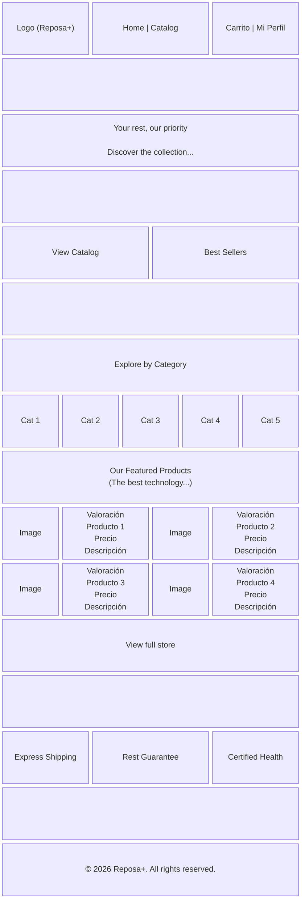
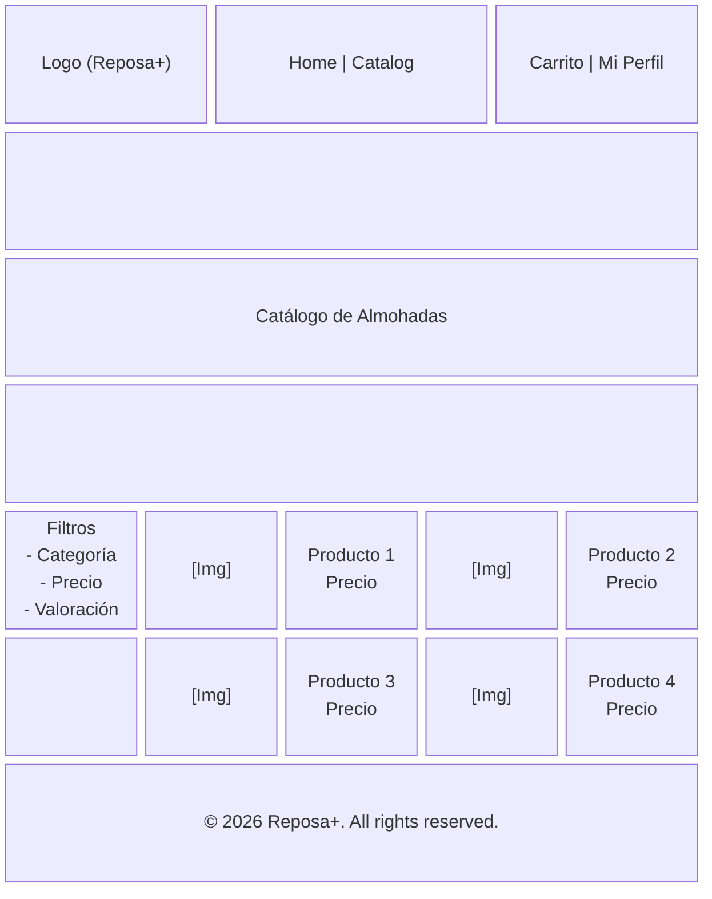
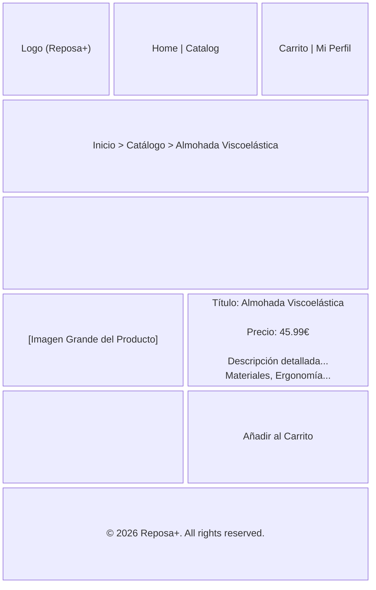
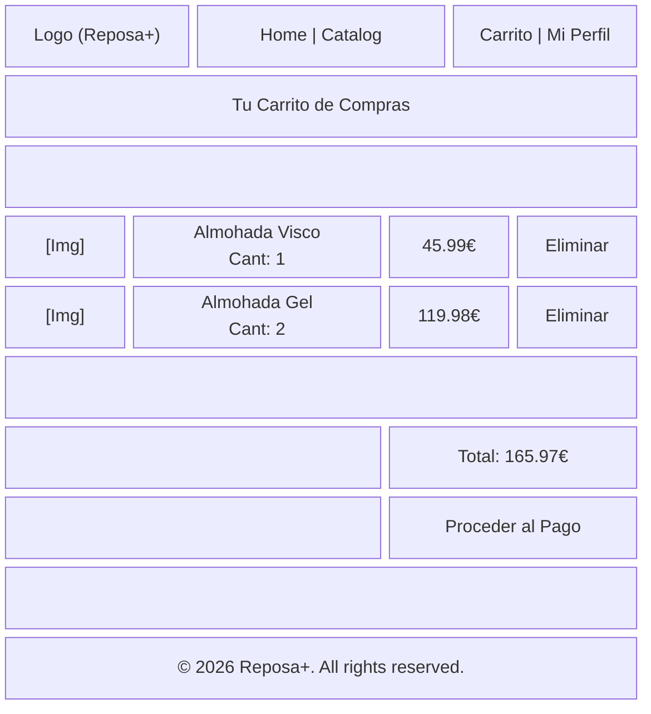
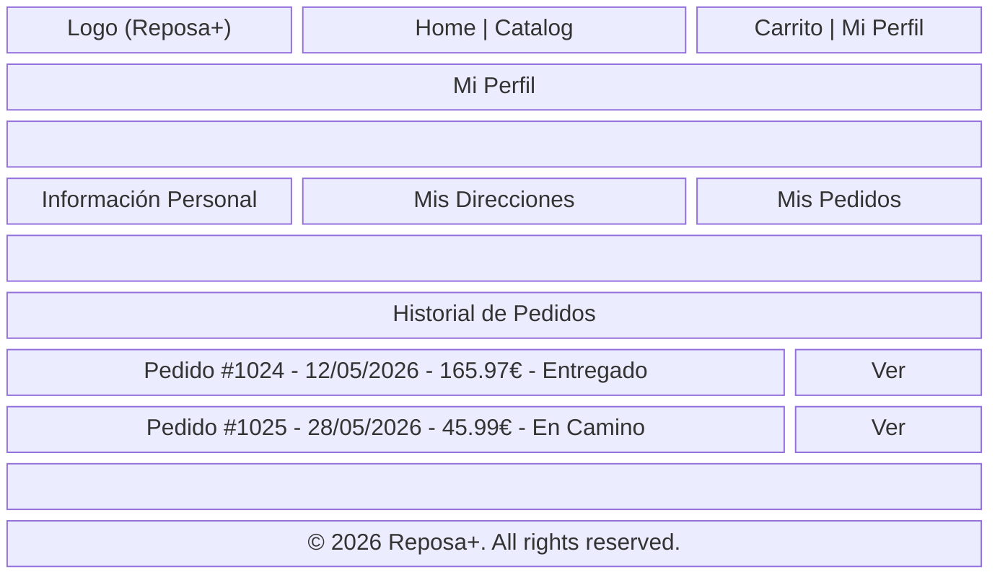
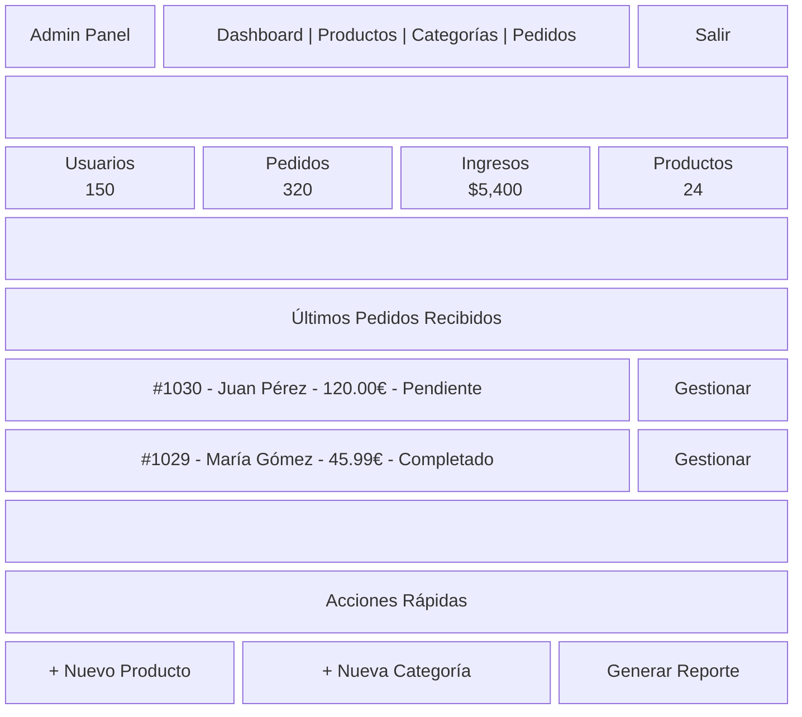

# Wireframes de la Aplicación Reposa+

Este documento contiene los esquemas estructurales (wireframes de baja fidelidad) para las pantallas principales de la aplicación Reposa+, utilizando diagramas de bloques con sintaxis de Mermaid.

## 1. Pantalla de Inicio (Home) (`/`)

Vista principal de bienvenida de la tienda con productos destacados y categorías.

## 2. Pantalla de Catálogo (`/catalog`)

Vista principal para explorar todos los productos, con opciones de filtrado.

## 3. Detalle del Producto (`/catalog/{product}`)

Vista enfocada en la información detallada de una almohada específica.

## 4. Pantalla de Carrito (`/cart`)

Resumen de los artículos añadidos y proceso previo al checkout.

## 5. Perfil de Usuario (`/profile` / `/orders`)

Panel del usuario donde puede ver su información, direcciones y su historial de pedidos.

## 6. Dashboard de Administración (`/admin/dashboard`)

Panel exclusivo para los administradores para gestionar la tienda.

