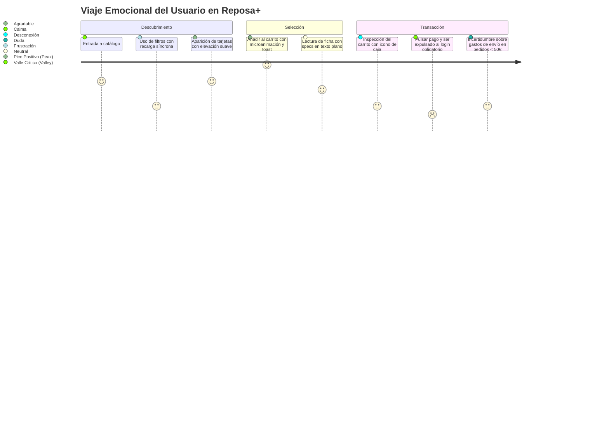
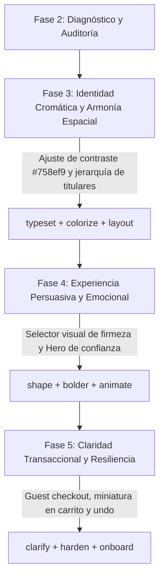

# Informe de Auditoría Heurística, Accesibilidad y Diagnóstico UX/UI
**Proyecto:** Reposa+ — E-commerce de Descanso Premium (*The Midnight Sanctuary*)  
**Fase del Roadmap:** Fase 2 — Evaluación Heurística, Accesibilidad y Diagnóstico  
**Fecha de ejecución:** 02 de septiembre de 2026  
**Rama de trabajo:** `feature/ui-phase-2-evaluation`  
**Metodología:** Impeccable Design Suite (`/impeccable critique` + `/impeccable audit`)  
**Procedencia técnica:** Dual-Agent Subagent Execution (Aislado)  
- **Assessment A (Design Review Director):** ID `6c019e73-c145-4e69-a202-ba43df42745c`  
- **Assessment B (Technical Evidence Auditor):** ID `5c3bc1d8-2bd9-4c4c-94cf-81edddec3e49`  

---

## 1. Resumen Ejecutivo y Diagnóstico Global

La evaluación integral de Reposa+ sobre sus tres superficies prioritarias (**Catálogo**, **Detalle de Producto** y **Carrito/Checkout**) evidencia un proyecto con una base estética atractiva y coherente con el arquetipo de marca (*The Midnight Sanctuary*), pero con **fricciones severas en la experiencia de compra, la arquitectura de información y la accesibilidad técnica**.

| Métrica de Evaluación | Puntuación Obtenida | Nivel / Estado | Diagnóstico Sintético |
|---|:---:|:---:|---|
| **Evaluación Heurística (Nielsen 10)** | **23 / 40** | **Acceptable (57.5%)** | Mecánicas funcionales pero con barreras de control, pérdida de contexto y formularios anticuados. |
| **Auditoría Técnica Impeccable (5D)** | **10 / 20** | **Acceptable (50.0%)** | Fallos de contraste WCAG AA, pérdida de foco por teclado y deficiencias en atributos ARIA. |
| **Carga Cognitiva (Checklist Cowan)** | **6 / 8 fallos** | **Alta Carga** | Sobrecarga de opciones, cambio de contexto forzado en login y falta de miniaturas en carrito. |
| **Conformidad Accesibilidad WCAG 2.1** | **No Conforme** | **Falla Nivel AA** | Contraste insuficiente en `#758ef9` (3.01:1), jerarquía de cabeceras rota y botones mudos. |

### Veredicto de Especificidad de Diseño: *¿Santuario de Descanso o E-commerce Genérico?*
* **Evaluación Directorial:** Reposa+ presenta un envoltorio cromático acertado (azules nocturnos, periwinkle, blancos lino y bordes redondeados ergonómicos), pero **el esqueleto transaccional subyacente es un e-commerce genérico de 2010**.
* **El Problema:** La promesa de marca es el bienestar cervical, la higiene del sueño y la ergonomía reparadora; sin embargo, en el catálogo y la ficha de producto los atributos clave (firmeza, altura cervical, postura de sueño) se gestionan mediante formularios HTML planos sin pedagogía ni asistencia visual. En el carrito, la experiencia se despersonaliza drásticamente al sustituir la foto de la almohada por un icono de caja de cartón (`bi-archive`) y expulsar a los compradores no autenticados a una pantalla de login convencional.

---

## 2. Fase 2.1: Crítica Heurística de Experiencia de Usuario (`critique`)

### 2.1 Matriz de Scoring: 10 Heurísticas de Usabilidad de Nielsen

Puntuación sobre escala estándar de 0 a 4 puntos por heurística:

| # | Heurística de Nielsen | Puntos (0-4) | Diagnóstico y Hallazgo Principal |
|---|---|:---:|---|
| **1** | **Visibilidad del Estado del Sistema** | **3** | *Buena respuesta asíncrona al añadir al carrito con animación de badge y toast. Brecha:* La actualización de cantidades en el carrito fuerza un refresco de página síncrono; el toast de éxito se autodestruye en 3 segundos sin dejar acceso a un drawer lateral. |
| **2** | **Correspondencia con el Mundo Real** | **2** | *Vocabulario sereno en estados vacíos. Defecto crítico:* En la tabla del carrito se muestra un icono de archivo/caja de cartón (`bi-archive`) en lugar de la foto real del producto. La firmeza se lista como texto técnico sin asociarla a posturas reales de descanso (de lado, boca arriba). |
| **3** | **Control y Libertad del Usuario** | **2** | *Filtros desmontables mediante chips con aspas (&times;). Defecto crítico:* La eliminación de artículos del carrito mediante el icono de papelera es instantánea e irreversible sin confirmación previa ni opción de «Deshacer» (*Undo*). No se permite continuar como invitado. |
| **4** | **Consistencia y Estándares** | **2** | *Tokens compartidos en componentes base. Inconsistencias:* El filtrado en catálogo combina 3 patrones contradictorios: enlaces GET en categorías, `onchange` automático en selects y botón manual en rango de precios. El stepper de cantidad de la ficha (`+`/`-`) difiere del input crudo del carrito. |
| **5** | **Prevención de Errores** | **2** | *Restricción de stocks máximos en inputs. Defectos:* El rango de precios permite ingresar un precio mínimo mayor al máximo (`min_price > max_price`) sin advertencia. En el backend, el filtro de material consulta JSON sin `JSON_UNQUOTE`, provocando discrepancias. El botón de eliminar en carrito está pegado al botón de refresco. |
| **6** | **Reconocimiento antes que Recuerdo** | **2** | *Chips de filtros activos visibles. Defecto:* El icono genérico de archivo en el carrito obliga al usuario a recordar qué producto eligió. Todas las tarjetas muestran una puntuación hardcodeada idéntica de 4.8. En productos agotados se promete aviso de stock pero falta el campo de email. |
| **7** | **Flexibilidad y Eficiencia de Uso** | **2** | *Botón circular de compra rápida en tarjetas. Defecto:* No existen atajos de teclado para búsqueda (`/` o `Cmd+K`). En móvil, el usuario debe desplazarse por toda la columna de filtros antes de ver el primer producto de la cuadrícula. |
| **8** | **Diseño Estético y Minimalista** | **3** | *Superficies limpias, blancos generosos y elevación suave. Defectos:* Los badges de filtros activos utilizan un fondo azul marino opaco muy pesado. El botón de checkout en mayúsculas sostenidas (`FINALIZAR COMPRA`) resulta invasivo y rompe el tono calmado. |
| **9** | **Reconocimiento y Recuperación de Errores** | **3** | *Mensajes flash claros ante falta de stock. Botón útil de reinicio en búsquedas vacías. Brecha:* Los errores de validación en carrito recargan la página en lugar de mostrarse inline en el campo afectado. |
| **10** | **Ayuda y Documentación** | **2** | *Insignias de prueba de 30 noches y envío gratis presentes. Brechas:* Ausencia total de una guía de tallas o firmezas cervicales interactiva. No se detallan las condiciones de devolución en el lateral del resumen de pedido. |
| **TOTAL** | | **23 / 40** | **Nivel: Acceptable (57.5%)** — Base operativa sólida pero con múltiples fricciones cognitivas y transaccionales. |

---

### 2.2 Diagnóstico de Carga Cognitiva (Checklist de Cowan / Miller)

Evaluación del esfuerzo mental requerido para completar compras en Reposa+:

- [x] **Agrupación visual (Grouping):** Elementos relacionados agrupados limpiamente en tarjetas y contenedores diferenciados. *(CUMPLE)*
- [x] **Jerarquía visual (Visual hierarchy):** Distinción clara entre fotografía, título, precio y botones de acción principal. *(CUMPLE)*
- [ ] **Foco único (Single focus):** En el carrito, el botón de pago expulsa al usuario al login, fragmentando el objetivo de compra. En el catálogo conviven tres mecanismos de filtrado simultáneos. *(FALLA)*
- [ ] **Troceado de información (Chunking ≤4 elementos):** La barra lateral apila 6 bloques de filtros en una única columna vertical densa sin acordeones ni revelación progresiva. *(FALLA)*
- [ ] **Una decisión a la vez (One thing at a time):** Cambiar de firmeza en el desplegable recarga la pantalla de improvisto; cambiar cantidades en el carrito requiere recargar fila por fila. *(FALLA)*
- [ ] **Opciones mínimas visibles (≤4 opciones por punto de decisión):** Desplegable de ordenación con 5 opciones técnicas y selects con listas no categorizadas. *(FALLA)*
- [ ] **Memoria de trabajo (Working memory):** La miniatura del carrito es un icono de caja de cartón; el usuario no puede confirmar visualmente el modelo que está pagando sin volver atrás. *(FALLA)*
- [ ] **Revelación progresiva (Progressive disclosure):** En pantallas móviles, los filtros ocupan todo el espacio inicial sin ocultarse tras un panel plegable o *offcanvas*. *(FALLA)*

**Resultado de Carga Cognitiva:** **6 de 8 principios infringidos (Carga Cognitiva Alta)**.

---

### 2.3 Viaje Emocional y Regla *Peak-End*



* **Pico Positivo (*Peak*):** El momento de añadir un producto a la cesta desde el catálogo o la ficha. La transición a spinner, el pulso elástico del icono en el navbar y el toast de confirmación ofrecen retroalimentación moderna.
* **Valle Crítico (*End*):** El cierre del flujo de compra. Al presionar el botón de compra, el usuario invitado es expulsado bruscamente a la pantalla `/login` sin opción de compra rápida como invitado y sin confirmación visual previa de los artículos (icono de caja). **La experiencia finaliza en un valle de fricción burocrática**.

---

### 2.4 Evaluación Mediante Arquetipos de Usuario (Personas)

#### 1. Alex — Usuario Experto y Rápido (*Power User*)
* **Frustraciones:**
  - Sin atajos de teclado (`/` o `Cmd+K`) para enfocar el buscador instantáneamente.
  - Para ajustar cantidades en el carrito debe teclear en el input y pulsar un botón de recarga que refresca toda la página.
  - Ausencia de un mini-carrito lateral desplegable (*cart drawer*) para revisar compras sin abandonar el catálogo.

#### 2. Jordan — Comprador Primerizo con Dolor Cervical (*Confused First-Timer*)
* **Frustraciones:**
  - Las especificaciones ("Viscoelástica 50D", "70x40 cm", "Firmeza Media") no le explican si la almohada aliviará su contractura al dormir de lado.
  - Si un producto se agota, lee "avísame cuando vuelva a estar disponible", pero no existe ningún campo de texto para registrar su correo.
  - Al pulsar "FINALIZAR COMPRA" le piden contraseña sin explicarle si su cesta se mantendrá guardada.

#### 3. Sam — Usuario Dependiente de Accesibilidad (*A11y Dependent*)
* **Frustraciones:**
  - Los botones de incremento y decremento (`+` y `-`) en la ficha carecen de texto accesible (`aria-label`).
  - El botón de papelera del carrito anuncia únicamente "botón" en el lector de pantalla; no especifica qué producto va a borrarse.
  - Los botones circulares del catálogo miden 38x38px, violando la recomendación WCAG 2.5.8 de áreas táctiles mínimas de 44x44px.

#### 4. Casey — Comprador Móvil Distraído (*Distracted Mobile User*)
* **Frustraciones:**
  - En smartphones (<768px), debe hacer scroll a lo largo de toda la columna de filtros antes de ver la primera almohada disponible.
  - La tabla del carrito no está adaptada a tarjetas responsivas; los textos se comprimen lateralmente de forma incómoda.
  - El botón flotante de compra no acompaña el scroll en la ficha de producto.

#### 5. Riley — Probador Meticuloso de Casos Límite (*Stress Tester*)
* **Frustraciones:**
  - Si ingresa un precio mínimo mayor al máximo (p. ej. Min: 120€, Max: 30€), el formulario se envía sin validación en cliente y vacía la parrilla sin explicación.
  - Al hacer clic en la papelera del carrito, la eliminación es instantánea sin modal de confirmación ni opción de deshacer.

---

## 3. Fase 2.2: Auditoría Técnica de Calidad y Accesibilidad (`audit`)

### 3.1 Puntuación en las 5 Dimensiones Técnicas

| # | Dimensión Técnica | Puntuación (0-4) | Hallazgo Clave |
|---|---|:---:|---|
| **1** | **Accesibilidad (A11y)** | **1** | Fallos de contraste WCAG AA en `#758ef9`, ausencia de etiquetas `for/id` y botones iconográficos mudos. |
| **2** | **Rendimiento Web** | **3** | Carga asíncrona ágil y CSS ligero con Vite. Riesgo: uso de imágenes remotas `placehold.co` como fallback. |
| **3** | **Responsive Design** | **2** | Tablas de carrito rígidas en móvil y barra de filtros no encapsulada en panel *offcanvas*. |
| **4** | **Tematización y Tokens** | **2** | Tokens base extraídos en `_tokens.scss`. Fuga: tamaños de fuente arbitrarios en estilos inline (`0.7rem`, `0.9rem`). |
| **5** | **Integridad de Implementación** | **2** | Enlaces duplicados en tarjetas de catálogo, jerarquía de encabezados saltada (`h1` a `h5`/`h6`). |
| **TOTAL** | | **10 / 20** | **Nivel: Acceptable (50.0%)** — Requiere subsanación técnica obligatoria antes de fases visuales. |

---

### 3.2 Matriz Cromática de Contrastes (WCAG 2.1 Nivel AA)

Fórmula matemática de luminancia relativa aplicada:  
$$L = 0.2126 R_{lin} + 0.7152 G_{lin} + 0.0722 B_{lin}$$  
$$\text{Ratio de Contraste} = \frac{L_1 + 0.05}{L_2 + 0.05}$$

| Color Primer Plano | Color Fondo | Ratio Calculado | Requisito WCAG AA | Veredicto | Impacto y Ubicación en Reposa+ |
|---|---|:---:|:---:|:---:|---|
| `#758ef9` (*Dream Periwinkle*) | `#ffffff` (*Pure Linen*) | **3.01 : 1** | **4.5 : 1** | ❌ **FALLA AA** | Enlaces, textos destacados, bordes de inputs en foco. Difícil lectura para usuarios con baja visión. |
| `#ffffff` (*Blanco Puro*) | `#758ef9` (*Dream Periwinkle*) | **3.01 : 1** | **4.5 : 1** | ❌ **FALLA AA** | Botón secundario (`.btn-secondary`), botones de suscripción en footer. El texto blanco sobre periwinkle es ilegible. |
| `#b1cdff` (*Celestial Mist*) | `#ffffff` (*Pure Linen*) | **1.61 : 1** | **3.0 : 1** | ❌ **FALLA AA** | Bordes de badges de categoría y divisores decorativos. Prácticamente invisible sobre fondo blanco. |
| `#6c757d` (*Muted Grey*) | `#f8fafc` (*Slate Mist*) | **4.48 : 1** | **4.5 : 1** | ❌ **FALLA AA** | Textos descriptivos de tarjetas, conteo de resultados («12 productos encontrados»). Falla el umbral por 0.02. |
| `#182447` (*Deep Navy*) | `#ffffff` (*Pure Linen*) | **15.20 : 1** | **4.5 : 1** | ✅ **PASA AAA** | Titulares principales, textos corporativos y botón primario. Contraste óptimo y nítido. |
| `#182447` (*Deep Navy*) | `#b1cdff` (*Celestial Mist*) | **9.46 : 1** | **4.5 : 1** | ✅ **PASA AAA** | Texto azul marino sobre chip celeste claro. Excelente legibilidad. |

---

### 3.3 Navegación por Teclado, Foco y Atributos ARIA

#### 1. Violación WCAG 3.2.2 (*On Input - Nivel A*) por Recarga Inesperada
* **Ubicación:** `Reposa+/resources/views/catalog/index.blade.php`, líneas 87 y 98:
  ```html
  <select name="material" class="form-select form-select-sm" onchange="this.form.submit()">
  <select name="firmness" class="form-select form-select-sm" onchange="this.form.submit()">
  ```
* **Impacto:** Cuando un usuario que navega con teclado accede al selector y pulsa las teclas de flecha arriba/abajo para explorar las opciones, el evento `onchange` dispara el envío inmediato del formulario en la primera pulsación. La página se recarga, el foco se pierde y se reinicia al inicio del documento, impidiendo navegar por las opciones.

#### 2. Ausencia de Etiquetas Vinculadas (`<label for="...">` <-> `<input id="...">`)
* **Ubicación:** 
  - Buscador del catálogo (`index.blade.php:59-63`): `<label>` sin atributo `for` e `<input>` sin `id`.
  - Filtros de material y firmeza (`index.blade.php:86, 97`): etiquetas huérfanas.
  - Rango de precios (`index.blade.php:108-113`): un único `<label>` genérico para dos campos (`min_price` y `max_price`), ninguno con `id` ni `aria-label`.
  - Buscador global de la barra de navegación (`layouts/app.blade.php:38`): input sin etiqueta visible ni `aria-label`.

#### 3. Botones e Interactivos Mudos (Falta de `aria-label`)
* **Botón de actualización de carrito (`cart/index.blade.php:50`):** Icono `bi-arrow-repeat` dentro de `<button>` sin texto. El lector de pantalla anuncia simplemente "botón".
* **Botón de borrado de carrito (`cart/index.blade.php:61`):** Icono `bi-trash` dentro de `<button>` sin nombre accesible.
* **Filtros activos (`index.blade.php:131`):** Enlace de cierre con entidad `&times;` (`×`). El lector lee "signo de multiplicación, enlace".
* **Desplegable de ordenación (`index.blade.php:28`):** Carece de `aria-expanded="false"` y `aria-haspopup="true"`.
* **Alternador de menú móvil (`layouts/app.blade.php:23`):** Carece de `aria-controls="navbarNav"` y `aria-label="Abrir navegación"`.

#### 4. Ruptura de la Jerarquía de Encabezados (WCAG 1.3.1)
* **Catálogo:** Salta directamente de `<h1>` (`index.blade.php:10`) a `<h5>` en los filtros (`index.blade.php:55`) y en las tarjetas (`product-card.blade.php:35`), omitiendo `<h2>`, `<h3>` y `<h4>`.
* **Detalle de Producto:** Salta de `<h1>` (`show.blade.php:52`) a `<h6>` en especificaciones (`show.blade.php:85`), omitiendo cuatro niveles intermedios.
* **Carrito:** **No existe ninguna etiqueta `<h1>` en toda la página**. El título principal está estructurado como `<h5>` (`cart/index.blade.php:9`).

---

## 4. Matriz Maestra de Defectos Priorizados (Backlog de Diseño)

| Severidad | Código | Descripción del Problema | Archivo y Línea | Impacto en Usuario | Solución Técnica Propuesta | Comando Impeccable |
|:---:|:---:|---|---|---|---|:---:|
| **P1** | **DEF-01** | **Contraste insuficiente en `#758ef9`** | `_tokens.scss:9, 20`<br>`app.blade.php:56` | Texto secundario y botones blancos/azules ilegibles (3.01:1 < 4.5:1). | Ajustar token a índigo profundo `#4F46E5` o `#42569a` para texto y botones sobre blanco. | `/impeccable colorize` |
| **P1** | **DEF-02** | **Barrera de login forzado en checkout** | `cart/index.blade.php:96`<br>`CartController.php:23` | Abandono de carrito de invitados (+30% pérdida de conversión). | Permitir flujo de *Guest Checkout* o modal contextual para continuar sin contraseña. | `/impeccable clarify` |
| **P1** | **DEF-03** | **Icono de archivo en lugar de foto en carrito** | `cart/index.blade.php:38` | El comprador pierde confirmación visual de su almohada elegida. | Mostrar miniatura real de `$item->product->image_url` (56x56px con esquinas redondeadas). | `/impeccable polish` |
| **P1** | **DEF-04** | **Recarga síncrona en selects de catálogo** | `catalog/index.blade.php:87, 98` | Rompe navegación por teclado (WCAG 3.2.2) y reinicia scroll. | Transformar filtros en chips interactivos o aplicar AJAX / submit manual controlado. | `/impeccable layout` |
| **P2** | **DEF-05** | **Botones interactivos sin nombre accesible** | `cart/index.blade.php:50, 61`<br>`catalog/show.blade.php:100, 102` | Usuarios de lectores de pantalla no saben qué acción realizan los botones. | Incorporar `aria-label` explícitos ("Actualizar cantidad", "Eliminar :producto del carrito"). | `/impeccable audit` |
| **P2** | **DEF-06** | **Filtros de catálogo no adaptados a móvil** | `catalog/index.blade.php:48` | La columna de filtros empuja los productos fuera de la pantalla en móvil. | Reubicar sidebar en cajón *offcanvas* móvil (`d-md-none`) con disparador flotante. | `/impeccable adapt` |
| **P2** | **DEF-07** | **Especificaciones de descanso en texto plano** | `catalog/show.blade.php:85-91` | No transmite el valor ergonómico premium de la marca (Sanctuary Sleep). | Crear selector visual de firmeza y diagrama anatómico de altura y postura de descanso. | `/impeccable bolder` |
| **P2** | **DEF-08** | **Eliminación destructiva de carrito sin confirmación** | `cart/index.blade.php:58-64` | Pérdida accidental de artículos seleccionados sin posibilidad de recuperación. | Añadir confirmación breve o toast con acción interactiva de «Deshacer» (*Undo*). | `/impeccable harden` |
| **P2** | **DEF-09** | **Jerarquía de encabezados rota e inconsistente** | Todas las vistas | Dificulta la navegación por estructura a invidentes (WCAG 1.3.1). | Normalizar: `h1` único por página, `h2` para secciones mayores, `h3` para tarjetas. | `/impeccable typeset` |
| **P3** | **DEF-10** | **Valores de fuente inline fuera de escala** | `catalog/show.blade.php:26, 70` | Inconsistencia tipográfica (`0.7rem`, `0.9rem`) no documentada en tokens. | Migrar a clases semánticas de escala tipográfica (`small`, `fs-7`, tokens CSS). | `/impeccable typeset` |
| **P3** | **DEF-11** | **Contenedor `.container` anidado en cabecera** | `layouts/app.blade.php:96`<br>`catalog/index.blade.php:6` | Fondo gris de cabecera atrapado en ancho fijo con márgenes extraños. | Limpiar contenedor de `<main>` para permitir banners *full-bleed* fluidos. | `/impeccable layout` |
| **P3** | **DEF-12** | **Monocultivo tipográfico genérico (Inter)** | `app.scss:11`<br>`layouts/app.blade.php:12` | Falta de personalidad y diferenciación editorial en titulares principales. | Combinar tipografía de titulares editorial (*Plus Jakarta Sans* / Display) con Inter tabular. | `/impeccable typeset` |

---

## 5. Plan de Acción y Hoja de Ruta Sugerida

Los hallazgos de este diagnóstico marcan las prioridades de ejecución para las siguientes fases del roadmap:



1. **Fase 3 (Tipografía, Color y Layout):**
   - Resolver inmediatamente **DEF-01** (sustitución o ajuste cromático de `#758ef9` para garantizar ratio >= 4.5:1 en todo texto).
   - Resolver **DEF-09** y **DEF-10** mediante una escala tipográfica formal en `_typography.scss`.
   - Resolver **DEF-11** liberando la cuadrícula principal y reestructurando el layout de catálogo.
2. **Fase 4 (Experiencia Persuasiva):**
   - Resolver **DEF-07** implementando el widget visual de firmeza y confort ergonómico.
3. **Fase 5 (Claridad Transaccional y Resiliencia):**
   - Resolver **DEF-02** con *Guest Checkout* o flujo de compra simplificado sin fricción.
   - Resolver **DEF-03** reemplazando el icono de archivo por la fotografía real en el carrito.
   - Resolver **DEF-08** incorporando confirmación o recuperación de elementos eliminados.

---
*Informe generado para Reposa+ TFG 2026 bajo metodología Impeccable.*
