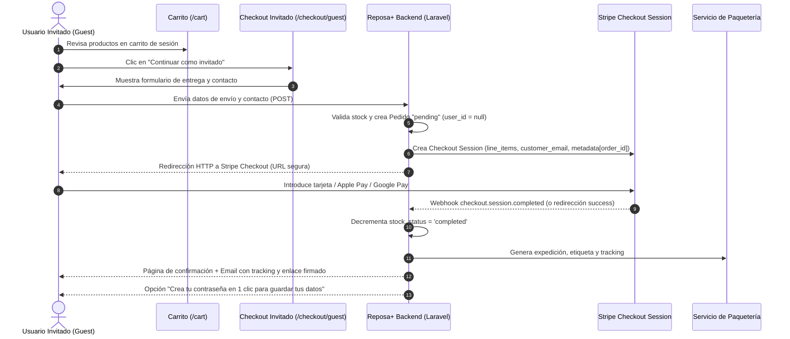
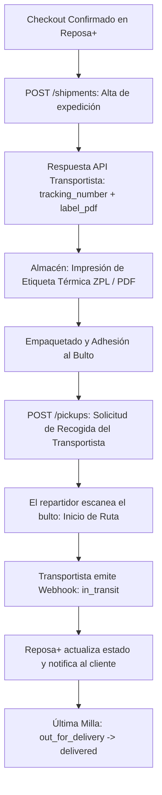

# Investigación y Diseño Arquitectónico: Flujos de Checkout, Registro y Paquetería en Reposa+

Este documento recoge el análisis técnico, funcional y de negocio para tres mejoras estratégicas del e-commerce **Reposa+**:
1. **Compra sin registro previo (*Guest Checkout*)** y redirección a pasarela de pago.
2. **Captura de datos de envío en el proceso de registro de usuarios**.
3. **Servicio de paquetería estándar:** Mock implementado en el sistema y estudio comparativo de servicios reales, arquitectura de integración y costes operativos.

---

## 1. Flujo de Compra como Invitado (*Guest Checkout*)

### 1.1. Justificación de Negocio, CRO y Experiencia de Usuario (UX)
En el comercio electrónico actual, obligar al cliente a crear una cuenta antes de permitirle pagar es una de las mayores fuentes de fricción.
- **Benchmark del sector (Baymard Institute):** El **24% al 26% de los usuarios abandonan el carrito** si la tienda les exige registrarse obligatoriamente antes de proceder al pago. Esta es la segunda causa de abandono de carritos a nivel global, únicamente por detrás de los costes imprevistos de envío.
- **Psicología de compra en Reposa+:** Los clientes que adquieren productos de descanso ergonómico a menudo realizan compras meditadas pero sensibles a la inmediatez o desde dispositivos móviles durante momentos de relax nocturno. Forzar la creación y memorización de una contraseña en el momento álgido de la decisión de compra genera ansiedad cognitiva (*password fatigue*) y frustración.
- **Principio "Just-in-Time Data Collection":** Solo deben solicitarse los datos estrictamente necesarios para formalizar el contrato de compraventa, el envío físico y el cumplimiento fiscal.

### 1.2. Matriz de Datos Necesarios del Invitado
Para tramitar la compra sin registro, el formulario de checkout debe recopilar:

| Campo | Obligatorio | Justificación Funcional / Legal |
| :--- | :---: | :--- |
| **Nombre y Apellidos** | Sí | Identificación del destinatario para el transportista y facturación. |
| **Correo Electrónico** | Sí | Envío de confirmación de pedido, factura legal y avisos de tracking. |
| **Teléfono Móvil** | Sí | Imprescindible para el mensajero (avisos SMS de entrega y llamadas en caso de ausencia). |
| **Dirección (Calle, nº, piso)** | Sí | Punto físico de entrega domiciliaria. |
| **Código Postal** | Sí | Enrutamiento logístico y cálculo de zonas tarifarias. |
| **Ciudad / Población** | Sí | Destino de la expedición en el transportista. |
| **Provincia** | Sí | Determinación de península vs. territorios insulares (Baleares / Canarias). |
| **País** | Sí (def. ES) | Fiscalidad (IVA aplicable) y operador postal. |
| **NIF / DNI / CIF** | Opcional | Obligatorio solo si el cliente marca *"Deseo factura con validez fiscal para autónomo o empresa"*. |
| **Notas de entrega** | Opcional | Instrucciones para el repartidor (*"Dejar en conserjería si no contesta"*). |

### 1.3. Arquitectura del Flujo y Redirección a la Pasarela (Stripe)



### 1.4. Modelo de Datos y Seguridad en Laravel

#### A. Flexibilidad en la tabla `orders`
La columna `user_id` de la tabla `orders` debe declararse **nullable** para admitir pedidos de invitados:
```php
$table->foreignId('user_id')->nullable()->constrained()->nullOnDelete();
```

#### B. Inmutabilidad de los Datos de Envío (*Snapshot Pattern*)
En un e-commerce robusto, **la dirección de entrega debe quedar congelada en el momento de la compra**. Si se usara únicamente una relación con `addresses`, y el usuario registrado editara su dirección en el perfil seis meses después, las facturas y pedidos históricos pasados reflejarían una dirección errónea.
Por ello, cada pedido debe almacenar el snapshot inmutable de entrega:
- `shipping_name`, `shipping_email`, `shipping_phone`
- `shipping_street`, `shipping_city`, `shipping_zip_code`, `shipping_province`, `shipping_country`

#### C. Seguridad en el Acceso y Consulta del Pedido por Invitados
Un invitado no tiene sesión (`auth()->check() = false`). Para evitar que un usuario malintencionado pueda ver datos personales de otros pedidos iterando identificadores numéricos (`/orders/1`, `/orders/2`), se deben aplicar dos mecanismos de seguridad:
1. **Token Criptográfico / UUID de Pedido:** Generar un `guest_token` único (o `order_uuid`) al crear la orden. La URL pública de consulta es: `/orders/track/{tracking_token}`.
2. **URLs Firmadas de Laravel (`URL::signedRoute`):** Enviar enlaces temporales o firmados criptográficamente en el correo electrónico de confirmación para la descarga de la factura (`route('orders.invoice.guest', ['order' => $order->id, 'hash' => sha256(...)])`).

#### D. Conversión Post-Compra (*Account Creation in 1-Click*)
En la pantalla de agradecimiento post-pago (`order-confirmed`), se ofrece la opción:
> *"¿Deseas guardar tus datos y consultar tus pedidos en cualquier momento? Crea una contraseña y activa tu cuenta."*

Si el usuario ingresa su contraseña, el backend crea el `User` con el email y nombre ya validados en el pedido, asocia la orden (`$order->update(['user_id' => $newUser->id])`), crea la `Address` predeterminada y lo autentica automáticamente sin fricción.

#### E. Cumplimiento Legal y RGPD (España / UE)
- **Base jurídica:** El tratamiento de los datos del invitado se ampara en el **Artículo 6.1.b del RGPD** (ejecución de un contrato en el que el interesado es parte).
- **Consentimiento informativo:** Checkbox no premarcado para aceptar los Términos de Compra y la Política de Privacidad.
- **Retención:** Los datos se conservan únicamente el tiempo exigido por la legislación tributaria española (Ley General Tributaria: 4 años; Código de Comercio: 6 años) y de garantías al consumidor (Real Decreto Legislativo 1/2007: 3 años de garantía legal).

---

## 2. Captura de Datos de Envío en el Proceso de Registro

### 2.1. Análisis Comparativo: Registro Minimalista vs. Registro con Dirección

| Enfoque | Ventajas | Inconvenientes | Recomendación para Reposa+ |
| :--- | :--- | :--- | :--- |
| **Registro Minimalista** (Solo Nombre, Email, Password) | Menor fricción en el alta inicial de cuenta. | El usuario debe introducir obligatoriamente su dirección en el primer checkout, interrumpiendo el funnel. | Adecuado para redes sociales o SaaS, deficiente para tiendas online con entrega física. |
| **Registro Completo con Dirección de Envío** (Propuesto) | **Fricción cero en futuras compras.** El usuario queda 100% cualificado para pagar en un solo clic. | Formulario ligeramente más largo. | **Recomendado:** Formulado con diseño agrupado por tarjetas visuales claras, genera percepción de seriedad y servicio premium. |

### 2.2. Diseño de la Interfaz de Registro (Blade & Estética Midnight Sanctuary)
El formulario de registro (`resources/views/auth/register.blade.php`) se estructura en **dos bloques temáticos visualmente delimitados**:
1. **Bloque 1: Credenciales de Acceso:**
   - Nombre completo.
   - Correo electrónico.
   - Contraseña y Confirmación de contraseña.
2. **Bloque 2: Dirección de Entrega Habitual:**
   - Dirección (Calle, número, piso/puerta).
   - Código Postal y Ciudad.
   - Provincia (Desplegable con provincias españolas o campo de texto libre).
   - Teléfono de contacto (con microcopy: *"Utilizado exclusivamente por el transportista para coordinar la entrega"*).

### 2.3. Implementación en Laravel Fortify (`CreateNewUser.php`)
En Laravel Fortify, la creación de usuarios se delega en la acción `App\Actions\Fortify\CreateNewUser`. La lógica debe envolver la creación en una transacción atómica de base de datos (`DB::transaction`):

```php
// app/Actions/Fortify/CreateNewUser.php
public function create(array $input): User
{
    Validator::make($input, [
        'name' => ['required', 'string', 'max:255'],
        'email' => ['required', 'string', 'email', 'max:255', Rule::unique(User::class)],
        'password' => $this->passwordRules(),
        'street' => ['required', 'string', 'max:255'],
        'city' => ['required', 'string', 'max:255'],
        'zip_code' => ['required', 'string', 'regex:/^[0-9]{5}$/'],
        'province' => ['nullable', 'string', 'max:100'],
        'phone' => ['nullable', 'string', 'max:30'],
    ])->validate();

    return DB::transaction(function () use ($input) {
        $user = User::create([
            'name' => $input['name'],
            'email' => $input['email'],
            'password' => Hash::make($input['password']),
        ]);

        $user->addresses()->create([
            'street' => $input['street'],
            'city' => $input['city'],
            'zip_code' => $input['zip_code'],
            'is_main' => true,
        ]);

        if (!empty($input['phone'])) {
            $user->profile()->create(['phone' => $input['phone']]);
        }

        return $user;
    });
}
```

### 2.4. Sincronización Transparente con el Carrito
Reposa+ ya cuenta con el listener `App\Listeners\MergeCartOnLogin`. Al completar el registro, Fortify dispara el evento de autenticación; el listener migra automáticamente los productos que el visitante tenía en la sesión del navegador a su nuevo carrito en la base de datos.
Al ser redirigido al carrito o checkout, la dirección ya está lista para su selección con un clic.

---

## 3. Servicio de Paquetería: Mock Implementado y Estudio de Servicios Reales

### 3.1. Arquitectura del Mock de Paquetería Implementado en Reposa+
Para dotar a la plataforma de una simulación completa, realista y testeada sin depender de credenciales reales ni costes externos durante la fase de desarrollo, se ha construido la siguiente arquitectura en el proyecto:

```
app/
├── Models/
│   └── Shipment.php                # Modelo Eloquent con estados, tracking, albarán y fechas
├── Services/
│   └── Shipping/
│       ├── ShippingServiceInterface.php     # Contrato desacoplado para cualquier transportista
│       └── MockStandardCourierService.php  # Simulación de Correos Express / Paq 24
database/
├── migrations/
│   └── 2026_09_05_100000_create_shipments_table.php # Migración de la tabla shipments
tests/Feature/
└── ShippingServiceTest.php         # Suite de 6 pruebas exhaustivas (41 assertions)
```

#### Capacidades del Mock Implementado:
1. **Cotización Dinámica de Tarifas (`calculateRates`):**
   - **Reposa+ Estándar (48-72h):** 4,95 € (o **0,00 € Gratis** si el pedido supera el umbral de 50,00 € definido en la marca).
   - **Reposa+ Express (24h):** 7,95 € (entrega urgente al siguiente día laborable).
   - **Punto de Recogida CityPaq (48h):** 3,50 € (recogida en taquilla inteligente).
2. **Generación de Códigos de Seguimiento Realistas:**
   - Genera identificadores con el estándar de operadores en España: `RPX` + Año (`2026`) + 6 dígitos aleatorios + `ES` (ej. `RPX2026849201ES`).
3. **Máquina de Estados Logísticos (`advanceTrackingStatus`):**
   - Simula las transiciones que un transportista real notifica vía API:
     1. `pre_registered` (*Etiqueta creada / Pre-admitido*): Paquete embalado en almacén central Coslada (Madrid).
     2. `in_transit` (*En tránsito*): Recogido por el camión de ruta nacional; actualiza automáticamente la orden a `shipped`.
     3. `at_hub` (*En plataforma destino*): Llegada a la delegación logística de la provincia de destino.
     4. `out_for_delivery` (*En reparto*): Asignado a la furgoneta de última milla.
     5. `delivered` (*Entregado*): Entrega confirmada con fecha y hora; actualiza la orden a `delivered`.
     6. `incident` (*Incidencia*): Destinatario ausente.
4. **Generación de Albarán Técnico / Etiqueta Térmica (`generateLabel`):**
   - Devuelve la información completa requerida para una impresora térmica de 10x15cm: código de barras Code 128, código de enrutamiento (ej. `VAL-46001-Z01`), remitente central (*Reposa+ Sleep Wellness S.L., Coslada*), datos del destinatario, peso volumétrico y observaciones de manipulación de almohadas ergonómicas.

---

### 3.2. Investigación de Servicios de Paquetería Reales en España y Europa

#### 3.2.1. Comparativa de los Principales Operadores de Transporte

| Operador | Puntos Fuertes | Puntos Débiles | Servicios Típicos E-commerce | Adecuación para Reposa+ |
| :--- | :--- | :--- | :--- | :--- |
| **Correos / Correos Express** | • Mayor capilaridad de oficinas en España.<br>• Red CityPaq (taquillas automáticas).<br>• Líder en cobertura rural y peninsular. | • API SOAP tradicional compleja en Correos (aunque Correos Express dispone de API REST v2 moderna). | • Paq 24 (24h)<br>• Paq 48 / Paq Estándar (48-72h)<br>• Paq Retorno (Devoluciones) | **Muy Alta:** Ideal como transportista principal por volumen y cobertura nacional. |
| **SEUR (DPDgroup)** | • Servicio *SEUR Predict* (aviso interactivo con ventana de 1 hora de entrega).<br>• Red Pickup con miles de comercios asociados.<br>• Excelente logística con Europa vía red DPD. | • Tarifas ligeramente superiores a la media.<br>• Suplementos estrictos por sobrepeso o reexpediciones. | • SEUR 24 / SEUR 13:30<br>• SEUR Domicilio E-commerce<br>• SEUR Devoluciones 2Shop | **Alta:** Excelente para opciones de entrega *Express* y clientes que valoran la puntualidad horaria. |
| **GLS Spain** | • Gran relación calidad/precio en B2C peninsular.<br>• Fuerte en envíos medianos/voluminosos.<br>• Red ParcelShop muy extendida en ciudades. | • Menor presencia en áreas rurales remotas frente a Correos. | • BusinessParcel (24h peninsular)<br>• ShopDeliveryParcel (Puntos de conveniencia)<br>• EuroBusinessParcel | **Alta:** Muy competitivo en costes para paquetes ligeros pero voluminosos (almohadas). |
| **MRW** | • Máxima fiabilidad en entregas urgentes garantizadas antes de las 10:00 o 14:00.<br>• Buena atención personalizada en delegaciones. | • Coste por expedición elevado para el segmento de bajo margen. | • Urgente 19 (antes de las 19h)<br>• Urgente 10 (antes de las 10h)<br>• Devoluciones con recogida | **Media:** Recomendable solo como opción prémium urgente de entrega en el mismo día o 24h temprano. |
| **DHL Parcel** | • Excelente infraestructura internacional en Europa.<br>• Gestión de aduanas ágil para envíos comunitarios. | • En España peninsular tiene menor cuota en envíos domésticos que Correos o SEUR. | • DHL Parcel Iberia<br>• DHL Parcel Connect (Europa) | **Media-Baja (Fase actual):** Muy útil si Reposa+ abre envíos a Francia, Alemania o Portugal. |

---

#### 3.2.2. Plataformas Agregadoras Multi-Carrier (SaaS de Envíos)
En lugar de negociar contratos individuales, fianzas e integraciones bilaterales con cada transportista, muchas tiendas online integran plataformas intermediarias especializadas:

| Plataforma | Modelo de Negocio | Ventajas Técnicas y Operativas |
| :--- | :--- | :--- |
| **Sendcloud** | SaaS por suscripción mensual + recargo opcional o tarifas propias. | • API REST moderna y documentada.<br>• Portal de devoluciones personalizable para el cliente con la marca de la tienda.<br>• Generación de reglas de enrutamiento automático (ej. pedidos < 2kg por Correos, > 2kg por SEUR). |
| **Packlink PRO** | Pago por envío (Pay-as-you-go) con tarifas de transportistas negociadas por volumen. | • Sin costes fijos ni cuotas mensuales.<br>• Acceso inmediato a Correos, SEUR, GLS y UPS con una sola cuenta bancaria.<br>• Ideal para fases de lanzamiento o volúmenes iniciales inferiores a 500 envíos/mes. |
| **ShippyPro** | Suscripción mensual por volumen de órdenes con conexión a cuentas propias del transportista. | • Gestión multicanal.<br>• Automatización de webhooks y notificaciones SMS/Email personalizadas.<br>• Optimizado para medianos y grandes volúmenes (>1.000 envíos/mes). |

---

### 3.3. Funcionamiento Técnico de las APIs Reales de Paquetería

Las integraciones modernas de transporte siguen un flujo de comunicación bidireccional basado en eventos (*Event-Driven Architecture*):



1. **Autenticación:**
   - Tradicional: Credenciales de cliente (Código de cliente + Usuario + Contraseña en cabeceras o Basic Auth).
   - Moderna: Bearer Token OAuth 2.0 o API Keys seguras regenerables.
2. **Generación de Etiquetas:**
   - **Formato ZPL (Zebra Programming Language):** Código vectorial en texto plano enviado directamente a impresoras térmicas de almacén (Zebra, Citizen, TSC). Extremadamente rápido y sin renderizado gráfico.
   - **Formato PDF (A6 / 10x15cm):** Descargable para impresoras estándar o almacenes pequeños.
3. **Webhooks y Trazabilidad en Tiempo Real:**
   - Los transportistas modernos no requieren polling periódico continuo; envían un `POST` HTTP al endpoint de la tienda (`/webhooks/carrier/tracking`) con el payload del evento (`parcel_id`, `status_code`, `timestamp`, `note`, `driver_name`).
4. **Manifiesto de Salida (*Manifest / End-of-Day*):**
   - Al final de la jornada logística, el almacén genera el albarán resumen con todos los paquetes expedidos para que el conductor del camión de recogida firme la recepción de los bultos.

---

### 3.4. Análisis Exhaustivo de Costes de Operación e Integración

#### 3.4.1. Costes de Integración Técnica y Software

| Concepto | Integración Directa con Transportista (ej. Correos Express) | Integración con Agregador (ej. Sendcloud / Packlink PRO) |
| :--- | :--- | :--- |
| **Coste de Licencia / API** | Gratuito (asociado a contrato mercantil con el transportista). | • Packlink PRO: 0 €/mes.<br>• Sendcloud: 0 € a 45 €/mes (pequeño) / 99 €/mes (mediano). |
| **Fianza o Depósito** | A menudo exigen fianza de 300 € a 1.000 € o pago mediante domiciliación bancaria previa fianza. | Tarjeta de crédito o domiciliación sin fianza inicial. |
| **Tiempo y Coste de Desarrollo** | 2-4 semanas de desarrollo (homologación de etiquetas y pruebas en sandbox del operador). | 1-2 semanas de desarrollo (SDKs preexistentes, REST APIs estándar). |
| **Hardware de Almacén** | Impresora térmica de etiquetas (Zebra ZD220 o similar): **180 € - 280 €** (pago único). Bobinas de etiquetas térmicas: ~0,01 €/etiqueta. | Impresora térmica o impresora láser estándar A4 con papel adhesivo. |

---

#### 3.4.2. Costes Operativos Unitarios (El Caso de Almohadas Ergonómicas)
En la logística e-commerce, el coste de envío no se calcula únicamente por el peso real de la báscula, sino por el **peso volumétrico**:

$$\text{Peso Volumétrico (kg)} = \frac{\text{Largo (cm)} \times \text{Ancho (cm)} \times \text{Alto (cm)}}{\text{Factor Volumétrico (habitualmente } 5.000 \text{ ó } 4.000\text{)}}$$

- **Caso real en Reposa+:**
  - Una almohada ergonómica pesa en báscula entre **1,2 kg y 1,8 kg**.
  - Sus dimensiones empaquetada son aproximadamente de $60 \times 40 \times 15\text{ cm} = 36.000\text{ cm}^3$.
  - $\text{Peso volumétrico} = \frac{36.000}{5.000} = \mathbf{7,2\text{ kg}}$ (o $\mathbf{3,6\text{ kg}}$ si se envía enrollada o sellada al vacío a $60 \times 20 \times 15\text{ cm}$).
  - El transportista tarificará por el mayor entre peso real y volumétrico.

#### Tarifas Negociadas Estimadas (España Peninsular, B2C):

| Tramo de Servicio | Coste Base Negociado | Suplemento Combustible (10%) | Coste Neto por Envío | P.V.P. Cobrado al Cliente | Margen de Transporte |
| :--- | :---: | :---: | :---: | :---: | :---: |
| **Estándar 48-72h (Pedido < 50 €)** | 3,80 € | 0,38 € | **4,18 €** | 4,95 € | +0,77 € (Cubre embalaje) |
| **Estándar 48-72h (Pedido > 50 €)** | 3,80 € | 0,38 € | **4,18 €** | 0,00 € (Gratis) | -4,18 € (Asumido por margen de producto) |
| **Express 24h** | 5,50 € | 0,55 € | **6,05 €** | 7,95 € | +1,90 € |
| **Punto de Recogida / Taquilla** | 2,80 € | 0,28 € | **3,08 €** | 3,50 € | +0,42 € |
| **Baleares (Marítimo 48-72h)** | 8,50 € | 0,85 € | **9,35 €** | 10,95 € | +1,60 € |
| **Canarias (Aéreo + DUA Aduanero)** | 14,00 € | 1,40 € | **15,40 € (+ DUA 12-18 €)** | Tarifado específico | Sujeto a trámite aduanero |

---

#### 3.4.3. Costes Adicionales y Logística Inversa (Devoluciones)
- **Recargo por combustible (*Fuel Surcharge*):** Es un porcentaje variable (entre el 8% y el 14%) que los operadores actualizan mensualmente según el precio del diésel en el BOE o índices europeos.
- **Segundo intento de entrega y entrega en sábado:** La mayoría de operadores incluye 2 intentos de entrega a domicilio. Si ambos fallan, el paquete pasa a punto de recogida durante 10-15 días. Las entregas concertadas en sábado conllevan un sobrecoste de **+3,50 € a +5,00 €**.
- **Logística Inversa (Devoluciones de Prueba de 30 a 100 noches):**
  - Reposa+ ofrece política de descanso y prueba. La recogida a domicilio de un producto devuelto suele costar **4,20 € a 5,50 €** por bulto.
  - Al tratarse de almohadas de descanso (artículos higiénicos), una almohada desprecintada y usada no puede revenderse como nueva; debe destinarse a reacondicionamiento (*outlet/recommerce*) o donación, lo que impacta en el coste de oportunidad del producto.

---

## 4. Conclusiones y Hoja de Ruta de Implementación

1. **Prioridad 1 (Mock de Paquetería):** Ya implementado y validado mediante la interfaz `ShippingServiceInterface`, la clase `MockStandardCourierService`, el modelo `Shipment` y su suite de tests unitarios/feature en verde.
2. **Prioridad 2 (Captura de Dirección en Registro):** Añadir los campos en `resources/views/auth/register.blade.php`, adaptar `CreateNewUser.php` para guardar `Address` transaccionalmente, y mantener las traducciones en `messages.php`.
3. **Prioridad 3 (Guest Checkout):** Habilitar el flujo de compra como invitado en `CartController`, permitir `orders.user_id` nullable, proteger la visualización mediante tokens firmados y dirigir al invitado a Stripe Checkout con sus metadatos de envío.
